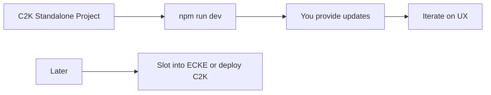

# Coast to Coast Kink – Standalone Front-End Project

## Goals

- **C2K as its own project**: New codebase (e.g. `coast-to-coast-kink` or `c2k-frontend`) next to EastCoast-master and swing-club-platform. No changes to ECKE or swing-club in this phase.
- **Front-end only**: UX, layout, and design first. No auth or backend; login/signup is UI-only (forms and tabs). You can plug in Supabase or ECKE later when "slotting in."
- **Local environment**: Run with `npm run dev` so you can review and request updates locally. README documents setup.

---

## 1. Project setup

- **Location**: Repo root, e.g. `c:\Users\shkin\Desktop\coast-to-coast-kink` (sibling to `eastcoast` on the Desktop).
- **Stack**: Next.js 14 (App Router), React 18, TypeScript, Tailwind CSS – aligned with EastCoast-master so future slot-in is straightforward.
- **Commands**: `npm install`, `npm run dev` (e.g. [http://localhost:3000](http://localhost:3000)). No env required for local UX work; optional `.env.example` for when you add API later.

---

## 2. C2K design system (Fetish.com-inspired, your own colors)

- **Reference**: [Fetish.com](https://www.fetish.com/) – dark theme, split hero + form, bold typography, single strong CTA.
- **Your palette** (Tailwind + CSS variables):
  - **Background**: Deep neutrals (e.g. `#0f0f0f`, `#1a1a1a`, `#252525`).
  - **Accent 1 (primary CTA)**: One bold accent (e.g. teal, amber, or deep coral) – distinct from Fetish.com's lime/purple.
  - **Accent 2 (nav/secondary)**: Softer accent for nav hover and secondary actions.
  - **Text**: White / near-white for headings, gray scale for body.
- **Typography**: Strong sans-serif for hero/headings (bold uppercase where it fits); clean body font (e.g. Inter). Defined in `tailwind.config` and/or `globals.css`.

---

## 3. Shell and key pages (front-end only)

- **Layout**: Single root layout with C2K Header + main + C2K Footer.
- **Header**: Dark bar, logo "Coast to Coast Kink", nav (Events, Dungeons, Education, Vendors, Calendar, States, Support, About), placeholder for "Login" / user (no real auth yet).
- **Footer**: Same link groups (Explore, Community, Legal) with C2K branding.
- **Home**: Fetish.com-style split:
  - **Left**: Full-height hero with gradient or image placeholder; headline (e.g. "The Kink-Positive Community for Events & Connection"); subline.
  - **Right**: Floating card with **Login / Sign up** tabs, email + password + optional "Identify as you are" dropdown; primary CTA button ("Create profile" / "Sign in"). Forms are UI-only; no submit to backend yet.
- **Placeholder pages**: Routes for `/events`, `/dungeons`, `/education`, `/vendors`, `/calendar`, `/states`, `/support`, `/about` with simple "Coming soon" or minimal list/card UI so navigation works and you can refine structure.

---

## 4. File structure (high level)

- **coast-to-coast-kink/** – New project root
- **src/app/layout.tsx** – Root layout (C2K shell)
- **src/app/page.tsx** – Home (split hero + login card)
- **src/app/globals.css** – C2K theme variables + Tailwind
- **tailwind.config.js** – C2K colors and fonts
- **src/components/** – Header, Footer, LoginCard, Button, etc.
- **src/app/events/**, **/dungeons/**, etc. – Placeholder pages
- **README.md** – Local dev: clone, npm install, npm run dev

---

## 5. Out of scope for this phase

- **Auth/backend**: No Supabase or API; login/signup are static forms. Backend and "slot-in" to ECKE come later.
- **EastCoast-master / swing-club-platform**: No edits; C2K is standalone.
- **Domain/deployment**: Focus on local UX; coasttocoastkink.com and deployment when you slot it in.

---

## 6. Implementation order

1. **Scaffold** – New Next.js 14 (App Router) project for C2K in the workspace.
2. **Design tokens** – Tailwind theme + CSS variables (custom palette, typography).
3. **Shell** – C2K Layout, Header, Footer.
4. **Home** – Split hero + login/signup card (UI only).
5. **Placeholder pages** – Events, Dungeons, Education, Vendors, Calendar, States, Support, About (minimal content so nav works).
6. **README** – Local dev instructions so you can run and provide updates.

