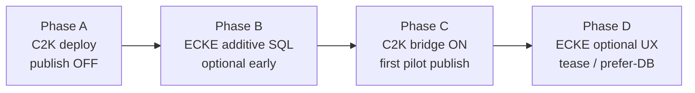
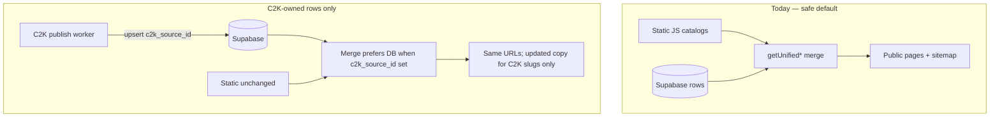
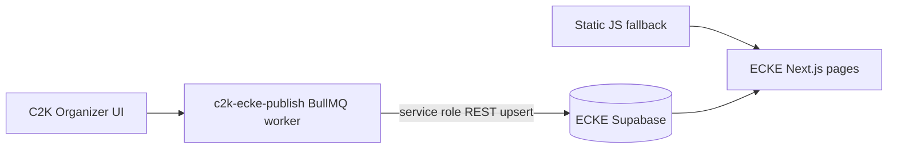

# ECKE ↔ C2K hookup master handoff

**Audience:**  
1. **C2K operator** — finish and go live on C2K first (§0, §8).  
2. **ECKE operator** — pick up after C2K bridge is verified (§7+).

**Goal:** C2K becomes the update surface for **new and opted-in** listings. **ECKE keeps operating exactly as today** until you deliberately change it — static catalogs, search URLs, and admin flows stay live throughout.

**Status (2026-06-06):** **Phase C verified for events only** — pilot slug `preview-c2k-weekend` in ECKE Supabase; local `/events`, detail page, legacy slug, and `sitemap.xml` verified (`smoke:ecke-bridge`, ECKE `verify:c2k-bridge`). **API + worker ship all four entity paths** (`events`, `dungeon_venues`, `vendors`, `articles`); vendor/article/dungeon rows not yet operator-piloted (0 C2K rows expected until toggles + publish). **Resume later:** ECKE Vercel prod redeploy (`NEXT_PUBLIC_C2K_PUBLIC_URL`, §12 merge, prod `sitemap.xml`); C2K prod `ECKE_PUBLISH_*` on API + worker (drop inline-only dev).

**Golden rule:** `ECKE_PUBLISH_ENABLED` stays **unset or `false`** on C2K until ECKE has applied additive SQL (§4 / §7A step 3). Until then, C2K cannot write ECKE Supabase and ECKE is unaffected.

**C2K repo companion docs:**

| Doc | Use |
|-----|-----|
| **This file §0 + §8** | Phased rollout; **C2K-first runbook** (ECKE unchanged until Phase C) |
| **This file §3–§6** | C2K API routes, ECKE Supabase DDL order, REST upsert contract |
| [`ECKE_C2K_ENTITY_MAP.md`](./ECKE_C2K_ENTITY_MAP.md) | Row-level field mapping |
| [`adr/ECKE_SUPABASE_INGEST.md`](./adr/ECKE_SUPABASE_INGEST.md) | Idempotency + source types |
| [`SERVER_CUTOVER_LOG.md`](./SERVER_CUTOVER_LOG.md) | Prod env journal |
| [`FEATURE_REGISTRY.md`](./FEATURE_REGISTRY.md) | API routes + env names |

**ECKE repo paths (relative to EastCoast-master root):**

| Area | Path |
|------|------|
| Events merge | `src/lib/unifiedEvents.ts` |
| Vendors merge | `src/lib/unifiedVendors.ts` |
| Dungeons merge | `src/lib/unifiedDungeons.ts` |
| C2K ingest columns | `database/c2k_ingest_external_ids.sql` |
| Static backfill scripts | `scripts/migrate-static-*-to-supabase.mjs` |
| C2K tease (home) | `src/data/c2kTease.ts`, `src/components/home/HomeC2kTeaseSection.tsx` |

---

## 0. Rollout phases (C2K first — ECKE unchanged until Phase C)



| Phase | C2K | ECKE public site | ECKE deploy required? |
|-------|-----|------------------|------------------------|
| **A — C2K ship** | Deploy API + worker + DB migration. **`ECKE_PUBLISH_ENABLED=false`** (default). | **Identical to today** — static JS only for events/vendors/dungeons. | **No** |
| **B — ECKE schema ready** | Still publish OFF. Obtain ECKE Supabase URL + service role for later. | **Identical to today** — new columns are nullable; no merge flags changed. | **SQL only** (`c2k_ingest_external_ids.sql` + table DDL if missing). No Next.js deploy. |
| **C — Bridge live** | Set `ECKE_PUBLISH_ENABLED=true`, worker running. Pilot org **Preview → Publish** (new slug first). | **Identical for legacy slugs** — static still wins on duplicates while `UNIFIED_*_PREFER_DB` is false. New C2K-only slugs may appear as extra DB rows. | No (unless §12 merge wanted for C2K slug updates without prefer-DB). |
| **D — ECKE polish** | Ongoing C2K publishes. | Optional: home tease banner, §12 `c2k_source_id` merge, prefer-DB audit. | Optional Next.js + env. |

**Why this is seamless for existing ECKE listings:**

| Safety mechanism | Effect |
|------------------|--------|
| Publish gate | No Supabase writes until `ECKE_PUBLISH_ENABLED=true` on C2K |
| Explicit convention/org publish | No accidental mass sync — organizer clicks Publish |
| Auto vendor/article | Only when user toggles `ecke_publish` **and** content is public/published |
| Upsert on `slug` | Never deletes rows; merges into existing slug or adds new slug |
| `c2k_source_id` on pushed rows only | Legacy backfill/static rows stay `NULL` — still editable on ECKE |
| `UNIFIED_*_PREFER_DB=false` (default) | Duplicate slug → **static wins**; ECKE pages match today |
| Static JS kept in repo | Rollback = flip prefer-DB off; static immediately regains precedence |

**Do not do on ECKE before Phase C is verified:** global `UNIFIED_*_PREFER_DB=true`, remove static catalogs, disable ECKE admin for legacy rows, or mass-delete Supabase rows.

---

## 1. Product rules (read first)

### What we are doing

- C2K organizers publish conventions, dungeon orgs, vendors, and education articles **outbound** to ECKE Supabase tables.
- ECKE public pages **continue to merge** static JS catalogs with Supabase (already implemented for events/vendors/dungeons).
- Attendee registration and accounts stay on **C2K**, not ECKE (unchanged strategic boundary).

### What we are **not** doing

| Do not | Why |
|--------|-----|
| Delete or stop shipping `src/data/events.js`, `dungeons.js`, `vendors.js` | SEO + resilience fallback; years of curated copy |
| Flip `UNIFIED_*_PREFER_DB=true` globally on day one | Would change which row wins on duplicate slugs before you audit parity |
| Remove existing ECKE admin/static listings | Legacy rows stay live until a **specific slug** is under C2K control |
| Replace Dancecard attendee runtime | Dancecard stays; C2K only syncs program copy + listing metadata |

### Preserve search relevance (recommended merge policy)



**Operator sequence (summary):**

1. **C2K Phase A** — deploy code; keep publish **disabled** (§8).
2. **ECKE Phase B** — additive SQL only when ready for bridge (§7A); site behavior unchanged.
3. **C2K Phase C** — enable bridge; test with a **new slug** not in static `events.js` (§8B).
4. **Per-slug cutover** — only when a listing is managed in C2K and you choose prefer-DB or §12 merge.
5. **ECKE Phase D** — tease banner, prefer-DB audit, optional §12 — all optional polish.

**Legacy detail (ECKE-side backfill, prefer-DB audit):** see §7B and §9.

---

## 2. Architecture (runtime)



| C2K source | ECKE table | Stable key | Trigger |
|------------|------------|------------|---------|
| `conventions` | `public.events` | `c2k_source_type=convention`, `c2k_source_id=conventions.id` | Explicit Publish on convention |
| `organizations` (dungeon) | `dungeon_venues` | `c2k_source_type=organization` | Org Publish when `feature_flags.listingKind=dungeon` |
| `vendor_profiles` | `vendors` | `c2k_source_type=vendor_profile` | Auto when `ecke_publish` + public shop |
| `education_articles` | `articles` | `c2k_source_type=education_article` | Auto when `ecke_publish` + published |
| Convention program | `dancecard_*` | existing `externalKey` | Explicit (already shipped) |

Listing webhook (`ECKE_PUBLISH_LISTING_WEBHOOK_URL`) is **optional legacy** for org/group; direct Supabase upsert is the target path for entity tables above.

**There is no ECKE ingest HTTP API today.** C2K writes ECKE Supabase with the service role (`POST {ECKE_SUPABASE_URL}/rest/v1/...`). ECKE Next.js only **reads** those tables (plus static JS merge).

---

## 3. C2K API routes (control plane)

All routes require `USE_DATABASE=true` on the C2K API. Session auth uses the normal C2K viewer JWT unless noted.

**Source files:** `packages/api/src/routes/ecke-publish-routes.ts`, `ecke-publish-entity-routes.ts`, `ecke-publish-queue.ts`, `ecke-publish-executor.ts`.

### 3A — Organizer explicit publish

| Method | Path | Auth | Writes ECKE Supabase? | Notes |
|--------|------|------|------------------------|-------|
| `GET` | `/api/v1/organizer/ecke-publish/organizations/:slug` | Org **moderator+** | No | `bridgeConnected` + `ecke_listing` preview (does not preview `ecke_dungeon`; check `ecke_publish_targets` after publish) |
| `POST` | `/api/v1/organizer/ecke-publish/organizations/:slug/preview` | Org moderator+ | No | Stages `ecke_listing` hash in C2K `ecke_publish_targets` |
| `POST` | `/api/v1/organizer/ecke-publish/organizations/:slug/publish` | Org moderator+ | **Yes** (conditional) | `ecke_listing` → **listing webhook only** (errors if `ECKE_PUBLISH_LISTING_WEBHOOK_URL` unset). When `feature_flags.listingKind=dungeon` (or `eckeDungeonListing`), **inline** `dungeon_venues` upsert + `ecke_dungeon` target row (not returned in HTTP `targets` array) |
| `GET` | `/api/v1/organizer/ecke-publish/conventions/:slug` | Convention **full admin** (`resolveConventionCommandAccess.isFullAdmin`) | No | Previews `ecke_listing` + optional `dancecard_event` only (no `ecke_event` preview) |
| `POST` | `/api/v1/organizer/ecke-publish/conventions/:slug/preview` | Convention full admin | No | Stages `ecke_listing` + optional `dancecard_event` preview rows |
| `POST` | `/api/v1/organizer/ecke-publish/conventions/:slug/publish` | Convention full admin | **Yes** | `ecke_listing` webhook attempt (may error if webhook unset) + **queues** `publish-convention-event` → `public.events` (HTTP returns `ecke_event` as `draft` until worker finishes) + inline `dancecard_*` when `dancecardEnabled` |
| `GET` | `/api/v1/organizer/ecke-publish/groups/:groupId` | Group moderator+ (or parent org moderator+) | No | Group `ecke_listing` preview |
| `POST` | `/api/v1/organizer/ecke-publish/groups/:groupId/preview` | Group moderator+ | No | Stages group listing preview |
| `POST` | `/api/v1/organizer/ecke-publish/groups/:groupId/publish` | Group moderator+ | Webhook only | `ecke_listing` via `ECKE_PUBLISH_LISTING_WEBHOOK_URL` (no direct Supabase table for generic group listings yet) |

**Typical GET response shape:**

```json
{
  "scope": { "type": "convention", "slug": "example-con", "name": "Example Con" },
  "bridgeConnected": true,
  "targets": [
    {
      "targetKind": "ecke_event",
      "externalSlug": "example-con",
      "status": "published",
      "contentHash": "…",
      "publishedContentHash": "…",
      "lastPublishedAt": "2026-05-27T…",
      "lastError": null,
      "payload": { }
    }
  ]
}
```

### 3B — Auto-publish (vendor + education)

| Method | Path | Auth | ECKE table | Trigger |
|--------|------|------|------------|---------|
| `GET` | `/api/v1/me/education-articles/:id/ecke-publish` | Article **author** | — | Status + `bridgeConnected` |
| `POST` | `/api/v1/me/education-articles/:id/ecke-publish` | Article author | `articles` (queued) | Enqueues BullMQ `publish-article` |
| `POST` | `/api/v1/me/education-articles/:id/ecke-publish/sync` | Article author | `articles` (inline) | Same worker logic, no Redis |
| `GET` | `/api/v1/vendors/me/ecke-publish` | Vendor owner | — | `eckePublish` flag + `ecke_vendor` target row |
| `POST` | `/api/v1/vendors/me/ecke-publish` | Vendor owner | `vendors` (queued) | Enqueues `publish-vendor` (no `/sync` route — use inline env or worker) |

**Side-effect enqueue (no separate HTTP call):**

| C2K write route | When ECKE job fires |
|-----------------|---------------------|
| `POST/PUT` education article save (`education-articles-routes.ts`) | `ecke_publish=true` **and** `publicationStatus=PUBLISHED` → `maybeEnqueueEckeArticlePublish` |
| `PUT /api/v1/me/vendor-profile` (`ecosystem-stubs.ts`) | `ecke_publish=true` **and** `visibility=PUBLIC` → `maybeEnqueueEckeVendorPublish` |

### 3C — BullMQ worker (`c2k-ecke-publish`)

| Job name | C2K input | ECKE Supabase action |
|----------|-----------|----------------------|
| `publish-convention-event` | `conventionId` | Upsert `public.events` via `executeEckePublishConventionEvent` (rebuilds listing → `buildEckeEventRowFromListing`) |
| `publish-vendor` | `vendorProfileId` | Upsert `public.vendors` when `ecke_publish` + `visibility=PUBLIC` |
| `publish-article` | `articleId` | Upsert `public.articles` when `ecke_publish` + `publicationStatus=PUBLISHED` |

**Not worker jobs (inline on organizer publish):** `ecke_listing` (webhook), `dancecard_*` (Supabase upsert + orphan delete), `ecke_dungeon` (org publish when dungeon listing).

Worker registration: `packages/api/src/worker.ts`. Enqueue helpers: `ecke-publish-queue.ts` (`requestEckeConventionEventPublish`, `requestEckeArticlePublish`, `requestEckeVendorPublish`). If `C2K_ECKE_PUBLISH_INLINE=true` or Redis enqueue fails, jobs run inline in the API process.

### 3D — C2K env gates (API + worker)

| Variable | Required | Effect |
|----------|----------|--------|
| `ECKE_PUBLISH_ENABLED=true` | Yes | Bridge active |
| `ECKE_SUPABASE_URL` | Yes | ECKE project URL (no trailing slash) |
| `ECKE_SUPABASE_SERVICE_ROLE_KEY` | Yes | Service role for REST writes |
| `ECKE_PUBLISH_LISTING_WEBHOOK_URL` | Optional | Org/group/convention **listing** JSON webhook (legacy) |
| `ECKE_PUBLISH_WEBHOOK_SECRET` | Optional | Bearer for listing webhook |
| `REDIS_URL` | Worker | BullMQ (unless inline mode) |

---

## 4. ECKE Supabase schema — how to update

Apply in the **ECKE Supabase SQL editor** (not C2K Postgres). Order matters.

### 4A — Apply order

| Step | ECKE repo file | Creates / extends |
|------|----------------|-------------------|
| 1 | `database/discovery_000_events_core.sql` | `venues`, `public.events` (if missing) |
| 2 | `database/discovery_schema.sql` | Discovery columns on `events` |
| 3 | `database/discovery_seed_tags.sql` | Tag seed data |
| 4 | `database/discovery_rls.sql` | Anon read for published events |
| 5 | `database/vendor_seo_000_vendors_core.sql` | `public.vendors` (if missing) |
| 6 | `database/dungeon_seo_000_dungeon_venues.sql` | `dungeon_venues` |
| 7 | `database/dungeon_seo_001_tags_and_links.sql` | Dungeon SEO tags |
| 8 | `database/dungeon_seo_seed_tags.sql` | Tag seed |
| 9 | `database/c2k_ingest_external_ids.sql` | **`c2k_source_id`**, **`c2k_source_type`**, unique indexes, dungeon RLS |
| 10 | `database/articles_rls_policies.sql` | Anon read published articles (if not already) |

See also `database/README_DISCOVERY.md` and `database/README_DUNGEON_SEO.md` in the ECKE repo.

### 4B — C2K columns added by step 9

Applied to all four ingest tables:

```sql
c2k_source_id   uuid
c2k_source_type varchar(32)

CREATE UNIQUE INDEX … ON (c2k_source_type, c2k_source_id)
  WHERE c2k_source_id IS NOT NULL AND c2k_source_type IS NOT NULL;
```

| ECKE table | `c2k_source_type` | `c2k_source_id` = |
|------------|-------------------|-------------------|
| `public.events` | `convention` | C2K `conventions.id` |
| `public.vendors` | `vendor_profile` | C2K `vendor_profiles.id` |
| `public.articles` | `education_article` | C2K `education_articles.id` |
| `dungeon_venues` | `organization` | C2K `organizations.id` (dungeon org only) |

**Legacy rows** from static backfill scripts leave both columns `NULL` — they remain editable on ECKE and keep winning merge precedence until you opt into prefer-DB or §12 logic.

### 4C — Columns C2K upserts (by table)

Built in C2K `packages/api/src/lib/ecke-directory-sync.ts`. ECKE must expose these column names (nullable columns OK if absent from payload).

**`public.events`** (convention publish):

| Column | C2K source |
|--------|------------|
| `slug`, `title` | Convention slug / name |
| `start_date`, `end_date`, `display_date` | Convention dates (ISO date) |
| `city`, `state` | Parsed from anchor event location |
| `short_description`, `long_description` | Description |
| `category` | `'Convention'` |
| `logo`, `website`, `organizer_name` | Image URL, empty, org name |
| `status` | `'published'` or `'draft'` if hidden |
| `tags`, `seo_title`, `meta_title`, `meta_description` | SEO helpers |
| `c2k_source_type`, `c2k_source_id` | `'convention'`, convention UUID |

**`public.vendors`:**

| Column | C2K source |
|--------|------------|
| `slug`, `name`, `description` | Vendor slug, display name, bio/story |
| `website_url`, `city`, `state`, `online_only` | Shop website; location often null |
| `c2k_source_type`, `c2k_source_id` | `'vendor_profile'`, vendor UUID |

**`public.articles`:**

| Column | C2K source |
|--------|------------|
| `title`, `slug`, `excerpt`, `content` | Article fields (`content` = HTML body) |
| `author_name`, `category` | Profile display name; first category |
| `status`, `publish_date`, `read_time` | Published state, date, `"N min read"` |
| `seo_title`, `meta_description`, `og_image` | SEO + hero image |
| `c2k_source_type`, `c2k_source_id` | `'education_article'`, article UUID |

**`dungeon_venues`** (org with `listingKind=dungeon`):

| Column | C2K source |
|--------|------------|
| `slug`, `name`, `description` | Org slug, display name, bio |
| `city`, `state`, `website_url` | Org location / external site |
| `private_address`, `meta_title`, `meta_description` | Defaults + SEO |
| `c2k_source_type`, `c2k_source_id` | `'organization'`, org UUID |

**`dancecard_*`** (unchanged from prior Dancecard bridge): `dancecard_events`, `dancecard_locations`, `dancecard_program_slots`, `dancecard_staff_shifts` — upserted inline on convention publish, not via entity worker jobs.

### 4D — Schema drift checklist

Before first prod push, verify ECKE columns exist:

```sql
SELECT column_name, data_type
FROM information_schema.columns
WHERE table_schema = 'public' AND table_name IN ('events','vendors','articles','dungeon_venues')
ORDER BY table_name, ordinal_position;
```

If C2K upsert fails with `column … does not exist`, add the column on ECKE **or** trim the payload in C2K — prefer adding nullable columns on ECKE when the field is already used by native ECKE flows (e.g. `meta_description` on events).

---

## 5. C2K → Supabase REST contract

Implemented in `packages/api/src/lib/ecke-publish-client.ts`. ECKE operators do **not** implement this server-side — document it so schema and RLS stay compatible.

### 5A — Request template

```
POST {ECKE_SUPABASE_URL}/rest/v1/{table}?on_conflict=slug
Authorization: Bearer {ECKE_SUPABASE_SERVICE_ROLE_KEY}
apikey: {ECKE_SUPABASE_SERVICE_ROLE_KEY}
Content-Type: application/json
Prefer: resolution=merge-duplicates,return=minimal
```

Body: JSON **array of one row** (PostgREST upsert).

**Conflict behavior:** Public URL key is **`slug`** (`on_conflict=slug`). The partial unique index on `(c2k_source_type, c2k_source_id)` prevents two C2K sources from claiming different slugs for the same source id; if slug changes in C2K, the upsert updates the row matching **slug** (audit slug changes carefully).

### 5B — Endpoints by entity

| C2K function | REST path | Table |
|--------------|-----------|-------|
| `publishEventRowToEcke` | `POST /rest/v1/events?on_conflict=slug` | `events` |
| `publishVendorRowToEcke` | `POST /rest/v1/vendors?on_conflict=slug` | `vendors` |
| `publishArticleRowToEcke` | `POST /rest/v1/articles?on_conflict=slug` | `articles` |
| `publishDungeonRowToEcke` | `POST /rest/v1/dungeon_venues?on_conflict=slug` | `dungeon_venues` |
| `publishDancecardEventToEcke` | `POST /rest/v1/dancecard_events?on_conflict=slug` + child table upserts/deletes | `dancecard_*` |

### 5C — Example payloads (abbreviated)

**Event (convention):**

```json
[{
  "title": "Example Convention",
  "slug": "example-con",
  "start_date": "2026-06-01",
  "end_date": "2026-06-03",
  "display_date": "2026-06-01",
  "city": "Philadelphia",
  "state": "PA",
  "short_description": "…",
  "long_description": "…",
  "category": "Convention",
  "logo": "https://…",
  "website": "",
  "organizer_name": "Example Org",
  "status": "published",
  "c2k_source_type": "convention",
  "c2k_source_id": "550e8400-e29b-41d4-a716-446655440000",
  "tags": ["convention"]
}]
```

**Vendor:**

```json
[{
  "slug": "example-maker",
  "name": "Example Maker",
  "description": "…",
  "website_url": "https://…",
  "city": null,
  "state": null,
  "online_only": true,
  "c2k_source_type": "vendor_profile",
  "c2k_source_id": "…"
}]
```

**Article:**

```json
[{
  "title": "Rope Safety Basics",
  "slug": "rope-safety-basics",
  "excerpt": "…",
  "content": "<p>…</p>",
  "author_name": "Educator Name",
  "category": "Safety",
  "status": "published",
  "publish_date": "2026-05-27",
  "read_time": "8 min read",
  "seo_title": "Rope Safety Basics",
  "meta_description": "…",
  "og_image": "https://…",
  "c2k_source_type": "education_article",
  "c2k_source_id": "…"
}]
```

**Dungeon venue:**

```json
[{
  "slug": "example-dungeon",
  "name": "Example Dungeon",
  "description": "…",
  "city": "Baltimore",
  "state": "MD",
  "website_url": "https://…",
  "private_address": false,
  "meta_title": "Example Dungeon",
  "meta_description": "…",
  "c2k_source_type": "organization",
  "c2k_source_id": "…"
}]
```

### 5D — RLS expectations

Service role **bypasses RLS** — C2K writes succeed once columns exist. **Public SSR** still needs anon policies:

| Table | Anon read policy |
|-------|------------------|
| `events` | Published rows (`discovery_rls.sql`) |
| `vendors` | Vendor SEO RLS (if enabled) |
| `articles` | `status = 'published'` (`articles_rls_policies.sql`) |
| `dungeon_venues` | Open select (`c2k_ingest_external_ids.sql`) |

After upsert, confirm anon key can `SELECT` the row ECKE pages expect — otherwise SSR falls back to static-only for that slug.

---

## 6. C2K tracking table (`ecke_publish_targets`)

Lives on **C2K Postgres only** — not ECKE Supabase. Use for operator debugging (“did the push succeed?”).

| Column | Purpose |
|--------|---------|
| `scope_type` | `organization`, `convention`, `group`, `education_article`, `vendor_profile` (`event` reserved in enum; unused) |
| `target_kind` | `ecke_listing`, `dancecard_event`, `ecke_event`, `ecke_vendor`, `ecke_article`, `ecke_dungeon` |
| Scope FK | `organization_id`, `convention_id`, `group_id`, `education_article_id`, or `vendor_profile_id` (one set per row) |
| `external_slug` | ECKE public slug |
| `status` | `never`, `draft`, `published`, `error`, `stale` |
| `content_hash` / `published_content_hash` | Change detection |
| `last_error` | Worker or REST failure text |

Query example on C2K:

```sql
SELECT target_kind, external_slug, status, last_error, last_published_at
FROM ecke_publish_targets
WHERE convention_id = '…'
ORDER BY target_kind;
```

---

## 7. ECKE checklist (after C2K Phase C verified)

**Start here only after** C2K §8C first publish succeeds. Until then, ECKE prod needs **no changes** for the hookup to be safe.

### 7A — SQL (Supabase SQL editor, in order)

1. **Events discovery core** (if `public.events` missing):  
   `database/discovery_000_events_core.sql` → `discovery_schema.sql` → `discovery_seed_tags.sql` → `discovery_rls.sql`  
   See `database/README_DISCOVERY.md` in the ECKE repo.

2. **Dungeon SEO** (if not applied):  
   `database/dungeon_seo_000_dungeon_venues.sql` → `dungeon_seo_001_tags_and_links.sql` → `dungeon_seo_seed_tags.sql`  
   See `database/README_DUNGEON_SEO.md` in the ECKE repo.

3. **C2K external ids + dungeon RLS:**  
   `database/c2k_ingest_external_ids.sql`  
   Adds `c2k_source_id`, `c2k_source_type` on `events`, `vendors`, `articles`, `dungeon_venues`.

### 7B — Backfill static → Supabase (optional, no deletions)

**Not required for C2K go-live.** Backfill duplicates static into DB for later prefer-DB audit; it does not remove static and does not change pages while prefer-DB is false.

From ECKE repo root, with `NEXT_PUBLIC_SUPABASE_URL` + `SUPABASE_SERVICE_ROLE_KEY` in `.env.local`:

```bash
npm run migrate:events-to-supabase -- --dry    # inspect sample
npm run migrate:events-to-supabase

npm run migrate:vendors-to-supabase -- --dry
npm run migrate:vendors-to-supabase

npm run migrate:dungeons-to-supabase -- --dry
npm run migrate:dungeons-to-supabase
```

**After backfill:** spot-check 5 slugs per entity on `/events/:slug`, `/vendors/:slug`, `/dungeons/:slug` with prefer-DB **still false** — pages should match today (static still wins on dupes; DB fills gaps only).

### 7C — ECKE environment variables

Add to ECKE `.env.local` / Vercel project settings:

```env
# Supabase (already required for articles / optional discovery)
NEXT_PUBLIC_SUPABASE_URL=
NEXT_PUBLIC_SUPABASE_ANON_KEY=
SUPABASE_SERVICE_ROLE_KEY=          # scripts + server admin only — never NEXT_PUBLIC_

# Merge policy — leave FALSE until slug audit complete (§1)
# UNIFIED_EVENTS_PREFER_DB=false
# UNIFIED_VENDORS_PREFER_DB=false
# UNIFIED_DUNGEONS_PREFER_DB=false

# C2K tease banner on ECKE home (§11)
NEXT_PUBLIC_C2K_PUBLIC_URL=https://YOUR-C2K-DOMAIN.com
```

### 7D — Verify SSR merge (code already merged)

- `unifiedEvents.ts` / `unifiedVendors.ts` / `unifiedDungeons.ts` use `getSupabaseServerClient()` on SSR.
- Sitemap uses `getUnifiedEvents()` + `getUnifiedDungeons()` so DB-only slugs can appear in `sitemap.xml` when present.

Smoke:

```bash
npm run verify:discovery-db   # if configured
npm run build
```

Manual: load home, `/events`, one dungeon hub, one vendor — confirm counts ≥ static-only baseline.

### 7E — What stays editable on ECKE

| Content | ECKE admin / static edits |
|---------|---------------------------|
| Legacy events/vendors/dungeons **without** `c2k_source_id` | **Keep editable** — preserves search corpus |
| Rows with `c2k_source_id` set by C2K | **Do not hand-edit** — C2K is source of truth; ECKE displays only |
| Dancecard runtime | Unchanged |
| Static JS files | **Keep in repo** permanently as archive + fallback |

---

## 8. C2K runbook — complete before ECKE behavior changes

Everything in this section is **C2K repo / C2K server only**. ECKE can stay on current prod with zero deploys through Phase A and most of Phase B.

### 8A — Phase A: deploy C2K (publish bridge OFF)

**1. Ship code** (already in repo):

| Area | Path |
|------|------|
| Publish routes | `packages/api/src/routes/ecke-publish-routes.ts`, `ecke-publish-entity-routes.ts` |
| Worker queue | `packages/api/src/lib/ecke-publish-queue.ts`, `ecke-publish-executor.ts` |
| Supabase client | `packages/api/src/lib/ecke-publish-client.ts`, `ecke-directory-sync.ts` |
| Worker registration | `packages/api/src/worker.ts` (`c2k-ecke-publish`) |
| UI toggles | Convention/org ECKE Publish, vendor + article `ecke_publish` |

**2. C2K database migration** (C2K Postgres — not ECKE):

```bash
npm run db:migrate-incremental -w @c2k/api
```

Adds `vendor_profiles.ecke_publish`, extended `ecke_publish_targets`, enum values for `ecke_event`, `ecke_vendor`, `ecke_article`, `ecke_dungeon`.

**3. Processes** (local or prod):

```bash
docker compose -f docker-compose.dev.yml up -d   # Postgres, Redis, Mailpit
npm run dev                                       # API + web
# Separate terminal — worker MUST run for queued publishes:
npm run build -w @c2k/api && npm run start:worker -w @c2k/api
# Or without build: npx tsx packages/api/src/worker.ts
```

**4. Env — Phase A defaults (no ECKE writes):**

```env
USE_DATABASE=true
REDIS_URL=redis://127.0.0.1:6379

# Leave OFF until Phase C — this is the master kill switch
# ECKE_PUBLISH_ENABLED=false

# Staging/dev inline publish (optional — skips Redis for entity jobs)
# C2K_ECKE_PUBLISH_INLINE=true

C2K_PUBLIC_WEB_URL=https://YOUR-C2K-DOMAIN.com
```

**5. Verify Phase A (bridge disconnected is OK):**

- Organizer → Integrations → ECKE Publish on a test convention: `bridgeConnected: false` is expected.
- `GET /api/v1/organizer/ecke-publish/conventions/:slug` returns previews but **Publish** must fail gracefully if bridge off.
- No traffic to ECKE Supabase.

### 8B — Phase B prep: credentials (still publish OFF)

Obtain from ECKE operator (read-only until Phase C):

| Secret | Purpose |
|--------|---------|
| ECKE Supabase project URL | Same project ECKE site uses |
| Service role key | C2K worker REST upserts only — store in C2K secrets, never web `NEXT_PUBLIC_*` |

**ECKE operator applies before Phase C** (§7A): at minimum `database/c2k_ingest_external_ids.sql`. Without those columns, C2K upserts will 400/500 — still no public ECKE breakage if publish stays OFF.

C2K operator: confirm columns exist (run on ECKE Supabase when granted access):

```sql
SELECT table_name, column_name
FROM information_schema.columns
WHERE column_name IN ('c2k_source_id', 'c2k_source_type')
  AND table_schema = 'public'
ORDER BY table_name;
```

Expect four tables: `events`, `vendors`, `articles`, `dungeon_venues`.

### 8C — Phase C: enable bridge (first live push)

**Pre-flight checklist (all must pass):**

| ☐ | Gate |
|---|------|
| ☐ | C2K prod/staging API + **worker** running with same env |
| ☐ | ECKE `c2k_ingest_external_ids.sql` applied |
| ☐ | Pilot convention created with slug **not** in ECKE static `events.js` (or collision explicitly accepted) |
| ☐ | `npm run db:migrate-incremental -w @c2k/api` applied on C2K DB |
| ☐ | Redis reachable (or `C2K_ECKE_PUBLISH_INLINE=true` for a one-off test only) |

**Enable on C2K API + worker:**

```env
ECKE_PUBLISH_ENABLED=true
ECKE_SUPABASE_URL=https://YOUR-ECKE-PROJECT.supabase.co
ECKE_SUPABASE_SERVICE_ROLE_KEY=eyJ…

REDIS_URL=redis://…
USE_DATABASE=true
```

Restart API and worker after env change.

**First publish (safest path):**

1. C2K → pilot convention → **Integrations → ECKE Publish**.
2. **Preview** — confirm targets: `ecke_listing` (webhook may skip if unset), `ecke_event` queued, optional `dancecard_event` if Dancecard enabled.
3. **Publish** — check C2K:

```sql
SELECT target_kind, external_slug, status, last_error, last_published_at
FROM ecke_publish_targets
WHERE convention_id = (SELECT id FROM conventions WHERE slug = 'YOUR-PILOT-SLUG');
```

4. Check ECKE Supabase:

```sql
SELECT slug, title, status, c2k_source_type, c2k_source_id
FROM public.events
WHERE c2k_source_id IS NOT NULL
ORDER BY slug DESC LIMIT 5;
```

5. **ECKE public page:** with prefer-DB still false, a **new slug** should appear (DB-only path). A slug that exists in static JS should **look unchanged** until prefer-DB or §12 merge.

**Slug policy for pilot orgs:**

| Situation | C2K action | ECKE visitor sees |
|-----------|------------|-------------------|
| Brand-new event/con on C2K | Use new slug | New listing when DB row visible |
| Replacing legacy ECKE event later | Same slug only after content review | No change until ECKE opts into prefer-DB / §12 |
| Vendor / education auto-publish | Leave `ecke_publish` **off** until pilot ready | No ECKE writes |

### 8D — Ongoing C2K operations

| Entity | Where in C2K | When it writes ECKE |
|--------|--------------|---------------------|
| Convention | Organizer → Integrations → ECKE Publish | Explicit Publish → `events` + optional `dancecard_*` |
| Org (dungeon) | Org settings → ECKE Publish + `feature_flags.listingKind = "dungeon"` | Publish → `dungeon_venues` |
| Org (non-dungeon) | Org ECKE Publish | Listing webhook only if `ECKE_PUBLISH_LISTING_WEBHOOK_URL` set |
| Group | Group ECKE Publish | Listing webhook only |
| Vendor | Vendor shop → “List on East Coast Kink Events” | Auto on save when `ecke_publish` + `PUBLIC` |
| Education | `/education/write` → ECKE toggle | Auto on save when `ecke_publish` + `PUBLISHED` |

**Monitoring (C2K):**

```sql
SELECT target_kind, external_slug, status, last_error, last_attempt_at
FROM ecke_publish_targets
WHERE status = 'error'
ORDER BY last_attempt_at DESC;
```

**Rollback (instant, ECKE unaffected):** set `ECKE_PUBLISH_ENABLED=false` on C2K API + worker and restart. Existing ECKE static pages unchanged. Rows already in ECKE Supabase remain but stop updating.

**Optional dev env block** (add to C2K server secrets / `.env.local` for API + worker):

```env
# ECKE outbound (Phase C+)
# ECKE_PUBLISH_ENABLED=true
# ECKE_SUPABASE_URL=
# ECKE_SUPABASE_SERVICE_ROLE_KEY=
# ECKE_PUBLISH_LISTING_WEBHOOK_URL=     # optional legacy
# ECKE_PUBLISH_WEBHOOK_SECRET=
# C2K_ECKE_PUBLISH_INLINE=true          # dev only — bypass Redis for entity jobs
```

See [`SERVER_CUTOVER_LOG.md`](./SERVER_CUTOVER_LOG.md) for prod journal entries.

---

## 9. Slug collision audit (before prefer-DB)

Run on ECKE after backfill, before any `UNIFIED_*_PREFER_DB=true`:

```sql
-- Events: slugs in both static (manual list) and DB — compare title + dates
SELECT slug, title, start_date, status, c2k_source_id
FROM public.events
ORDER BY slug;

-- C2K-owned rows only
SELECT slug, c2k_source_type, c2k_source_id, title
FROM public.events
WHERE c2k_source_id IS NOT NULL;
```

For each slug that exists in **both** static JS and Supabase:

- If content matches → safe for prefer-DB when you choose global cutover.
- If content differs → **do not** enable prefer-DB globally until resolved; keep static winning for that slug until C2K publishes the canonical version.

**Rollback:** set `UNIFIED_*_PREFER_DB=false` — static catalogs immediately regain precedence on duplicates.

---

## 10. Troubleshooting

| Symptom | Likely cause | Fix |
|---------|--------------|-----|
| C2K publish “ok” but ECKE page unchanged | prefer-DB false + slug exists in static | Expected for legacy slugs; use new slug test or per-slug cutover |
| SSR shows static only | Supabase anon RLS blocking read | Apply `discovery_rls.sql` + dungeon RLS in `c2k_ingest_external_ids.sql` |
| Worker job error in `ecke_publish_targets.last_error` | Wrong service role / table missing | Re-run SQL migrations; verify `ECKE_SUPABASE_*` on worker |
| Duplicate events in sitemap | Static + DB both listed, different slugs | Normal until dedupe audit; merge is by slug |
| Article push fails column mismatch | ECKE `articles` schema drift | Compare `educationArticles.ts` select `*` shape vs C2K `buildEckeArticleRow` |

---

## 11. C2K tease post on ECKE (home)

**Purpose:** Tell ECKE visitors that organizer updates and registration live on **Coast to Coast Kink (C2K)** without removing any existing listings.

**Implementation (shipped in ECKE repo):**

- Data: `src/data/c2kTease.ts`
- UI: `src/components/home/HomeC2kTeaseSection.tsx` (rendered on home after hero)
- Env: `NEXT_PUBLIC_C2K_PUBLIC_URL` → primary CTA link

### Copy (canonical)

| Field | Text |
|-------|------|
| **Eyebrow** | Organizer tools |
| **Headline** | Run your event on Coast to Coast Kink |
| **Teaser** | List once on C2K — your convention, vendor shop, dungeon profile, and educator articles can sync to East Coast Kink Events for public discovery. Registration and door tools stay on C2K. |
| **Primary CTA** | Explore C2K for organizers → `{NEXT_PUBLIC_C2K_PUBLIC_URL}/orgs` or `/about` |
| **Secondary CTA** | Browse listings here (anchor `#home-upcoming-events-title` or `/events`) |

### Optional extensions (not required for hookup)

| Placement | How |
|-----------|-----|
| Education hub | Add one row to `src/data/externalEducationResources.ts` category **Community** linking to C2K `/education` |
| Footer | One line under quick links: “Organizers: manage listings on Coast to Coast Kink” |
| `/contact` | Note that **new** event submissions should go through C2K org onboarding, not duplicate ECKE admin entry |

**Do not** replace existing event cards or remove submission flows until C2K pilot org is live — tease is additive marketing only.

---

## 12. §12 merge — **shipped on ECKE** (2026-05-27)

ECKE implemented per-slug C2K precedence **without** global `UNIFIED_*_PREFER_DB`:

| File | Behavior |
|------|----------|
| `unifiedEvents.ts` | List + `resolveEventForPage`; static logo/features overlay on C2K rows |
| `unifiedVendors.ts` | `overlayStaticPaidAssets` on C2K rows |
| `unifiedDungeons.ts` | `overlayStaticDungeonAssets` on C2K rows |

**Rule:** When `UNIFIED_*_PREFER_DB` is false/unset — duplicate slug + DB row with `c2k_source_id` → **DB wins**; otherwise **static wins**. Legacy listings unchanged until C2K publishes that slug.

ECKE verification: `npm run verify:c2k-bridge` (see ECKE `docs/C2K_PHASE_C_VERIFY.md`).

---

## 13. Sign-off checklist

### C2K first (Phases A–C)

| Step | Owner | Done |
|------|-------|------|
| C2K code deployed; `db:migrate-incremental` applied | C2K | ☑ |
| Worker process running (`c2k-ecke-publish`) | C2K | ☑ (inline for pilot) |
| Phase A: `ECKE_PUBLISH_ENABLED` off — no accidental ECKE writes | C2K | ☑ |
| ECKE `c2k_ingest_external_ids.sql` applied (Phase B gate) | ECKE | ☑ |
| Phase C: bridge env in `.env.local` (`load-dev-env.ts`) | C2K | ☑ |
| Pilot publish; `ecke_publish_targets.status=published` for `ecke_event` | C2K | ☑ (`preview-c2k-weekend`) |
| Vendor / article / dungeon entity pilot publish | C2K | ☐ (API + worker shipped; not operator-tested) |
| ECKE Supabase row has `c2k_source_id` (events) | Both | ☑ |
| ECKE `npm run verify:c2k-bridge` | ECKE | ☑ |
| Local `/events` lists pilot slug | Both | ☑ |
| Legacy slug unchanged (`indy-rope-expo`) | Both | ☑ |
| Pilot slug in local `sitemap.xml` | Both | ☑ |
| Prod ECKE redeploy + `sitemap.xml` | ECKE | ☐ (live host 500 until deploy) |

### ECKE polish (Phase D — optional, after C2K live)

| Step | Owner | Done |
|------|-------|------|
| Baseline recorded (`docs/C2K_HOOKUP_BASELINE.md`: 80 events, 105 vendors, 62 dungeons) | ECKE | ☑ |
| Phase B SQL applied (`c2k_ingest_external_ids`, `articles_rls_policies`) | ECKE | ☑ |
| `npm run verify:discovery-db` passed | ECKE | ☑ |
| `scripts/verify-c2k-bridge.mjs` + `npm run verify:c2k-bridge` | ECKE | ☑ |
| §12 merge in `unifiedEvents/Vendors/Dungeons.ts` | ECKE | ☑ |
| Slug collision audit (`docs/C2K_SLUG_COLLISION_AUDIT.md`; dry-run only) | ECKE | ☑ |
| `NEXT_PUBLIC_C2K_PUBLIC_URL` local + `.env.example` guidance | ECKE | ☑ |
| Vercel prod `NEXT_PUBLIC_C2K_PUBLIC_URL` + redeploy (tease CTA) | ECKE | ☐ |
| Static backfill scripts run (optional parity — not required) | ECKE | ☐ |
| Legacy listings indexed (spot-check Search Console) | ECKE | ☐ |

### ECKE repo docs (operator reference)

| Doc (EastCoast-master) | Purpose |
|------------------------|---------|
| `docs/C2K_HOOKUP_BASELINE.md` | Pre-hook catalog counts + env snapshot |
| `docs/C2K_PHASE_C_VERIFY.md` | Post–C2K-publish verification checklist |
| `docs/C2K_SLUG_COLLISION_AUDIT.md` | Dry-run backfill / collision notes |

---

## 15. Resume later (not blocking)

| Item | Owner | Notes |
|------|-------|-------|
| Vercel `NEXT_PUBLIC_C2K_PUBLIC_URL` + redeploy | ECKE | Tease banner prod CTA |
| ECKE prod deploy with §12 merge code | ECKE | Fixes prod `sitemap.xml` 500 observed 2026-05-27 |
| C2K prod `ECKE_PUBLISH_*` on API + worker | C2K | Copy from local `.env.local`; drop `C2K_ECKE_PUBLISH_INLINE` |
| Publish vendor / article / dungeon from C2K | C2K | First of each entity type when ready |
| Optional static→Supabase backfill | ECKE | Parity audit only — not required |
| Search Console spot-check legacy URLs | ECKE | Optional |

**Re-verify after any publish:**

```bash
# C2K
npm run smoke:ecke-bridge -w @c2k/api

# ECKE
npm run verify:c2k-bridge
```

---

## 14. Revision log

| Date | Note |
|------|------|
| 2026-05-27 | Initial master handoff after C2K unified push implementation; preservation-first merge policy |
| 2026-05-27 | Added §3–§6: C2K API routes, ECKE Supabase schema update guide, REST upsert contract, C2K `ecke_publish_targets` |
| 2026-05-27 | §0 phased rollout + §8 C2K-first runbook; ECKE unchanged until C2K Phase C |
| 2026-05-27 | ECKE handback: Phase B–D complete (§12 merge, verify:c2k-bridge, baseline/audit docs); **C2K Phase C is the remaining gate** |
| 2026-05-27 | C2K Phase C pilot executed: `smoke:ecke-bridge`, ECKE verify 1 event; decoupled `ecke_event` from listing webhook |
| 2026-05-27 | **Session end:** public checks passed (events list, legacy slug, sitemap local); prod deploy + other entities deferred |
| 2026-06-06 | Reconciled §3 routes/worker table with `ecke-publish-routes.ts`, `ecke-publish-entity-routes.ts`, `ecke-publish-queue.ts`, `ecke-publish-executor.ts` (convention full-admin gate, inline dungeon/dancecard vs queued entity jobs, listing webhook optional) |

*Update this file when ECKE merge logic, C2K payload columns, or tease placement changes.*
