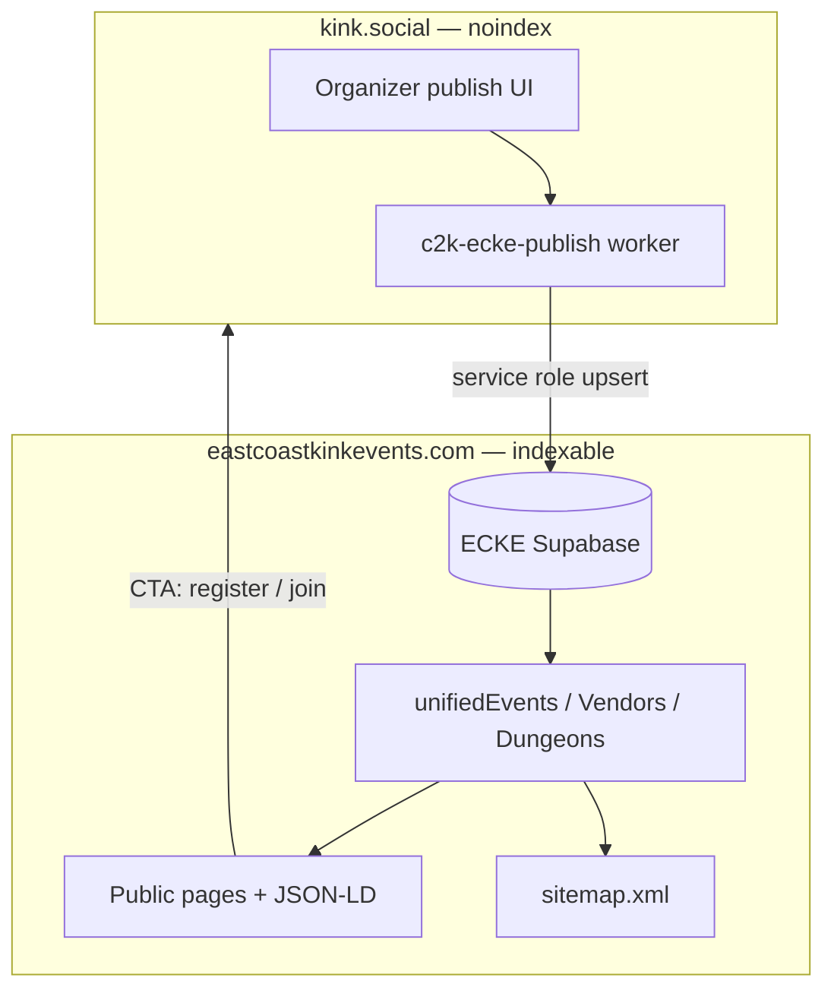

# ECKE launch readiness (two-domain strategy)

**Purpose:** Cross-repo checklist so **eastcoastkinkevents.com** is the public SEO surface and **kink.social** stays private, with C2K publishes taking full advantage of ECKE SEO.

**Repos:**

| Repo | Role |
|------|------|
| `coast-to-coast-kink` (this monorepo) | Private member app + outbound publish bridge |
| `EastCoast-master` (ECKE) | Public Next.js site, sitemap, structured data, merge layer |

**Companion docs:** [`ECKE_C2K_HOOKUP_MASTER.md`](./ECKE_C2K_HOOKUP_MASTER.md) · [`ECKE_C2K_ENTITY_MAP.md`](./ECKE_C2K_ENTITY_MAP.md)

---

## Architecture (launch target)



**Rule:** Google indexes ECKE only. kink.social receives member traffic via ECKE CTAs, not search.

---

## C2K side — ready / in progress

### Shipped in C2K

| Item | Status |
|------|--------|
| kink.social full noindex (`robots.txt`, `X-Robots-Tag`, Helmet meta) | Done |
| No kink.social sitemap | Done |
| Publish bridge: conventions → `public.events` | **Operator-verified** (`preview-c2k-weekend`) |
| Publish bridge: vendors, articles, dungeons (Supabase upsert) | Code shipped; **not operator-piloted** |
| Eligibility gate (`isEckePublishEligible`) | Done |
| Strip `kink.social` URLs from ECKE payloads | Done |
| Event `website` → C2K registration URL (indexed CTA from ECKE) | Done |
| Group listing includes `description` | Done |
| Vendor/article publish status UI (`target` + `targets`) | Done |
| Convention GET includes `ecke_event` preview | Done |
| Org publish response includes `ecke_dungeon` when applicable | Done |

### C2K prod cutover (required before launch)

Set on **API and worker** (see [`SERVER_CUTOVER_LOG.md`](./SERVER_CUTOVER_LOG.md)):

```env
ECKE_PUBLISH_ENABLED=true
ECKE_SUPABASE_URL=https://YOUR-PROJECT.supabase.co
ECKE_SUPABASE_SERVICE_ROLE_KEY=...
# Optional — org/group listing webhook (errors if unset; ecke_event still works)
ECKE_PUBLISH_LISTING_WEBHOOK_URL=...
ECKE_PUBLISH_WEBHOOK_SECRET=...
```

- Run `c2k-ecke-publish` worker in prod (do **not** rely on `C2K_ECKE_PUBLISH_INLINE=true`).
- Pilot all four entity paths before announcing launch (see §Pilot matrix below).

### C2K SEO payload gaps (post-launch improvements)

| Gap | Impact | Recommendation |
|-----|--------|----------------|
| No per-entity SEO override fields on C2K | Organizers cannot tune `meta_title` / `og_image` separately | Add optional JSONB or columns; map in `ecke-directory-sync.ts` |
| Vendor rows lack `meta_*` / `og_image` | Weaker vendor SERP | Extend `buildEckeVendorRow` when ECKE columns exist; use `bannerUrl` / `logoUrl` |
| Dungeon org city/state not parsed | Weaker local SEO | Map org location fields when available |
| Org/group `ecke_listing` webhook-only | Generic org pages may stay static | Direct Supabase upsert for org listings (retire webhook) |
| Standalone calendar events | Non-convention events cannot publish | Future: `scope_type: event` worker job |

---

## ECKE side — required before launch

ECKE work happens in **EastCoast-master**. Until these are done, C2K publishes may succeed in Supabase but **public pages and SEO will not reflect them**.

### P0 — ECKE blockers

| # | Task | ECKE path / notes |
|---|------|-------------------|
| 1 | Apply additive SQL | `database/c2k_ingest_external_ids.sql` (+ discovery/dungeon DDL if missing) |
| 2 | Verify anon RLS on `events`, `vendors`, `articles`, `dungeon_venues` | SSR must read published rows |
| 3 | Deploy §12 merge (`c2k_source_id` prefer-DB for C2K-owned slugs) | `unifiedEvents.ts`, `unifiedVendors.ts`, `unifiedDungeons.ts` |
| 4 | Fix prod `sitemap.xml` (was 500 per hookup master) | Uses `getUnifiedEvents()` + `getUnifiedDungeons()` |
| 5 | Set `NEXT_PUBLIC_C2K_PUBLIC_URL=https://kink.social` | Home tease + CTAs |
| 6 | **`/kink-social` explainer page** | Explain ECKE = discovery, kink.social = member platform |
| 7 | Canonical URLs on all public pages | `https://www.eastcoastkinkevents.com/...` — never kink.social |
| 8 | `robots.txt` allows crawlers on ECKE | Do **not** copy kink.social disallow rules |

### P1 — ECKE SEO capabilities (consume C2K data)

| # | Task | Uses pushed columns |
|---|------|---------------------|
| 9 | Event detail: `meta_title`, `meta_description`, `seo_title`, `logo` | `public.events` |
| 10 | Event detail: **Register on kink.social** CTA from `website` column | `events.website` |
| 11 | Article pages: `seo_title`, `meta_description`, `og_image` | `public.articles` |
| 12 | Vendor pages: name + description (meta from description until C2K sends more) | `public.vendors` |
| 13 | Dungeon pages: `meta_title`, `meta_description`, city/state | `dungeon_venues` |
| 14 | JSON-LD structured data | `Event`, `Article`, `LocalBusiness` as appropriate |
| 15 | Sitemap includes C2K-published slugs only on ECKE domain | No kink.social URLs |
| 16 | Open Graph + Twitter cards on all indexable routes | From row meta + hero |

### P2 — ECKE polish

| # | Task |
|---|------|
| 17 | Home `HomeC2kTeaseSection` live with correct C2K URL |
| 18 | Per-slug prefer-DB audit before global `UNIFIED_*_PREFER_DB=true` |
| 19 | Optional static backfill scripts (does not remove legacy JS) |
| 20 | `npm run verify:c2k-bridge` green after each C2K publish pilot |

---

## Pilot matrix (run before launch announcement)

Run from C2K with bridge enabled; verify on ECKE public site + Supabase.

| Entity | C2K action | ECKE verify |
|--------|------------|-------------|
| Convention | Organizer → Publish convention | `/events/:slug`, sitemap, JSON-LD, Register CTA → kink.social |
| Vendor | Enable ECKE publish + public shop | `/vendors/:slug` |
| Article | Publish article + ECKE toggle | `/articles` or education route |
| Dungeon org | Org with `listingKind: dungeon` → Publish | `/dungeons/:slug` |
| Group | Group publish (webhook) | Listing webhook handler / future org page |

**C2K smoke:** `npm run smoke:ecke-bridge -w @c2k/api`  
**ECKE verify:** `npm run verify:c2k-bridge` (EastCoast-master)

**SQL audit on C2K:**

```sql
SELECT target_kind, external_slug, status, last_error, last_published_at
FROM ecke_publish_targets
ORDER BY last_published_at DESC NULLS LAST
LIMIT 20;
```

---

## Search Console (post-deploy)

| Domain | Action |
|--------|--------|
| eastcoastkinkevents.com | Verify property; submit `sitemap.xml` only |
| kink.social | Verify property; **do not** submit sitemap; request URL removals if previously indexed |

---

## Sign-off

| Owner | Item | Date |
|-------|------|------|
| C2K | Prod bridge env + worker running | |
| C2K | All four entity pilots complete | |
| C2K | kink.social noindex verified in prod | |
| ECKE | SQL + deploy + sitemap 200 | |
| ECKE | `/kink-social` page live | |
| ECKE | Canonical + JSON-LD on event/article/vendor/dungeon pages | |
| ECKE | C2K pilot slug visible on public site | |
| Both | Search Console configured per table above | |

---

*Update when ECKE repo paths change or new entity types publish from C2K.*
