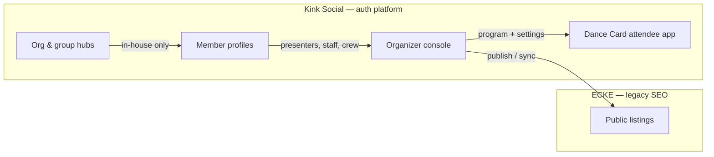

# Platform vision — Kink Social + ECKE

**Status:** Adopted 2026-05-21 · **Last synced:** 2026-06-06 (Kink Social rebrand) · **Authoritative for product direction**  
**Related:** [`ORGANIZER_CONSOLE.md`](./ORGANIZER_CONSOLE.md), [`FEATURE_REGISTRY.md`](./FEATURE_REGISTRY.md), [`EVENT_SYSTEMS_IDENTITY.md`](./EVENT_SYSTEMS_IDENTITY.md), [`ECKE_C2K_ENTITY_MAP.md`](./ECKE_C2K_ENTITY_MAP.md)

**Naming:** **Kink Social** (kink.social) is the public brand. **C2K** is the internal codename (repo, env, packages). **Dance Card by Kink Social** is the convention attendee product. **ECKE** is the legacy SEO bridge only.

---

## One ecosystem, two surfaces

| Surface | Product name | Who sees it | Primary purpose |
|---------|--------------|-------------|-----------------|
| **Authenticated community** | **Kink Social** (internal: C2K) | Authenticated members | Social graph, privacy-first profiles, org/group hubs, DMs, forums, chat, organizer console, **Dance Card** attendee runtime |
| **Legacy SEO bridge** | **East Coast Kink Events (ECKE)** | Everyone (Google-indexable) | Events, dungeons, clubs, org listings, convention pages — **discovery only**; no auth, no Dance Card runtime |

Kink Social and ECKE are **not two products to maintain separately**. They are two faces of one ecosystem:

- **Kink Social** = where community lives behind auth and privacy controls — **identity authority** for registration, staff, organizers, and **Dance Card** on Kink Social.
- **ECKE** = legacy public discovery surface — **SEO bridge only**; outbound publish from Kink Social is not a registration path.

See [Event Systems identity ADR](./EVENT_SYSTEMS_IDENTITY.md#ecke-advertising-only) for signed-off boundaries (no `dancecard_accounts` migration, no guest checkout).

---

## Control plane vs runtime

| Component | Lives on | Notes |
|-----------|----------|-------|
| **Organizer console** | **Kink Social** | Single admin experience for orgs and groups |
| **Dance Card** (attendee weekend app) | **Kink Social** | Schedule, gate, reservations — convention attendee runtime on Kink Social |
| **Member profiles** | **Kink Social** | Presenters, staff, members — one identity spine ([`EVENT_SYSTEMS_IDENTITY.md`](./EVENT_SYSTEMS_IDENTITY.md)) |
| **Publish bridge** | Kink Social → ECKE | **Shipped** (preview + outbound publish); SEO listings only — not attendee runtime |

**Organizers never maintain two admin sites.** They work in Kink Social; public listing copy flows outward to ECKE.

---

## Organizer scope

Organizer is an **org-level and group-level** tool:

| Affects | Examples |
|---------|----------|
| **In-house Kink Social community** | Forums, chat, member directory, internal program views, access grants, Dance Card attendee hub |
| **External ECKE listing** | Public copy, discovery metadata, program visibility — SEO bridge only |

**Roles (Kink Social / C2K-native):** org `MODERATOR+` for most tabs; `ADMIN+` for settings; group `moderator+` / `owner` / `admin`.

**Not in scope (historical Loop 1):** native payments (placeholders only). **Shipped since:** full publish API (Loop 3), Dance Card organizer UI on Kink Social (kit parity — [`DANCECARD_ORGANIZER_PARITY.md`](./DANCECARD_ORGANIZER_PARITY.md)), Event Systems identity Phase 1–2 ([`EVENT_SYSTEMS_IDENTITY.md`](./EVENT_SYSTEMS_IDENTITY.md)).

---

## Privacy-first social (Kink Social)

Public ECKE listings must not leak private Kink Social data by default:

- Profile field visibility, discoverability opt-out, and connection-gated DMs stay on Kink Social.
- ECKE shows only what organizers **publish** — not the full member graph.
- **Dance Card** attendee runtime lives on **Kink Social** (convention hub `/conventions/:slug`); registration and identity are Kink Social accounts — not ECKE.

---

## Build order (dependency timeline)

| Loop | Work | Depends on |
|------|------|------------|
| **1 ✓** | Organizer shell + IA on Kink Social | — |
| **2 ✓** | Entity map + publish bridge foundation (preview API, `ecke_publish_targets`) | Loop 1 |
| **3 ✓** | Outbound ECKE publish + People hub | Loop 2 |
| **4 ✓** | Event Systems organizer (kit parity UI + `/api/v1/conventions/:key/*` organizer routes) | Loop 3 |
| **5 ✓** | Dance Card attendee hub on Kink Social (`ConventionAttendeeHubShell`) | Loop 3 |
| Later | Payments / ticketing (real) | Product decision |
| Later | Push notifications | Messaging prefs |
| Later | Friend/group schedule overlays | Dancecard + connections |

---

## Technical stacks (current)

| Repo / area | Stack |
|-------------|-------|
| **Kink Social monorepo** (internal: C2K) | Vite + React Router, Fastify, Drizzle/Postgres |
| **ECKE reference site** | Next.js 14 + Supabase (legacy SEO; `vendor/dancecard-eastcoast-export/` for kit parity reference) |

Integration is **API/sync**, not a literal port of 290 Next routes into Fastify without an ADR.

---

## Agent workflow

For each feature vertical:

1. Audit (code + docs + privacy + mobile UX)
2. Plan → implement → test → fix
3. Re-audit for obvious user-facing gaps (privacy first)
4. Second pass if needed
5. Update `FEATURE_REGISTRY.md`, `NEXT_STEPS.md`, and this doc when architecture shifts
6. Mark **complete, awaiting review** before starting the next item

Out-of-scope work goes on the dependency timeline above — not dropped.

---

*Refresh this document when the Kink Social/ECKE boundary or organizer scope changes materially.*
