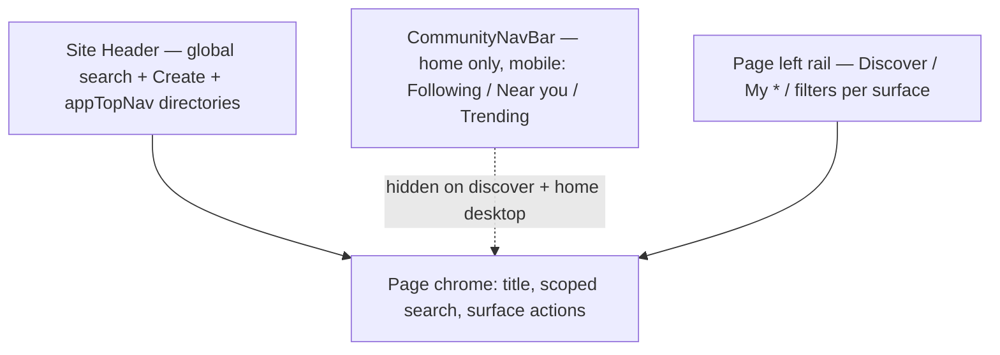

# UI discover refresh — progress & consolidation backlog


**Last updated:** 2026-06-12 (pass 26 — status unchanged; registry cross-ref updated)  

**Status:** **Shipped (UI-DISC-1–6 complete; followups below)**  

**Owner pattern:** Extend existing routes/hooks — see [`extend-before-add`](../.cursor/rules/extend-before-add.mdc) and [`C2K-STRATEGIC-GUIDANCE.md`](./C2K-STRATEGIC-GUIDANCE.md).

This sprint added **mockup-driven discover layouts** (dark/gold, 3-column where noted) for member browse surfaces. **Navigation duplication is resolved** (UI-DISC-1). **Create/search policy and home-vs-standalone IA shipped** (UI-DISC-2/3). **Filter honesty, stub nav cleanup, and legacy component removal shipped** (UI-DISC-4/5/6, 2026-06-06).


---


## 1. What shipped


| Surface | Route(s) | Layout | Key files |

|---------|----------|--------|-----------|

| **Home feed shell** | `/home?mode=following`, `/home?mode=discover&tab=Local` | 3-col feed (left rail, center, right discover) | `HomePageClient.tsx`, `LocalHomeFeed.tsx`, `home-feed-layout.ts`, `HomeFeedLeftRail`, `HomeFeedDiscoverRail` |

| **Events discover** | `/events` (no `?groupId`) | 3-col: filters + list/grid + right rail | `EventsDiscoverPage.tsx`, `EventsDiscoverLeftRail`, `EventsListRow`, `events-page-layout.ts` |

| **Events personal library** | `/events?mine=registrations`, `?mine=saved`, `?host=me`, `?view=past`, etc. | 2-col left nav + list | `EventsPersonalLibraryPage.tsx`, `events-section-mode.ts` |

| **Events (group scope)** | `/events?groupId=` | 2-col legacy filters + `EventCard` grid | `page.tsx` → group-scoped branch |

| **Groups discover** | `/groups` | 3-col: nav/filters + card grid | `GroupsDiscoverPage.tsx`, `GroupsDiscoverLeftRail`, `GroupDiscoverListCard`, `groups-page-layout.ts` |

| **Groups personal library** | `/groups?tab=my`, `?tab=invitations`, `?tab=posts`, `?tab=saved` | 2-col left nav + honest empty states | `GroupsPersonalLibraryPage.tsx`, `groups-section-nav.ts`, `groups-section-mode.ts` |

| **Conventions discover** | `/conventions`, `?view=past`, `?mine=1` | 3-col: featured row + list rows | `ConventionsDiscoverPage.tsx`, `ConventionsLeftRail`, `conventions-page-layout.ts` |

| **People directory** | `/people` (canonical); `/discovery`, `/explore/people` → redirect | 3-col: refine search + profile grid + widgets | `FindPeopleDiscoverPage.tsx`, `people/page.tsx`, `find-people/*`, `explore-page-layout.ts` |

| **Explore dashboard** | `/explore` | Hub sections linking to real directories | `ExploreDashboardPage.tsx`, `explore-hub.ts` |

| **Education hub** | `/education` (overview only) | 3-col: rails + hero/paths/strips | `EducationDiscoverPage.tsx`, `EducationDiscoverCenter`, `education-page-layout.ts` |


**Feed interaction vocabulary (home):** Love / Respect / Sympathize / Helpful (Love wired to like API); Discuss / Repost / Share / Report — `FeedReactionsRow`, `LocalPostCard`. **Stories row removed** (per product).


**Themes:** Black Gold default + member appearance presets expanded (`appearancePresets.ts`, `MEMBER_SITE_APPEARANCE_IDS`).


**Nav consolidation (UI-DISC-1, shipped 2026-06):**


- `CommunityNavBar` — home-only scope tabs (Following / Near you / Trending), mobile (`lg:hidden`); hidden on all discover routes.

- `ExploreSubNav` — **deleted**; `showExploreSubNav()` removed from `explore-page-layout.ts`.

- Directory destinations — top nav (`site.config.ts` `appTopNav` / `appHomeMainNav`) + each page's left rail; no second browse tab row.

- `community-nav.ts` — `browseHref()` deep-links home tabs to standalone routes; `PEOPLE_DIRECTORY_NAV` → `/people`.


---


## 2. Preview URLs (local)


```bash

cd packages/web && npm run dev

```


| Page | URL |

|------|-----|

| Home Following | http://localhost:5173/home?mode=following |

| Home Near you | http://localhost:5173/home?mode=discover&tab=Local |

| Explore hub | http://localhost:5173/explore |

| Events | http://localhost:5173/events |

| Groups | http://localhost:5173/groups |

| Conventions | http://localhost:5173/conventions |

| People | http://localhost:5173/people |

| Education | http://localhost:5173/education |


Legacy bookmarks: `/discovery` and `/explore/people` redirect to `/people`. Sign in for API-backed lists. Use `VITE_HOME_DEMO_FALLBACK=true` for guest mock screenshots.


---


## 3. Navigation architecture (current)





**`community-nav.ts` + `*-page-layout.ts`** hide `CommunityNavBar` when:


| Helper | Routes |

|--------|--------|

| `hideCommunityNavForFeedShell` | Home 3-col feed (`home-feed-layout.ts`) |

| `hideCommunityNavOnHome` | `/home`, `/`, `/feed` (top nav + left rail own navigation) |

| `hideCommunityNavForEventsDiscover` | `/events` without `groupId` |

| `hideCommunityNavForGroupsDiscover` | `/groups` |

| `hideCommunityNavForConventionsDiscover` | `/conventions` |

| `hideCommunityNavForEducationDiscover` | `/education` overview only |

| `hideCommunityNavForExploreDiscover` | `/people`, legacy `/discovery`, `/explore/people`, `/explore` dashboard |

| `hideCommunityNavForOrgsDiscover` | `/orgs` |


**`explore-page-layout.ts`:** `showExploreSubNav()` removed. `ExploreDiscoverShell` / `ExploreSubNav` / `DiscoveryPeopleFilters` deleted. `EducationDiscoverShell` is a pass-through wrapper.


**Home discover tabs (UI-DISC-3, shipped 2026-06-06):** `?tab=Events`, `Groups`, `Conventions`, `Vendors`, `Education`, `Media` **redirect** to standalone directories via `home-directory-tabs.ts`. Home keeps **Local** (Near you feed) and **Trending** inline. Left rail + feed scope tabs link to `/events`, `/groups`, etc.


---


## 4. Known UX debt (prioritized)


### P0 — Navigation & duplicates


| ID | Status | Issue | Notes |

|----|--------|-------|------|

| NAV-1 | **done** | Two browse tab rows on discover routes | ExploreSubNav retired; CommunityNavBar hidden on discover |

| NAV-2 | **done** | Inconsistent sub-nav across Events/Groups/Conventions/People | Unified policy: no ExploreSubNav anywhere; top nav + left rails |

| NAV-3 | **done** | Duplicate “Find people” / People entry | Canonical `/people` in top nav; legacy `/discovery` redirects |

| NAV-4 | **done** | Duplicate Create | Header **+ Create** only; Groups/Events rails demoted; empty-state + `?create=group` contextual |

| NAV-5 | **done** | Duplicate search | Header people-only; hidden on scoped-search routes (`discover-nav-policy.ts`); page search owns list filters |

| NAV-6 | **done** | Home tab vs standalone route | Home directory tabs redirect; Local + Trending stay on home |


### P1 — Wiring & honesty


| ID | Status | Issue | Notes |

|----|--------|-------|------|

| WIR-1 | **done** | Find people geo filters | Country/city client filter wired; radius only on **Near you** when API-backed; honest copy; **followup:** server nearby API for Near you tab |
| WIR-2 | partial | Groups My Groups / Invitations / My Posts | `GroupsPersonalLibraryPage` — My Groups wired (`useApiMyGroups`); invitations/posts/saved honest empty states, no API yet |
| WIR-3 | **done** | Conventions My Conventions, tickets, notifications | `?mine=1` client view; notifications button **Soon** chip; removed dead geo filter state; Submit → `/organizer` |
| WIR-4 | **done** | Education paths, video strip, Follow, bookmarks, right-rail progress | API-backed mode hides mock paths/educators; honest rails + disabled Follow; demo banner when guest/mock |
| WIR-5 | **done** | Events bookmarks in list rows | `EventsListRow` → `EventSaveButton` → `useApiBookmarks` |
| WIR-6 | partial | Convention/event badges & counts | Fake count backfill removed; demo badges may remain in enrichment maps |


### P2 — Quality & consistency


| ID | Status | Issue | Notes |

|----|--------|-------|------|

| POL-1 | open | Grid vs list default | Events defaults list; Groups 2-col; People 3-col — OK if intentional; document per surface |

| POL-2 | open | Typecheck noise | Intermittent failures in unrelated files after parallel agents — run `npm run typecheck -w web` before merge |

| POL-3 | **done** | Legacy components | `DiscoveryPeopleFilters`, `ExploreDiscoverShell`, `ExploreSubNav` deleted |

| POL-4 | partial | Mobile filter drawers | Pattern on Events, Groups, Conventions, People, Education — verify 768–1023px on all discover pages |


---


## 5. Wired vs stub (by surface)


### Events (`/events`)


| Feature | Status |

|---------|--------|

| List API + client filters | Wired |

| Left nav (Discover, Past via `?view=past`, My Events via personal modes) | Wired / partial |

| Featured strip, scope tabs, list rows, pagination | Wired (client) |

| List-row save / bookmark | Wired (`EventSaveButton`) |

| My Tickets, Saved Events nav | Personal library routes (`EventsPersonalLibraryPage`) |

| Create | Header **+ Create** / `?create=group` empty-state only |

| Right rail suggestions | Derived from list + mock enrichment |


### Groups (`/groups`)


| Feature | Status |

|---------|--------|

| `useApiGroups` + nearby for “Near you” | Wired |

| Purpose filters, scope tabs, discover cards | Wired |

| Create group modal | Wired |

| Invitations badge on discover left rail | Omitted (no fake count) |

| My Groups (`?tab=my`) | Wired via `useApiMyGroups` |

| Invitations / My Posts / Saved (`?tab=…`) | Honest empty states — API pending |


### Conventions (`/conventions`)


| Feature | Status |

|---------|--------|

| `GET /api/v1/conventions` | Wired when signed in |

| Featured cards, list rows, filters (incl. client distance) | Client-side + demo badges |

| Past conventions `?view=past` | Wired (client) |

| My conventions `?mine=1` | Client filter |

| Enable notifications | **Soon** chip (disabled) |

| Submit convention | → `/organizer` |


### People (`/people`)


| Feature | Status |

|---------|--------|

| `GET /api/v1/profiles` | Wired |

| 3-col layout, scope tabs, profile cards | Wired |

| Apply filters / member count | Wired (client rank + country/city filter) |

| Right-rail suggestions | Mock or derived |

| `/discovery`, `/explore/people` | Redirect to `/people` |


### Education (`/education`)


| Feature | Status |

|---------|--------|

| Article hub API + strips from API | Wired when signed in |
| Hero stats, learning paths, video strip | Honest when API-backed; demo/mock when guest |
| Left/right rails | Topics filter wired; progress/Follow **coming soon** when API-backed |

| Sub-routes (`/education/write`, series) | Unchanged — still use normal community nav |


### Home feed


| Feature | Status |

|---------|--------|

| 3-col shell on discover Local + Following | Wired |

| Custom reactions (Love wired to like API; Respect/Sympathize/Helpful coming soon) | Partial |

| Stories | **Removed** |

| Discover tab previews (Events, Groups, …) | **Redirect** to standalone directories (UI-DISC-3) |


---


## 6. Recommended consolidation order


1. ~~**Unify browse chrome**~~ — **Done (UI-DISC-1).** ExploreSubNav retired; CommunityNavBar home-only; discover uses top nav + left rails.

2. ~~**Create & search policy**~~ — **Done (UI-DISC-2).** Header owns people search + Create; scoped page search on discover routes.

3. ~~**Home vs standalone**~~ — **Done (UI-DISC-3).** Home directory tabs redirect; left rail links out.

4. ~~**Wire or hide filters**~~ — **Done (UI-DISC-4).** People country/city filter; convention dead geo removed; event fake counts removed; Near-you server API remains followup.

5. ~~**Stub nav honesty**~~ — **Done (UI-DISC-5).** Conventions notifications Soon chip; education rails honest when API-backed.

6. ~~**Delete dead code**~~ — **Done (UI-DISC-6).** Legacy explore/people filter components removed.


Track execution in [`UX_REFACTOR_BACKLOG.md`](./UX_REFACTOR_BACKLOG.md) (IDs `UI-DISC-*`) and [`PROJECT_ROADMAP.md`](./PROJECT_ROADMAP.md) Track D.


---


## 7. Related docs


| Doc | Use |

|-----|-----|

| [`FEATURE_REGISTRY.md`](./FEATURE_REGISTRY.md) | Route truth (**pass 26**, 2026-06-12) |

| [`UX_REFACTOR_V2_PROGRESS.md`](./UX_REFACTOR_V2_PROGRESS.md) | ECKE tokens + V2-6 home IA |

| [`UI_UX_AUDIT.md`](./UI_UX_AUDIT.md) | Pre-refresh audit (P0–P2 still largely valid) |

| [`UI_UX_DECISIONS.md`](./UI_UX_DECISIONS.md) | Q5 People vs Find people |

| [`MY_FINDINGS_ON_USABILITY.md`](./MY_FINDINGS_ON_USABILITY.md) | Discovery geo + feed quirks |

| [`HANDOFF.md`](./HANDOFF.md) | Session handoff § 2026-06-01 |


---


## 8. Verification


```bash

npm run typecheck -w @c2k/web

# or: cd packages/web && npm run typecheck

```


Manual: signed-in walk each preview URL at `lg` width; Black Gold theme; confirm **no** ExploreSubNav row and **no** CommunityNavBar on discover routes; tap Create once per page; confirm `/people` loads People directory.


