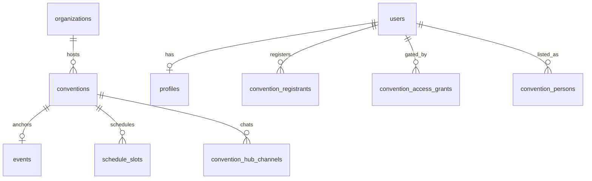

# Entity relationships

Schema split: `schema.ts` (platform core) + `convention-organizer-schema.ts` (Event Systems kit).

---

## Identity cluster

```
users 1──1 profiles
users 1──* sessions
users 1──1 user_settings
users 1──0..1 user_notification_preferences
users 1──* connections (requester | recipient)
users 1──* user_follows (follower | followee)
users 1──* blocks | mutes
```

**Invariant:** `profiles.user_id` is unique. Display defaults flow from profile; event-specific overrides live on participation rows.

---

## Org / group cluster

```
organizations 1──* organization_members (user_id, role)
organizations 1──* groups
organizations 1──* events (calendar)
organizations 1──* org_channels ──* org_channel_messages
organizations 1──* forum_categories ──* forum_threads ──* forum_posts

groups 1──* group_members
groups *──1 places (optional, for nearby)
groups 1──* forum_* (group-scoped)
```

**Scope email** (marketing lists): `scope_email_subscribers (scope_type, scope_id, email)` — not a separate list product per org.

---

## Convention cluster (attendee runtime)

```
organizations 1──* conventions
conventions *──1 events (anchor_event_id)
conventions 1──* schedule_slots
schedule_slots *──* schedule_slot_presenters (user_id)
schedule_slots *──* schedule_slot_staff (user_id, role_label)
conventions 1──* convention_volunteer_shifts ──* convention_volunteer_shift_signups

conventions 1──* convention_access_grants (user_id, role, attending_confirmed, paid_confirmed)
conventions 1──* convention_registrants (user_id, category_id, check-in fields)  // kit schema
conventions 1──* convention_persons (user_id optional) ──* convention_person_role_assignments
conventions 1──* convention_hub_channels ──* convention_hub_channel_messages
conventions 1──* convention_pins (user_id)
conventions 1──* convention_iso_listings
```

**Same human, three views:**

| Table | Meaning |
|-------|---------|
| `convention_registrants` | Registration / ticket / check-in state |
| `convention_access_grants` | Door app / attending gate / staff role rank |
| `convention_persons` | Organizer directory row (synced aggregate) |

Unique: `(convention_id, user_id)` on registrants when linked.

---

## Command bridge

```
conventions 1──* convention_command_grants
  (user_id, can_registration, can_staff_ops, can_scheduler)
```

Org `OWNER`/`ADMIN` bypass grants via `resolveConventionCommandAccess()` — not stored as rows.

---

## Calendar event (without full convention)

```
events 1──* event_rsvps (user_id)
events 1──* event_contributors
events 0..1 conventions (if multi-day program created)
```

Munch-scale events may never create a `conventions` row; identity rules still apply to RSVPs (`user_id`).

---

## Feed cluster

```
users 1──* feed_activities (actor)
feed_posts — global Discover source (not connection-scoped)
```

---

## Messaging clusters

| System | Tables | Scope |
|--------|--------|-------|
| **DMs** | `conversations`, `conversation_participants`, `messages` | User-to-user; folders (main, requests, iso) |
| **Org chat** | `org_channels`, `org_channel_messages`, replies, reactions | Org members |
| **Hub chat** | `convention_hub_channels`, `convention_hub_channel_messages` | Convention attendees with view access |
| **Organizer campaigns** | `convention_message_templates`, `convention_message_campaigns`, `convention_message_deliveries` | Email/SMS style ops (kit) |

Do not merge hub messages into org channels — different authorization and push rules.

---

## Commerce / vendors

```
users 1──0..1 vendor_profiles
vendor_profiles 1──* products
vendor_profiles 1──* vendor_external_listings (cached external SKUs)
```

---

## Notifications & captures

```
users 1──* notifications (type, payload jsonb)
platform_email_captures — append-only audit of sends/signups
push_subscriptions (user_id, endpoint) — Web Push endpoints
```

---

## Publish / external state

```
conventions 1──0..* ecke_publish_targets (hash, status, listing ids)
```

---

## ER diagram (core path)



---

## Read-model APIs (aggregates, not tables)

| API | Joins |
|-----|-------|
| `GET …/me/participation` | profile + registrant + access grant |
| `GET …/people` (organizer) | persons + role buckets + registrant map |
| `GET …/registrants` | registrants + category + `directoryPersonId` |

These reduce “three identities” in UI without merging tables.
