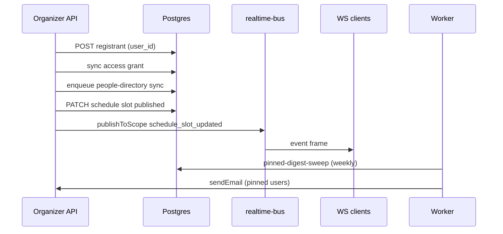

# Event workflows

Two related lifecycles: **calendar events** (`events`) and **conventions** (multi-day programs). Do not conflate them.

---

## Workflow A: Org calendar event (munch / class / ticketed night)

```
Organizer (org MODERATOR+)
  → POST /api/v1/events (or group-scoped create)
  → event row + optional contributors
  → public: GET /api/v1/events/:id, org hub Calendar tab

Attendee
  → PUT /api/v1/events/:eventId/rsvp { status }
  → optional: C2K_EVENT_RSVP_EMAIL → transactional email
  → optional: createNotification(event_rsvp_confirmed_virtual, …)

Optional anchor
  → Create convention linked via anchor_event_id for full program
```

**Tables touched:** `events`, `event_rsvps`, `event_contributors`, `notifications`.

**No convention row required** for simple munches.

---

## Workflow B: Convention program (Event Systems)

### B1 — Setup

```
Org ADMIN
  → convention row + settings JSON (venue, publicProgramListing, ECKE, dancecard, peopleHubTemplate)
  → anchor event (ticketing hero, contributors)
  → locations, tracks, tags (kit)
  → schedule_slots (draft → published)
```

Publish triggers: `publishToScope(convention:{id}:schedule, schedule_slot_*)`.

### B2 — Registration

```
Public (logged in)
  → POST /api/v1/public/conventions/:key/registrations
  → upsertConventionRegistrant() + syncAccessGrantOnRegistration()

Organizer
  → POST /api/v1/conventions/:key/registrants { userId }  (required)
  → upsertConventionRegistrant()
  → syncAccessGrantOnRegistration()  // attendingConfirmed
  → requestConventionPeopleDirectorySync()  // directory bucket 'registered'

Import path
  → POST …/registrants/import (email → resolveUserIdByEmail)
```

**Check-in (door):** `convention-organizer/door-routes.ts` — updates `checkedInAt`, timing.

### B3 — Staff & program assignments

```
Scheduler grant
  → CRUD schedule_slots, assign presenters/staff
  → volunteer shifts + signups
  → staff duties on slots

On staff assignment change
  → createNotification(convention_staff_assignment_updated)
  → publishToScope(…, schedule_staff_updated)
```

### B4 — Attendee runtime (public hub)

```
Viewer opens /conventions/:slug
  → GET convention + access evaluation
  → tabs: Schedule, Chat, Announcements, ISO, Dancecard, Gallery, …

Pin convention
  → POST …/pin (`convention-hub-ext-routes.ts`) → convention_pins (audience for digests + push)

Hub message
  → POST hub-channels/:id/messages
  → if ANNOUNCEMENTS|CHAT → push to pinned users (prefs + VAPID)
  → mark-read / unread-count for C214
```

### B5 — Organizer comms

```
Staff_ops grant
  → message templates + campaigns
  → deliveries table
  → test-send via mailer.ts
```

### B6 — Outbound marketing (ECKE)

```
Admin
  → POST /api/v1/organizer/ecke-publish/conventions/:slug/preview
  → POST …/publish → ecke_publish_targets + external Supabase/listing

Registration always on C2K — not on ECKE
```

---

## Workflow C: Social event side effects (cross-cutting)

| Trigger | Side effect |
|---------|-------------|
| Connection accept | `createNotification(connection_accepted)` |
| DM to non-connection | `dm_request` notification + requests folder |
| Feed post (global) | `feed_posts` insert + `emitActivity` → `feed_activities` (Following) |
| Virtual event window | Worker `virtual-event-reminders` → notifications |

---

## State machines (simplified)

### Registrant display status

Derived in `mapRegistrantFull` (`lib/convention-organizer/registration.ts`) from `registration_status` + `checked_in_at`:

- registered → checked_in (with early/late timing)

### Access grant

- `attendingConfirmed`, `paidConfirmed`, `role` ∈ ATTENDEE | STAFF | MODERATOR
- `pickAccessRoleOnRegistration` on sync — monotonic rank

### Gallery image

`moderation_status`: `pending` → `approved` (staff PATCH)

---

## Workflow interaction diagram



---

## Following feed (Phase 2 — shipped 2026-05-26)

Emit `feed_activities` on post create, connection accept, committed RSVP, presenter slot assign, convention pin, org join, org announcement, group join (`lib/feed-activities.ts`, BullMQ `c2k-feed-activities`). Read via `GET /api/v1/feed/following` with sub-filters and `/feed/following/counts`. Web: `/home` **Following** / **Discover** modes — see [`FETLIFE_CLASS_HOME.md`](../FETLIFE_CLASS_HOME.md).
