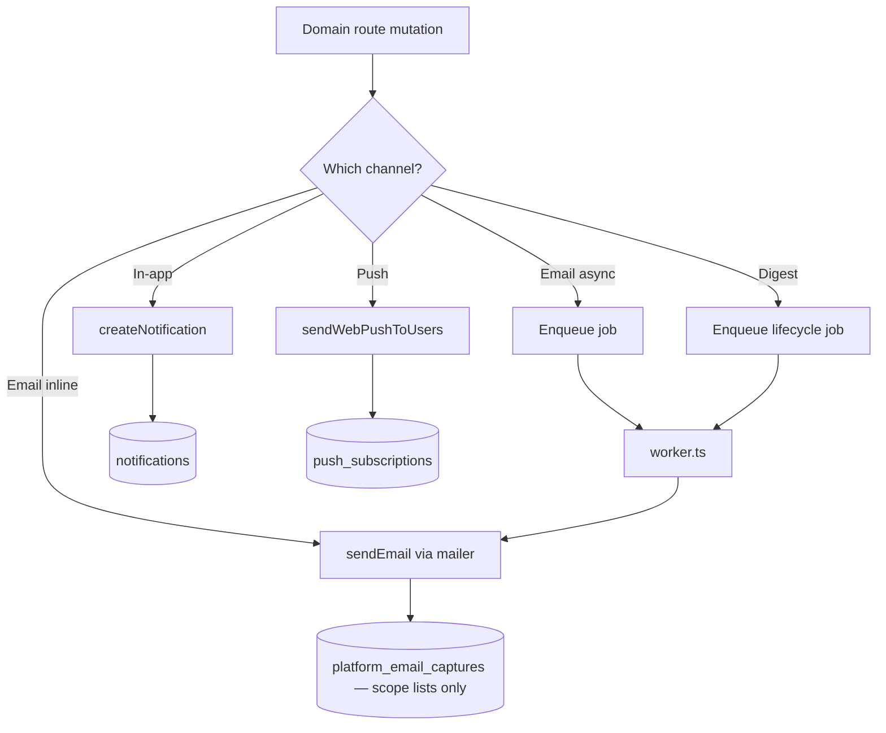

# Notification systems

Three delivery channels share preferences and capture tables but use **different pipelines**.

**Deploy / mail ops:** [DEPLOY_MAIL_K8S.md](../DEPLOY_MAIL_K8S.md) · staging smokes [REALTIME_SCALING.md](../REALTIME_SCALING.md) §4 · runbook [DEPLOYMENT_RUNBOOK.md](../DEPLOYMENT_RUNBOOK.md) §9 · VAPID dev [PUSH_VAPID_DEV.md](../PUSH_VAPID_DEV.md)

**Workers:** `packages/api/src/worker.ts` — digest and async notification jobs in [11-background-workers.md](./11-background-workers.md).

---

## Channel overview

| Channel | Transport | Persistence | Opt-out |
|---------|-----------|-------------|---------|
| **In-app** | DB row | `notifications` | Per-type UI (partial) |
| **Email** | SMTP / Resend (`lib/mailer.ts`) | Scope-list audit: `platform_email_captures` | Digests + list unsubscribe |
| **Web Push** | VAPID + `web-push` | `push_subscriptions` | `pushHubAnnouncements`, `pushHubChat` |

---

## In-app notifications

**Write API:** `createNotification(userId, type, payload)` — `lib/create-notification.ts`

Single insert into `notifications`. No queue — synchronous with request (except P0 moderation — see below).

**Read:** `GET /api/v1/notifications`, `POST …/:id/read`, `POST …/read-all` — registered in `ecosystem-stubs.ts`.

**Types:** Register in `packages/shared/src/notification-types.ts` (`NOTIFICATION_TYPES`) before routes/workers emit.

| type (examples) | Typical trigger |
|-----------------|-----------------|
| `connection_request`, `connection_accepted` | Social graph |
| `dm_request`, `new_message` | Messaging (`ecosystem-stubs.ts`) |
| `event_rsvp_confirmed_virtual`, `event_virtual_reminder_*` | Events; reminders via lifecycle worker |
| `schedule_conflict_detected` | Slot signup conflict (`conventions-routes.ts`) |
| `convention_staff_assignment_updated` | Staff on slot |
| `dancecard_booking_*`, `dancecard_reschedule_*`, `dancecard_scene_cancelled` | Booking state machine (`convention-dancecard-routes.ts`) |
| `org_announcement` | Org broadcast (`organizations.ts`) |
| `convention_participation_offer_*` | Participation offers |
| `moderation_*`, `p0_moderation_case_created`, `report_reviewed` | Moderation (`moderation-notify.ts`) |
| `profile_relationship_*` | Profile relationships |

**Web:** Notifications page API-backed when authenticated — no mock fallback.

**Async moderation:** P0 case creation enqueues `p0_report_notify` on `c2k-moderation`; `worker.ts` calls `notifyP0ModerationCaseCreated` (which uses `createNotification`).

---

## Email

**Core:** `lib/mailer.ts` — `mailTransportMode()`: `disabled` | `smtp` | `resend`; outbound via `sendEmail`.

**Transactional helpers:** `lib/transactional-email.ts` — RSVP confirm, test payloads; routes in `email-routes.ts` (`GET /api/v1/me/email/status`, test send).

**Digests (worker):** `org-digest-sweep`, `pinned-digest-sweep` on `c2k-lifecycle` → `sendEmail`.

**Marketing / scope lists:** `scope_email_subscribers`, broadcast, unsubscribe/confirm — `scope-email-routes.ts`; list events recorded via `capturePlatformEmail` → `platform_email_captures` (audit trail, not a copy of every transactional send).

**Participation offers:** `c2k-convention-participation-offer` queue → `sendParticipationOfferEmail`.

**Env, K8s secrets, Mailpit, BCC capture:** [DEPLOY_MAIL_K8S.md](../DEPLOY_MAIL_K8S.md) — do not duplicate env tables here.

---

## Web Push

**Status:** `GET /api/v1/me/push/status` · **Subscribe:** `POST /api/v1/me/push/subscribe` · **Send:** `lib/web-push-send.ts` · **Hub triggers:** `convention-hub-channels-routes.ts` (announcements + chat, per-channel prefs via `filterPinnedUsersForHubPush`).

**VAPID keys and local setup:** [PUSH_VAPID_DEV.md](../PUSH_VAPID_DEV.md). Kill switches: `C2K_PUSH_ANNOUNCEMENTS`, `C2K_PUSH_CHAT` (default on; set `false` to disable).

---

## Preferences table

`user_notification_preferences` (per user):

| Column | Default |
|--------|---------|
| `org_digest_email_weekly` | true |
| `pinned_digest_email_weekly` | true |
| `push_hub_announcements` | true |
| `push_hub_chat` | true |

API: `GET|PATCH /api/v1/me/notification-preferences` (`notification-preferences-routes.ts`)

---

## Notification flow diagram

---

## Scaling / reliability

| Risk | Mitigation |
|------|------------|
| `createNotification` in hot path | Acceptable at current volume; P0 already async via BullMQ |
| Digest duplicate sends | Job idempotency via BullMQ `jobId` repeat keys |
| Push 410/404 endpoints | Auto-delete subscription in `web-push-send` |
| Mail worker split | **Must** run `worker.ts` with same mail env as API |

---

## Planned (FetLife home)

Activity feed notifications may add types (`post_love`, `follow`) — prefer emitting to `feed_activities` + optional in-app row, not parallel email per love at scale.
