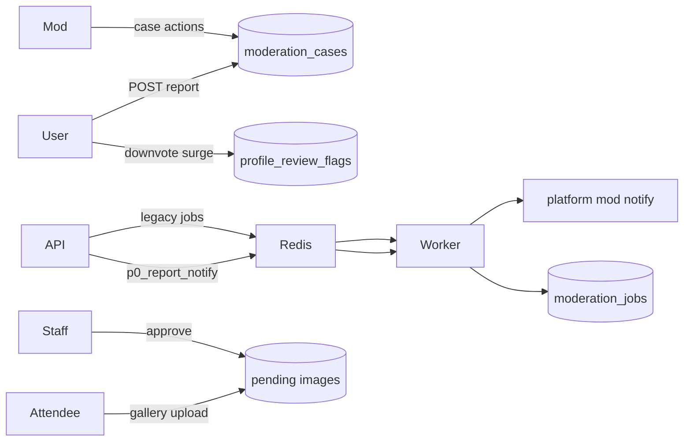

# Moderation systems

**Last updated:** 2026-06-06 (T&S-5 alpha — platform `/moderation/*` + scoped org/group/event mod)

Trust & safety spans **user reports**, **case queues**, **async jobs**, **gallery approval**, **profile review flags**, and **platform staff tools** — not a single “moderation service.”

**T&S program (post T&S-1+ detail):**

| Doc | Role |
|-----|------|
| [ADR-004-multi-tier-moderation.md](./ADR-004-multi-tier-moderation.md) | Tier model, rule-of-two, scope vs identity bans |
| [../audits/trust-and-safety/T&S-IMPLEMENTATION.md](../audits/trust-and-safety/T&S-IMPLEMENTATION.md) | Shipped waves, routes, verification |
| [../audits/trust-and-safety/MODERATOR_WORKFLOW.md](../audits/trust-and-safety/MODERATOR_WORKFLOW.md) | Operator playbook, queues, enforcement matrix |
| [../audits/trust-and-safety/POLICY_TAXONOMY.md](../audits/trust-and-safety/POLICY_TAXONOMY.md) | Enum mirror (`moderation-types.ts` in `@c2k/shared`) |
| [../MODERATION_WIREFRAME.md](../MODERATION_WIREFRAME.md) | Team walkthrough of shipped console |

This doc: runtime map (surfaces, route prefixes, org vs platform split) only.

---

## Report intake (T&S-1 canonical)

**Routes:** `moderation-ts-reports.ts`

| Method | Path | Auth |
|--------|------|------|
| `POST` | `/api/v1/moderation/reports` | Signed-in user; rate-limited (`reports`) |
| `GET` | `/api/v1/me/moderation/reports` | Reporter's own report history |

**Legacy delegate:** `POST /api/v1/reports` in `ecosystem-stubs.ts` — same `createReport()` intake with `category` → `policyReason` mapping; may call `notifyModerationReportEscalated` for org targets.

**Body (canonical):** `targetType`, `targetId`, `policyReason` (or legacy `category`), optional `note` / `body`. `policyReason: OTHER` requires `note`.

**Lib:** `moderation-ts-intake.ts` — `createReport()`, target validation (`moderation-ts-target-validate.ts`), content snapshot, queue/severity from `@c2k/shared` policy enums.

**Canonical target types** (stored on `moderation_cases.target_content_type`):  
`profile`, `profile_photo`, `post`, `comment`, `message`, `group`, `group_thread`, `group_reply`, `organization`, `org_chat_message`, `org_forum_thread`, `org_forum_reply`, `event`, `convention`, `vendor`, `presenter`, `media_asset`, `education_article`, `media_show`, `media_episode`, `convention_chat_message`, `conversation`, `platform` — plus legacy web aliases (`org_forum_post` → `org_forum_reply`, etc.).

**On create:**

1. Validate target exists and is reportable
2. Dedupe within 24h on `(reporter, targetType, targetId, policyReason)` — returns existing case with `duplicate: true`
3. Insert `moderation_cases`, `moderation_reports`, `moderation_queue_items`, `content_snapshots`, `moderation_events`
4. Link `media_assets.moderation_case_id` when target is `media_asset`
5. Mirror scoped reports to legacy `reports` inbox (org/group/event/convention)
6. P0 reasons → enqueue `p0_report_notify` on `c2k-moderation` (worker → `notifyP0ModerationCaseCreated`; inline fallback if Redis down)
7. Non-P0 org-scoped → `notifyOrgModerationNeeded` to org mods
8. Optional incident clustering attach (`incident-clustering.ts`)

Member UI: `ContentReportDialog` / `TsReportModal`; status in Settings → Support & reports.

Surface wiring inventory → [UGC_REPORT_SURFACE_AUDIT.md](../audits/trust-and-safety/UGC_REPORT_SURFACE_AUDIT.md).

---

## Platform staff console (T&S-1 admin)

**Routes:** `moderation-ts-admin.ts` (platform moderator via `requirePlatformModerator`)

| Method | Path | Purpose |
|--------|------|---------|
| `GET` | `/api/v1/moderation/dashboard` | Queue/case counts |
| `GET` | `/api/v1/moderation/queues` | Queue item list (`?queue=`) |
| `GET` | `/api/v1/moderation/cases` | Case list (`?queue=`, `?status=`) |
| `GET` | `/api/v1/moderation/cases/:caseId` | Case detail + snapshot + context links |
| `GET` | `/api/v1/moderation/cases/:caseId/media-content` | Stream media for review (logs `media.viewed_by_moderator`) |
| `PATCH` | `/api/v1/moderation/cases/:caseId` | Assign / status patch |
| `POST` | `/api/v1/moderation/cases/:caseId/notes` | Internal note |
| `POST` | `/api/v1/moderation/cases/:caseId/actions` | `mark_no_violation`, `close_duplicate`, `escalate`, `hide_content`, `keep_quarantined`, `remove_media`, `restore_media` |
| `GET` | `/api/v1/moderation/trust-safety/config` | Media policy + scanner config snapshot |
| `GET` / `POST` | `/api/v1/moderation/media-hash-list` | CSAM hash list admin |

**Lib:** `moderation-ts-admin.ts`, `moderation-action-execute.ts`, `media-mod-actions.ts`

**Related routes (legacy / complementary):**

- `moderation-reports.ts` — legacy `reports` inbox summary/list
- `moderation-actions.ts` — rule-of-two `moderation_actions` approvals
- `moderation-admin.ts` — platform staff CRUD
- `moderation-trust-summary.ts` — per-user trust summary + incident resolution
- `moderation-profile-flags.ts` — peer-reputation flag queue

**Policy:** [ADR-004-multi-tier-moderation.md](./ADR-004-multi-tier-moderation.md). **Ops:** [MODERATOR_WORKFLOW.md](../audits/trust-and-safety/MODERATOR_WORKFLOW.md). **UI:** `/moderation/*` web console.

**Tables:** `platform_staff`, `moderation_cases`, `moderation_reports`, `moderation_queue_items`, `moderation_events`, `content_snapshots`, `moderation_actions` + approvals, legacy `reports`, `moderation_jobs`.

---

## Legacy moderation jobs (async placeholder)

Separate from T&S case intake — generic job table for future ML/vendor hooks.

```
POST /api/v1/moderation/jobs { kind, payload }  (platform mod only)
  → INSERT moderation_jobs (status PENDING)
  → getModerationQueue().add('process', { jobId })
Worker
  → status COMPLETED (no analysis)
```

**Failure:** If Redis unavailable, job stays PENDING; API logs enqueue failure.

---

## Profile review flags

**Table:** `profile_review_flags` — tied to peer reputation downvote surges

**Routes:** `moderation-profile-flags.ts`

Workflow: flag created → staff PATCH resolution — links to `profile_reputation_events` discipline.

---

## Peer reputation & bans

| Mechanism | Table / lib |
|-----------|-------------|
| Peer +/- | `profile_reputation_events` |
| IP prefix registration | `users.registration_ip_prefix` |
| Strict one-profile-per-IP | `C2K_ONE_PROFILE_PER_IP_STRICT` |
| Identity ban | `identity_bans` — blocks auth |
| Scope ban | `scope_bans` — org/group chat + WS subscribe |

---

## Content moderation (convention gallery)

**Workflow:** attendee submit → `moderation_status: pending` → staff `PATCH …/gallery/:imageId/moderation` → `approved`

**List:** Public sees approved; moderators see `pendingCount`.

Routes: `convention-hub-ext-routes.ts`

---

## ISO board moderation

Convention staff can remove/restore `convention_iso_listings` — separate from gallery.

Routes: `convention-iso-routes.ts`, organizer `modules-routes.ts` ISO shim.

---

## Org/group moderation (tier 2)

**Routes:** `organization-moderation.ts`, `group-moderation.ts`, `event-moderation.ts`

- Scoped inbox: `GET .../organizations/:orgKey/reports` (and group/event mirrors)
- Hide: `POST .../forum/posts/:postId/hide`; chat message hide; thread lock/pin
- **Scope bans:** `scope_bans` — org/group only; optional `escalateToPlatform` on ban; enforced in REST **and** WS (`ws-subscribe-auth.ts`)
- Audit: `GET .../moderation/audit` (org ADMIN+)
- Hidden content filtered in forum GETs for non-mods

**Web:** Organizer → **Moderation** tab (`OrganizerOrgModerationPanel`, `OrganizerGroupModerationPanel`); org hub **Hide** for mods on forum posts.

---

## Blocks & mutes (user-level)

**Tables:** `blocks`, `mutes`

Affect DMs and discovery — enforced in message and people routes.

---

## Moderation architecture diagram



---

## Audit

**Table:** `moderation_audit_events` — append-only; `recordModerationAudit` from scoped org/group moderation routes. T&S cases use `moderation_events` timeline.

## Gaps / scaling

| Gap | Recommendation |
|-----|----------------|
| Legacy `moderation_jobs` / forum hooks complete without analysis | Integrate vendor API or human triage assist (humans still decide) |
| DM content in mod UI | Out of scope; reports/metadata only |
| Vendor shop mod tab | Link from org vendor tools; dedicated inbox later |
| Notification delivery | P0 uses worker queue; other paths still inline `createNotification` |

---

## Federation

Foreign instances should **not** PATCH moderation state directly — use signed webhook or shared report inbox with source instance id. Cross-instance principles → [13-interoperability-federation.md](./13-interoperability-federation.md).
