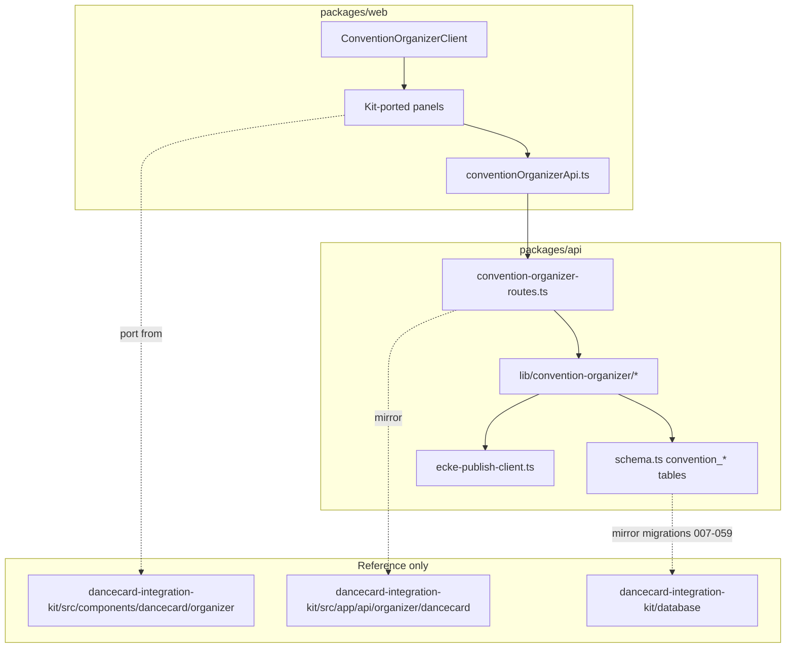

# Dancecard Organizer — Full Parity Plan (One Shot)

> **Stable copy in repo:** `docs/plans/dancecard-organizer-full-parity.plan.md` — use this if **View plan** in chat disappears. Identity follow-up: `docs/EVENT_SYSTEMS_IDENTITY.md`.

**Gold standard:** [`dancecard-integration-kit`](C:\Users\shkin\Desktop\eastcoast\dancecard-integration-kit) (688 files, 104 organizer API routes, 60 SQL migrations)

**Target shell:** [`ConventionOrganizerClient.tsx`](packages/web/src/components/organizer/convention/ConventionOrganizerClient.tsx) at `/organizer/orgs/:slug/conventions/:convSlug?tab=…`

**Strategy:** Add full kit organizer tables to C2K Postgres (user chose **full_kit** — overlap with existing C2K ISO/check-ins/announcements is OK; unify later). Port kit server libs + UI with a thin **API adapter layer** (`conventionOrganizerApi.ts`) mapping kit fetch paths to C2K Fastify routes. Do **not** copy Supabase client code wholesale.

---

## Phase 0 — Foundation (schema + shared infra)

### 0.1 Drizzle schema — new `convention_*` tables

Add to [`packages/api/src/db/schema.ts`](packages/api/src/db/schema.ts), mirroring kit migrations. Apply via `npm run db:push -w @c2k/api`.

| Kit migration | C2K table(s) | Used by |
|---------------|--------------|---------|
| 007 + 013 | `convention_locations` (hierarchy: `parent_id`, `kind`, accessibility, directions) | Venues, import, staff |
| 007 | `location_id` FK on `schedule_slots`, `convention_volunteer_shifts` | Venues, program, staff |
| 014 + 035 + 037 | `convention_maps`, `convention_map_pins` | Venues, settings |
| 016 | `convention_dm_requirements` | People/coverage |
| 010 | `convention_tracks`, `convention_tags`, `schedule_slot_tags` | Program, settings |
| 032 | Nullable `starts_at`/`ends_at` on `schedule_slots` | Program unscheduled library |
| 043 | `schedule_slot_audit` | Program audit drawer |
| 007 | `convention_import_batches`, `convention_import_rows`, `convention_schedule_audit_log`, `convention_schedule_change_notifications` | Import |
| 011 | `convention_persons`, `convention_person_role_assignments`, `schedule_slot_persons` | People roster |
| 012 + 018 + 036 + 041 | `convention_registration_categories`, `convention_registration_forms`, `convention_registration_questions`, `convention_registrants`, `convention_registrant_answers`, `convention_registrant_tags`, `convention_policy_documents`, `convention_registrant_policy_acceptances` | People/signups, settings |
| 015 + 027 | Extend `convention_volunteer_shifts` (status, claim, notes, `person_id`), `convention_shift_swap_requests` | People/staff/swaps |
| 022 | `convention_message_templates`, `convention_message_campaigns`, `convention_message_deliveries` | Messaging |
| 024–027 | `convention_registrant_inbound_secrets`, `convention_google_sheet_connections`, `convention_api_keys`, `convention_webhook_subscriptions`, `convention_webhook_deliveries`, `convention_audit_log`, `convention_embed_tokens`, `convention_event_entitlements` | Integrations |
| 027 + 038 + 042 | `convention_vetting_applications`, `convention_trusted_roles`, `convention_trusted_role_questions`, `convention_safety_incidents` | People/applications/incidents |
| 049 + 053 + 054 | `convention_iso_posts`, `convention_iso_interests`, `convention_iso_comments`, `convention_attendee_groups` (+ junction tables) | Integrations ISO/groups |
| 050 + 058 + 059 | `convention_session_feedback`, `convention_meal_periods`, `convention_meal_signups`, `convention_exhibitors` | Integrations modules |
| 021 | `convention_calendar_feed_tokens` | Exports |
| 028 | `organizer_notes` on `schedule_slots` | Program drawer |
| 009 | `is_published`, `visibility`, `is_frozen` on `schedule_slots` | Program lifecycle |

**Remove shortcut:** Deprecate `conventions.settings.venueRooms[]`; migrate existing values into `convention_locations` on first load.

**Keep C2K-native tables** (`dancecard_entries`, `convention_check_ins`, legacy ISO) — kit tables run in parallel until later unification.

### 0.2 Storage

Extend [`packages/api/src/routes/upload.ts`](packages/api/src/routes/upload.ts):

- `POST /api/v1/conventions/:key/maps/upload` — S3 key prefix `conventions/{id}/maps/`
- `POST /api/v1/conventions/:key/badges/logo/upload` — prefix `conventions/{id}/badges/`
- Signed/public URL helper in `packages/api/src/lib/convention-organizer/map-storage.ts` (port from kit `venueMapsSigned.ts`)

### 0.3 Server lib layer

Create `packages/api/src/lib/convention-organizer/` by porting kit `src/lib/dancecard/` organizer modules (Drizzle queries instead of Supabase):

- DTOs: `organizerProgramSlotDto.ts`, `organizerLocationDto.ts`, `organizerStaffShiftDto.ts`, `organizerRegistrantDto.ts`, `organizerEventDto.ts`
- Pure logic (copy verbatim): `venueSlotAssignment.ts`, `dmCoverageScanner.ts`, `locationHierarchyHelpers.ts`, `conflictScanner.ts`, `staffShiftConflicts.ts`, `organizerImport.ts`, `readinessSummary.ts`, `setupTasks.ts`, `eventPackExport.ts`
- Validation: `organizerSchemas.ts` (Zod, adapted to C2K types)

### 0.4 Web API client

Replace/expand [`conventionProgramApi.ts`](packages/web/src/lib/organizer/conventionProgramApi.ts) → **`conventionOrganizerApi.ts`** mirroring kit [`organizerApi.ts`](C:\Users\shkin\Desktop\eastcoast\dancecard-integration-kit\src\components\dancecard\organizer\organizerApi.ts):

- Base: `/api/v1/conventions/${slug}`
- GET cache + mutation invalidation keys per domain
- Bootstrap: `GET …/organizer/bootstrap` (event + slots + shifts + locations in one call)

### 0.5 Shared UI primitives

Port to `packages/web/src/components/organizer/dancecard/ui/`:

- `useConfirmDialog.tsx`, `OrganizerConfirmDialog.tsx`, `EntityPickerModal.tsx`, `DatetimeLocalField.tsx`, `OrganizerSectionTabs.tsx`

---

## Phase 1 — API routes (mirror kit 104 → C2K ~85 convention-scoped)

New file: **`packages/api/src/routes/convention-organizer-routes.ts`** registered from [`server.ts`](packages/api/src/server.ts). All routes auth-gated via existing `canManageConvention()`.

### Core / dashboard

| C2K route | Kit equivalent |
|-----------|----------------|
| `GET …/organizer/bootstrap` | `/bootstrap` |
| `GET …/readiness`, `GET …/readiness/summary` | readiness |
| `GET …/ops/live` | live ops |

### Program (extend existing slot routes + new)

| C2K route | Notes |
|-----------|-------|
| Extend `PATCH …/slots/:id` | Add `locationId`, `isPublished`, `visibility`, `isFrozen`, `organizerNotes`; clear `roomLabel` when `locationId` set |
| `POST …/slots/bulk` | Bulk create/update/delete |
| `GET …/program-conflicts` | Replace/augment `schedule-warnings` |
| `GET/PATCH …/slots/:id/audit`, `…/change-log`, `POST …/notify-schedule-change` | Audit + attendee notify |
| `GET/POST …/tracks`, `PATCH/DELETE …/tracks/:id` | Track taxonomy |
| `GET/POST …/tags`, `PATCH/DELETE …/tags/:id` | Tag taxonomy |

### Venues / locations / maps

| C2K route | Kit equivalent |
|-----------|----------------|
| `GET/POST …/locations` | `/locations` |
| `PATCH/DELETE …/locations/:locationId` | `/locations/[locationId]` |
| `GET/POST …/maps`, `POST …/maps/upload` | `/maps` |
| `PATCH/DELETE …/maps/:mapId`, `GET/PUT …/maps/:mapId/pins` | pins |
| `GET …/ical-busy-preview` | iCal overlay |

### Import

| C2K route | Kit equivalent |
|-----------|----------------|
| `GET/POST …/imports`, `GET/PATCH …/imports/:batchId` | import batches |
| `PUT …/imports/:batchId/mapping`, `POST …/imports/:batchId/publish` | workflow |
| `PATCH …/imports/:batchId/draft-rows/:rowId` | draft rows |
| `GET/POST …/google-sheets/*` | OAuth + preview (env: Google OAuth creds) |

Keep existing `POST …/slots/import-csv` as quick path; full import UI uses batch workflow.

### People

| C2K route | Kit equivalent |
|-----------|----------------|
| `GET/POST …/people`, `PATCH/DELETE …/people/:personId` | presenter roster |
| Full registrant stack: `…/registrants*`, `…/registration-categories`, `…/registration-form` | signups |
| Extend `…/volunteer-shifts` → rename alias `…/staff-shifts` | staff grid + `locationId`, status |
| `POST …/staff-shifts/assign-coverage` | DM auto-assign |
| `GET/POST …/dm-requirements`, `PATCH/DELETE …/:id` | coverage rules |
| `GET/PATCH …/shift-swaps/:id` | swap workflow |
| `GET …/volunteer-compliance` | compliance panel |
| `GET/PATCH …/vetting-applications/:id` | applications |
| `GET/POST …/trusted-roles` | trusted roles |
| `GET/POST …/safety-incidents` | incidents |
| `GET …/door/roster`, registrant check-in/QR routes | door mode |

### Messaging

| C2K route | Kit equivalent |
|-----------|----------------|
| `GET/POST …/message-templates`, `POST …/test-send` | templates |
| `GET/POST …/message-campaigns`, `POST …/:id/send` | campaigns via existing [`mailer.ts`](packages/api/src/lib/mailer.ts) (Resend/SMTP) |

### Settings support

| C2K route | Kit equivalent |
|-----------|----------------|
| `GET/PATCH …/policy-documents`, `…/policy-acceptances/stats` | policies |
| Extend `PATCH …/conventions/:key` | attendee guide JSON, badge layout, theme fields from kit `dancecard_events` |

### Exports

| C2K route | Kit equivalent |
|-----------|----------------|
| `GET …/exports/event-pack`, `…/sessions`, `…/conflict-report`, `…/presenter-directory`, `…/volunteer-call-sheet` | export hub |
| `GET …/registrants/export`, `…/policy-acceptances/export`, `…/media/no-photo-list` | CSV exports |
| `GET/POST …/calendar-feeds`, `DELETE …/calendar-feeds/:tokenId/revoke` | public ICS tokens |

### Integrations

| C2K route | Kit equivalent |
|-----------|----------------|
| `GET/PATCH …/event-entitlements` | module toggles |
| `GET/POST …/api-keys`, `…/webhooks`, `…/embed-tokens` | automation |
| `GET/PUT …/registrant-inbound-secret` | inbound webhook |
| `GET/PATCH …/iso`, `…/iso/comments` | kit ISO moderation (parallel to C2K ISO) |
| `GET/POST …/attendee-groups`, `…/session-feedback`, `…/meal-periods`, `…/exhibitors` | module panels |
| Keep existing [`ecke-publish-routes.ts`](packages/api/src/routes/ecke-publish-routes.ts) | outbound sync |

---

## Phase 2 — UI (port all kit organizer panels)

Directory: **`packages/web/src/components/organizer/dancecard/`** — port from kit, restyle tokens (`c2k-*` not `dc-*`), wire to `conventionOrganizerApi.ts`.

### Nav expansion

Update [`conventionNavConfig.ts`](packages/web/src/lib/organizer/conventionNavConfig.ts):

**People sub-tabs** (kit parity): `signups`, `roster`, `staff`, `applications`, `swaps`, `badges`, `coverage`, `incidents`, `compliance` (+ keep `volunteer` as alias or merge into staff)

**Settings panels** (kit parity): `guide`, `basics`, `branding`, `registration`, `policies`, `venue`, `program`, `attendee-guide`, `attendee-profile`, `advanced` (map from current `basics/logistics/documents/program/advanced`)

### Tab-by-tab UI deliverables

| Tab | Replace stub in | Port from kit |
|-----|-----------------|---------------|
| **dashboard** | `ConventionDashboardPanel.tsx` | `OrganizerEventDashboard.tsx`, `SetupTaskList.tsx`, `LiveOpsConsolePanel.tsx` |
| **program** | `ConventionProgramTabPanel.tsx` | `program/ProgramTab.tsx`, `ProgramScheduleGrid.tsx`, `ProgramListView.tsx`, `SessionDetailDrawer.tsx`, `ConflictDock.tsx`, `ScheduleChangeImpactModal.tsx` |
| **venues** | `VenueAvailabilityGrid.tsx` (rewrite) | Full `VenueAvailabilityGrid.tsx` + `VenueMapAssignPanel.tsx` + `VenueMapCanvas.tsx` |
| **import** | `ConventionImportPanel.tsx` | `ScheduleImportPanel.tsx`, `GoogleSheetsImportSection.tsx` |
| **people** | `ConventionPeopleHubPanel.tsx` | `PeopleHubPanel.tsx` + all 9 sub-panels |
| **messaging** | `ConventionMessagingPanel.tsx` | `MessagingPanel.tsx` |
| **settings** | `ConventionSettingsHubPanel.tsx` | `EventSettingsPanel.tsx` + all settings sections including `LocationsSettingsSection`, `MapsSettingsSection`, `TracksTagsSettingsSection`, `RegistrationSettingsSection`, `PoliciesAgreementsPanel`, `EventSetupWizard.tsx` |
| **exports** | `ConventionExportsPanel.tsx` | `ExportsHubPanel.tsx`, `IcalBusyPreviewPanel.tsx` |
| **integrations** | `ConventionIntegrationsPanel.tsx` | `IntegrationsPanel.tsx` + `IsoModerationPanel`, `AttendeeGroupsModerationPanel`, `SessionFeedbackConfigPanel`, `KitchenMealPanel`, `ExhibitorsOrganizerPanel` |

### Extra routes (kit has, add to C2K)

- `/organizer/orgs/:slug/conventions/:convSlug/door` — `DoorModePanel.tsx`
- `/organizer/orgs/:slug/conventions/:convSlug/print/schedule` — print schedule
- `/organizer/orgs/:slug/conventions/:convSlug/print/venue-signs` — venue signs
- `/organizer/orgs/:slug/conventions/:convSlug/assignments` — `AssignmentBoardPanel.tsx` (legacy tab)

### Shell upgrades

- Port `OrganizerCommandPalette.tsx` into existing [`OrganizerAppShell`](packages/web/src/components/organizer/) command palette
- Bootstrap load in `ConventionOrganizerClient` (single fetch, pass props to all tabs)
- Replace `window.confirm` with `useConfirmDialog` everywhere

### Deprecate

- Remove simplified [`venueSlotAssignment.ts`](packages/web/src/lib/organizer/venueSlotAssignment.ts) — use kit port in `packages/web/src/lib/organizer/dancecard/venueSlotAssignment.ts`
- Retire legacy [`ConventionProgramOrganizer.tsx`](packages/web/src/components/organizer/ConventionProgramOrganizer.tsx) on public convention Manage tab (redirect only)

---

## Phase 3 — ECKE publish bridge

Extend [`ecke-publish-payload.ts`](packages/api/src/lib/ecke-publish-payload.ts) + [`ecke-dancecard-slot-sync.ts`](packages/api/src/lib/ecke-dancecard-slot-sync.ts) + new `ecke-dancecard-location-sync.ts`:

1. Upsert `dancecard_locations` from `convention_locations` (stable C2K UUID as ECKE id)
2. Map `schedule_slots.location_id` → ECKE `location_id`; fallback `room_label` → `room`
3. Sync `convention_volunteer_shifts.location_id` + status fields → `dancecard_staff_shifts`
4. Sync tracks/tags, registrants (optional phase if ECKE tables exist)

Update [`ECKE_C2K_ENTITY_MAP.md`](docs/ECKE_C2K_ENTITY_MAP.md) with location + registrant mappings.

---

## Phase 4 — Verification

- `npm run typecheck` (web + api)
- API tests for: locations CRUD, slot locationId assign, import batch publish, DM coverage gaps, publish payload with locations
- Manual smoke on `demo-east-collective` / `seed-demo-con-program`:
  - Venues: add location → grid column → drag slot → map pin assign → DM banner
  - Program: unscheduled library → place on grid → conflict dock → audit log
  - People: registrant CRUD → staff shift with location → coverage gap → assign coverage
  - Import: CSV batch → mapping → publish
  - Messaging: template → test send
  - Integrations: embed token mint → ECKE publish with locations
- Update [`DANCECARD_ORGANIZER_PARITY.md`](docs/DANCECARD_ORGANIZER_PARITY.md) checklist to all-green

---

## Execution order (single pass, ~12 work blocks)

Execute strictly in dependency order within one branch; each block is committable but nothing ships until all blocks complete.

1. **Schema block** — all `convention_*` tables + FKs + `db:push`
2. **Lib block** — `packages/api/src/lib/convention-organizer/*` + web `lib/organizer/dancecard/*`
3. **API block A** — bootstrap, locations, maps, tracks/tags, slot extensions
4. **API block B** — import batches, people/registrants, staff/DM/swaps
5. **API block C** — messaging, exports, integrations, policies, modules
6. **API adapter block** — `conventionOrganizerApi.ts` covering all routes
7. **UI primitives block** — confirm dialog, section tabs, entity picker
8. **UI tab block A** — dashboard, program (+ drawer), venues (+ maps)
9. **UI tab block B** — import, people (all 9 sub-tabs)
10. **UI tab block C** — messaging, settings (all panels), exports, integrations
11. **UI extra block** — door, print, assignments, command palette
12. **Publish + docs block** — ECKE location sync, parity doc, FEATURE_REGISTRY

---

## Key files to create/modify

| Action | Path |
|--------|------|
| Create | `packages/api/src/routes/convention-organizer-routes.ts` |
| Create | `packages/api/src/lib/convention-organizer/` (~25 files) |
| Modify | `packages/api/src/db/schema.ts` (+~35 tables) |
| Modify | `packages/api/src/routes/conventions-routes.ts` (slot PATCH extensions) |
| Modify | `packages/api/src/lib/ecke-publish-payload.ts` |
| Create | `packages/web/src/lib/organizer/conventionOrganizerApi.ts` |
| Create | `packages/web/src/components/organizer/dancecard/` (~90 files ported) |
| Modify | `packages/web/src/components/organizer/convention/ConventionOrganizerClient.tsx` |
| Modify | `packages/web/src/lib/organizer/conventionNavConfig.ts` |
| Modify | `docs/DANCECARD_ORGANIZER_PARITY.md` |

---

## Risks and mitigations

| Risk | Mitigation |
|------|------------|
| Scope (~200 new files) | Copy kit files verbatim first, then mechanical find-replace API paths + CSS tokens |
| Google Sheets OAuth | Gate behind env vars; UI shows setup instructions when unset |
| Parallel ISO/check-in systems | User chose full_kit; document overlap in parity doc; no deletion of C2K-native tables |
| S3 not configured locally | Maps upload shows clear error; grid works without maps |
| ECKE Supabase schema drift | Location sync uses same UUID upsert pattern as existing slot sync |
