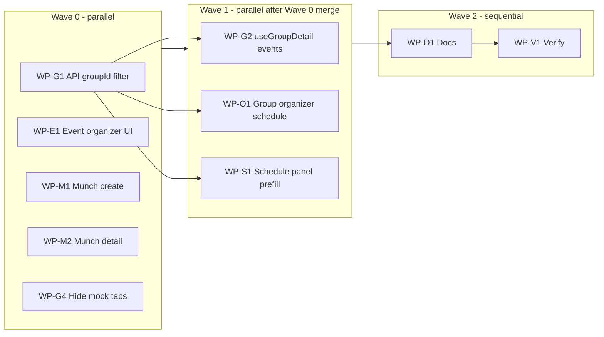

# Groups & single-day events — parallel implementation plan

> **Use this doc** to launch multiple subagents in one turn. Each work package (WP) lists **exclusive file ownership**, acceptance criteria, and a **copy-paste prompt**. Do **not** assign two agents the same files in the same wave.

## Principles (non-negotiable)

1. **Extend, don’t clone** — No `/api/v1/groups/:id/organizer/*` kit parity; no new `munch_*` tables ([`EXTEND_BEFORE_ADD.md`](../EXTEND_BEFORE_ADD.md)).
2. **Conventions stay gold standard** — Full Event Systems only when `conventions` + `anchor_event_id` / “full program” create path.
3. **Munches = `events` row** — UI flags only (ADR Phase 7); RSVP via existing `event_rsvps`.
4. **One calendar spine** — `events` + optional `conventions` + `schedule_slots`; group events use `events.group_id`.

## Dependency graph



**Same-wave conflict rule:** WP-O1 and WP-S1 both touch schedule UX — prefer **one agent for O1+S1** if running Wave 1 with only two slots; otherwise O1 owns `OrganizerGroupClient.tsx`, S1 owns `OrganizerSchedulePanel.tsx` only.

---

## Wave 0 — run in parallel (no cross-WP file overlap)

### WP-G1 — API: filter events by group

| Field | Value |
|-------|--------|
| **Owns** | `packages/api/src/routes/ecosystem-stubs.ts` (GET `/api/v1/events` handler only) |
| **Must not touch** | `convention-organizer-*`, web package, schema (unless filter needs no migration) |
| **Depends on** | None |

**Task**

- Add optional query `groupId` (UUID) to `GET /api/v1/events`, same pattern as existing `organizationId` filter (~line 591).
- Validate UUID; `where(eq(schema.events.groupId, groupId))`.
- Document in handler comment; no new route file required.

**Acceptance**

- `GET /api/v1/events?groupId=<uuid>` returns only that group’s events, ordered by `startsAt` desc.
- Existing `organizationId` filter still works; both filters together AND if both provided.
- `npm run typecheck -w @c2k/api` passes.

**Agent prompt**

```
Repo: c:\Users\shkin\Desktop\coast-to-coast-kink
WP-G1 only. READ docs/EXTEND_BEFORE_ADD.md.

In packages/api/src/routes/ecosystem-stubs.ts, extend GET /api/v1/events to accept optional query groupId (UUID). Filter events where events.group_id matches. Mirror organizationId filter style. Do not add new tables or routes. Run api typecheck. Return: diff summary + example curl.
```

---

### WP-E1 — Web: standalone event organizer (replace stub)

| Field | Value |
|-------|--------|
| **Owns** | `packages/web/src/app/organizer/orgs/[slug]/events/[eventId]/OrganizerOrgEventPageClient.tsx`, **new** `packages/web/src/components/organizer/EventOrganizerPanel.tsx` (or `event/EventOrganizerPanel.tsx`) |
| **May read** | `packages/web/src/app/events/[id]/` (extract patterns, do not refactor public page heavily) |
| **Must not touch** | `dancecard/organizer/*`, `ConventionDancecardOrganizerClient`, API routes |

**Task**

- Replace stub with real **EventOrganizerPanel**: host settings (reuse fields from public event edit), RSVP/attendees section (existing API hooks), link to public event, link to **Manage program** → `/organizer/orgs/:slug/conventions/:convSlug` only when event has linked convention (read from GET event or program endpoint).
- Keep `OrganizerAppShell` with `scopeKind="org"`.
- No Dancecard imports.

**Acceptance**

- `/organizer/orgs/:slug/events/:eventId` shows editable organizer surface for UUID events (not mock ids).
- No new API routes; use existing `GET/PATCH /api/v1/events/:id`, RSVP endpoints.
- `npm run typecheck -w @c2k/web` passes.

**Agent prompt**

```
Repo: c:\Users\shkin\Desktop\coast-to-coast-kink
WP-E1 only. READ docs/EVENT_SYSTEMS_IDENTITY.md (munch/convention scope) and docs/ORGANIZER_CONSOLE.md.

Replace OrganizerOrgEventPageClient stub with EventOrganizerPanel: host edit + RSVP admin using existing /api/v1/events APIs. Do NOT import dancecard/organizer kit. Add "Manage program" link only when convention anchor exists. New component under packages/web/src/components/organizer/. Typecheck web. Return: files changed + manual test URLs.
```

---

### WP-M1 — Web: munch defaults on create

| Field | Value |
|-------|--------|
| **Owns** | `packages/web/src/components/CreateFlowModal.tsx` (or path from grep CreateFlowModal) |
| **Must not touch** | API, convention organizer |

**Task**

- When user selects category **Munch** (or `?create=event&kind=munch` if you add query): default shorter duration, `newcomerFriendly`, hide/disable “full program” / convention creation branch, set `category: 'Munch'`.
- Align with ADR: no convention unless explicit opt-in (keep opt-in if already exists).

**Acceptance**

- Creating a munch does not POST `/conventions` unless user explicitly enables full program.
- Typecheck web passes.

**Agent prompt**

```
Repo: c:\Users\shkin\Desktop\coast-to-coast-kink
WP-M1 only. READ docs/EVENT_SYSTEMS_IDENTITY.md Phase 7.

In CreateFlowModal, when category is Munch: apply sensible defaults and do not default to full program / POST conventions. Hide or gate full-program UI for munch. Extend only; no new tables. Typecheck web. Return behavior summary.
```

---

### WP-M2 — Web: simplified munch event detail

| Field | Value |
|-------|--------|
| **Owns** | `packages/web/src/app/events/[id]/page.tsx` and **new** small helper e.g. `packages/web/src/lib/event/eventKind.ts` if needed |
| **Must not touch** | CreateFlowModal (M1), organizer stub (E1) |

**Task**

- Detect munch: `category === 'Munch'` (or shared helper).
- For munch + no `hasProgram`: show tabs **Overview**, **Attendees**, **Safety** only (hide Matchmaker, Schedule, Vendors, Discussion unless already API-required).
- Keep UUID API path behavior.

**Acceptance**

- Munch UUID event shows reduced tab set; convention-backed event still shows Schedule when `hasProgram`.
- Typecheck web passes.

**Agent prompt**

```
Repo: c:\Users\shkin\Desktop\coast-to-coast-kink
WP-M2 only. READ docs/EVENT_SYSTEMS_IDENTITY.md.

On packages/web/src/app/events/[id]/page.tsx, when category is Munch and no program: simplify visible tabs to Overview, Attendees, Safety. Do not remove API integrations. Optional tiny helper in lib/event/. Typecheck web. Return tab matrix for munch vs normal event.
```

---

### WP-G4 — Web: hide mock-only group tabs (API-backed groups)

| Field | Value |
|-------|--------|
| **Owns** | `packages/web/src/app/groups/[id]/page.tsx`, `packages/web/src/components/group/GroupCommunityShell.tsx` (tab list only) |
| **Must not touch** | `useGroupDetail.ts` (G2), API |

**Task**

- When `apiBacked` (UUID group): **remove or hide** tabs **Channels**, **Resources**, **Photos** (no API yet — per audit).
- Keep **Forums**, **Events**, **Members**, **Feedback** (election).
- Add short empty-state on Events if G2 not merged yet: “Events loading…” or link to organizer.

**Acceptance**

- UUID group page does not show mock Channels/Resources/Photos.
- Mock slug groups unchanged (demo path).
- Typecheck web passes.

**Agent prompt**

```
Repo: c:\Users\shkin\Desktop\coast-to-coast-kink
WP-G4 only.

For API-backed groups (UUID) on groups/[id]/page.tsx: hide Channels, Resources, Photos tabs (mock-only). Keep Forums, Events, Members, Feedback. Do not change useGroupDetail.ts. Typecheck web. Return tab list before/after.
```

---

## Wave 1 — run in parallel after Wave 0 is merged to main/working branch

### WP-G2 — Web: load group events from API

| Field | Value |
|-------|--------|
| **Owns** | `packages/web/src/hooks/useGroupDetail.ts` |
| **Depends on** | WP-G1 (`GET /events?groupId=`) |
| **Must not touch** | `ecosystem-stubs.ts` |

**Task**

- When `apiBacked` and group UUID known: fetch `GET /api/v1/events?groupId=<id>`, map to existing `events` shape used by group page / `EventCard`.
- Remove intentional `return []` for apiBacked events (~line 192–195).

**Acceptance**

- UUID group **Events** tab lists real events.
- Loading/error states; no mock backfill on empty 200.

**Agent prompt**

```
Repo: c:\Users\shkin\Desktop\coast-to-coast-kink
WP-G2 only. Requires GET /api/v1/events?groupId= from WP-G1.

In useGroupDetail.ts, for apiBacked groups fetch events from API and populate events list. Handle loading/error. No mock on empty 200. Typecheck web. Return hook behavior summary.
```

---

### WP-O1 + WP-S1 — Web: group organizer schedule (combine if one agent)

| Field | Value |
|-------|--------|
| **O1 owns** | `packages/web/src/app/organizer/groups/[id]/OrganizerGroupClient.tsx` |
| **S1 owns** | `packages/web/src/components/organizer/OrganizerSchedulePanel.tsx` |
| **Depends on** | WP-G1 (and ideally G2 for shared fetch helper optional) |

**Task O1**

- Fetch group events via `GET /api/v1/events?groupId=`; pass to `OrganizerSchedulePanel` as `events={...}` (conventions stay `[]` unless group-hosted conventions exist later).
- Gate mod+ same as today.

**Task S1**

- For `scopeKind === 'group'`: set `createEventHref` to `/events?create=event&prefillGroupId=<groupId>` (and `prefillOrgId` from `parentOrganization` if available on group detail).
- Add create button in group schedule panel (parity with org).

**Acceptance**

- `/organizer/groups/:id?tab=schedule` shows event rows with Manage → `/organizer/orgs/:orgSlug/events/:id` or public event if no org slug.
- Create event link pre-fills group (extend CreateFlowModal to accept `prefillGroupId` if missing — **only S1 or a dedicated WP-M3**; if CreateFlowModal owned by M1, coordinate: M1 adds query param, S1 uses it).

**Note:** If `prefillGroupId` not in CreateFlowModal yet, **Wave 1 agent** may add minimal support in `CreateFlowModal.tsx` **only if M1 merged** — otherwise split **WP-M3** in Wave 1 for prefillGroupId alone.

**Agent prompt (combined O1+S1)**

```
Repo: c:\Users\shkin\Desktop\coast-to-coast-kink
WP-O1 + WP-S1. Requires GET /events?groupId=.

1) OrganizerGroupClient: fetch group events, pass to OrganizerSchedulePanel.
2) OrganizerSchedulePanel: for scopeKind group, show Create event link with prefillGroupId (and prefillOrgId when parent org exists).
3) If CreateFlowModal lacks prefillGroupId, add minimal support (POST events with groupId) — small change only in CreateFlowModal.

Do not touch dancecard organizer. Typecheck web. Return manual test steps.
```

---

## Wave 2 — after Wave 1

### WP-D1 — Docs sync

| Field | Value |
|-------|--------|
| **Owns** | `docs/FEATURE_REGISTRY.md`, `docs/BACKLOG_QUEUE.md`, `docs/ORGANIZER_CONSOLE.md` (group schedule + event manager rows only) |
| **Must not touch** | application code |

**Task**

- Update route statuses: event organizer ○→✓, group schedule stub→✓, munch template note.
- Append BACKLOG_QUEUE rows **G301–G305** (see below) as `done` or `pending` matching reality.

**Agent prompt**

```
Repo: c:\Users\shkin\Desktop\coast-to-coast-kink
WP-D1 docs only. Update FEATURE_REGISTRY, ORGANIZER_CONSOLE, BACKLOG_QUEUE for groups/events scope work completed in WPs G1–S1. No code changes.
```

---

### WP-V1 — Verification

| Field | Value |
|-------|--------|
| **Owns** | `docs/SMOKE_CHECKLIST.md` (add section only) or comment in this plan |

**Commands**

```bash
npm run typecheck
# Optional if DB up:
node scripts/audit-command-bridge.mjs
```

**Manual smoke (15 min)**

| # | Steps |
|---|--------|
| 1 | UUID group public: Forums + Events list; no Channels tab |
| 2 | `/organizer/groups/:id?tab=schedule` — events table + create |
| 3 | Create munch → no convention; public event simplified tabs |
| 4 | `/organizer/orgs/:slug/events/:eventId` — host edit + RSVPs |
| 5 | Event with convention anchor — “Manage program” opens convention kit |

---

## BACKLOG_QUEUE IDs (add when starting)

| ID | Wave | Title |
|----|------|-------|
| G301 | 0 | `GET /events?groupId=` filter |
| G302 | 0 | Event organizer panel (replace stub) |
| G303 | 0 | Munch create + detail template |
| G304 | 0 | Hide mock group tabs (Channels/Resources/Photos) |
| G305 | 1 | Group events API + organizer schedule tab |
| G306 | 2 | Docs + smoke for groups/events scope |

Mark `in_progress` one WP at a time if using autonomous loop; for **parallel subagents**, use branch-per-WP or merge Wave 0 before Wave 1.

---

## Explicitly out of scope (do not assign)

| Item | Reason |
|------|--------|
| Clone convention command bridge to groups | ADR + audit |
| `convention_command_grants` for groups | Defer until team split needed |
| Group chat API / Channels | Hide until org-parity chat scoped |
| C212–C215, O75–O77 | Convention polish backlog |
| Identity Phase 3–5 (my participation API) | Separate track; not blocking MVP |
| Delete orphaned `organizer/convention/panels` | Cleanup PR; avoid merge conflicts with feature WPs |

---

## Launching parallel subagents (parent checklist)

1. **Wave 0:** Spawn up to **5** agents with prompts WP-G1, WP-E1, WP-M1, WP-M2, WP-G4 (one prompt each).
2. **Merge / rebase** Wave 0 branches; resolve only `CreateFlowModal` if M1 and O1+S1 both touched it (prefer M1 first, then S1 prefill).
3. **Wave 1:** Spawn **1–2** agents (G2; O1+S1 combined).
4. **Wave 2:** Spawn D1 then V1 (or single doc+verify agent).

**Subagent type:** `generalPurpose` for implementation; `explore` only if re-auditing before Wave 2.

---

## Success criteria (program level)

- Groups: API-backed **Events** on public + organizer schedule; no mock Channels for UUID groups.
- Events: Organizer stub replaced; munches use simplified UX without conventions by default.
- Conventions: Unchanged; still the only full Event Systems surface.
- Zero new calendar/forum tables; FEATURE_REGISTRY reflects shipped scope.
