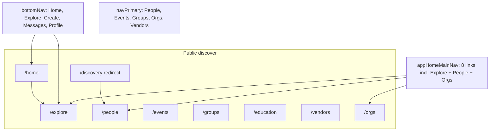

# Prelaunch audit 04 — Frontend routes & UI cleanup

**Audit ID:** 04-frontend-ui-cleanup  
**Date:** 2026-06-04  
**Wave 4 remediation (2026-06-04):** Command Bridge export/messaging/import/door/integrations controls aligned with [`docs/UI_CLEANUP_REGISTRY.md`](../../UI_CLEANUP_REGISTRY.md) Wave 4 table.  
**Scope:** Public and organizer-facing web routes — dead buttons, placeholder UI, fake features, broken links, duplicated navigation, query-param bugs, misleading labels, dev-only copy, raw internal terminology, unsupported publish/bulk actions, raw JSON to users, snake_case enum labels, broken empty states, reputation/default score issues, future features presented as active.

**Focus routes:** `/`, `/home`, `/explore`, `/events`, `/groups`, `/education`, `/vendors`, `/people`, `/orgs` (organizations directory — no `/organizations` route), `/orgs/new`, `/orgs/:slug`, `/organizer/orgs/:slug`, `/organizer/orgs/:slug/conventions/:convSlug`, `/organizer/orgs/:slug/conventions/:convSlug/door`.

**Method:** Static read-only review of `packages/web/src/router.tsx`, `site.config.ts`, route pages, discover shells, organizer command bridge, navigation chrome, and cross-reference with [`docs/UI_CLEANUP_REGISTRY.md`](../../UI_CLEANUP_REGISTRY.md), [`docs/UX_WALKTHROUGH_AUDIT.md`](../../UX_WALKTHROUGH_AUDIT.md), [`docs/FEATURE_REGISTRY.md`](../../FEATURE_REGISTRY.md). **No fixes applied.**

**Primary sources:** `packages/web/src/app/**`, `packages/web/src/components/**`, `packages/web/src/config/site.config.ts`, `packages/web/src/lib/explore-hub.ts`, `packages/web/src/hooks/useHomeSurface.ts`, `packages/web/src/hooks/useApiPeopleSearch.ts`.

---

## 1. Executive summary

The C2K web app ships a **hybrid API + mock/demo surface**. Core organizer flows (org hub, convention command bridge, door mode, registration) are largely wired, but **many discover and home rails still show fabricated social proof, progress, and counts** — including to **signed-in users when live APIs return empty arrays**.

**Top production risks for user trust:**

1. **Fake data presented as live** — landing “Real people. Real participation.” activity, home right-rail fallbacks (`HomeFeedDiscoverRail`), education progress ring (67%), explore category counts (“1.2K”), groups “friends here” hash for authenticated users.
2. **Dead or misleading actions** — Follow/Save/Sync calendar/Join group buttons that navigate only; ECKE publish when bridge disconnected; disabled Invite member shown as primary CTA.
3. **Navigation & query-param drift** — Landing search → `/discovery` → `/people` (not `/explore`); broken `?tab=discover` on events links; `?continue=1` on education ignored; door panel **Exit** link falls back to wrong path without workspace context.
4. **Reputation inconsistencies** — `trustScore ?? 0` hides unrated people; org directory shows `— (0)` while hub suppresses until 3 reviews; home “Trust” sidebar is profile completion, not reputation.

**Readiness:** Safe for **internal/staging alpha** with demo env flags documented. **Not pilot-ready** until P0 fake-data rails are removed or honestly labeled, door exit link fixed, and discover/education dead buttons gated.

---

## 2. Blockers

| ID | Issue | Evidence |
|----|-------|----------|
| B-04-1 | **Signed-in home feed shows hardcoded fake discovery rail when API empty** | `HomeFeedDiscoverRail.tsx` L60–92 — default upcoming events, trending, spotlight (`LeatherMama`, `Camp Crucible 2025`, Follow affordance) used when props empty; rendered from `HomePageClient.tsx` for authenticated 3-column shell |
| B-04-2 | **Landing markets fabricated activity as real** | `LandingCommunityProof.tsx`, `LandingDiscoveryPreview.tsx` — static `SAMPLE_ACTIVITY` under “Real people. Real participation.”; preview cards from `mockEvents` / `mockPeople` |
| B-04-3 | **Education hub shows fake progress/stats to all users** | `EducationRightRail.tsx` L64–79 — static 67% ring, Completed 12 / In progress 3 / Saved 8; hardcoded Trending + Top Educators + Follow buttons with no handlers |
| B-04-4 | **Groups discover shows fake “friends here” for authenticated users** | `GroupsDiscoverPage.tsx` L347–350 — `mockFriendsHereCount(g.id)` when `!isFallback && isAuthenticated` |
| B-04-5 | **Door mode in-panel Exit link wrong without workspace provider** | `door/page.tsx` has correct `← Exit door mode` via `organizerConventionBasePath`; `DoorModePanel.tsx` L35–36, L216–221 uses `useOrganizerTabHref` → fallback `/organizer/conventions/:slug?tab=people&peopleTab=signups` (door route is outside `OrganizerWorkspaceProvider`) |

---

## 3. High-risk issues

| ID | Issue | Notes |
|----|-------|-------|
| H-04-1 | **Explore popular category counts are fabricated** | `explore-hub.ts` L29–36 — comment “Demo counts until category aggregates exist”; links include `/events?tab=discover` which events page does not parse |
| H-04-2 | **People suggestions fall back to mock when API returns zero** | `FindPeopleDiscoverPage.tsx` — `suggestedPool` uses `mockPeople`; right rail “Suggested for you” without disclaimer |
| H-04-3 | **`trustScore ?? 0` treats missing scores as zero** | `useApiPeopleSearch.ts` — filters/sort/rings mis-rank unrated members |
| H-04-4 | **ECKE publish UI active when bridge disconnected** | `EckePublishStub.tsx`, `ConventionPublishActions.tsx` — Preview/Publish enabled; C2K listing can flip while ECKE sync fails; internal copy “ECKE events directory (Supabase)” |
| H-04-5 | **Org schedule tab omits door check-in links despite checklist logic** | `OrganizerOrgClient.tsx` computes `showDoorChecklist`; `OrganizerOrgSchedulePanel.tsx` L127–133 never passes `showDoorLinks` to `ProgramListSection` (defaults `false`) |
| H-04-6 | **Invite member — visible disabled primary action** | `people-ui.tsx`, `OrganizerOrgPeoplePanel.tsx` — “Invitations are not available yet” |
| H-04-7 | **Education mock strips when API returns empty (authenticated)** | `EducationDiscoverPage.tsx` — falls back to `pickTrendingFromMock` without demo banner unless `VITE_HOME_DEMO_FALLBACK` |
| H-04-8 | **Vendor detail falls back to mock shop on API miss** | `vendors/[id]/page.tsx` — `getMockVendorById` can render wrong storefront for arbitrary slug |
| H-04-9 | **Landing mobile search routes to people-only directory** | `LandingMobileSearch.tsx` → `/discovery?q=` → `DiscoveryRoute.tsx` → `/people` — placeholder says “events, groups, presenters” |
| H-04-10 | **MockDataBanner is DEV-only** | `MockDataBanner.tsx` — `VITE_HOME_DEMO_FALLBACK` / sample mode never disclosed in production builds |

---

## 4. Medium-risk issues

| ID | Issue | Notes |
|----|-------|-------|
| M-04-1 | **Duplicated / divergent navigation models** | `site.config.ts` — `appHomeMainNav`, `appTopNav`, `bottomNav`, `navPrimary`, `CommunityNavBar` / `FeedScopeTabs` overlap Home/Explore/Events/People; `/discovery` vs `/people` vs `/explore` |
| M-04-2 | **Signed-in home loses tab strip for browse verticals** | `HomePageClient.tsx` — `apiBackedHome` users rely on header only; Events/Groups/Vendors/Education need manual `?tab=` |
| M-04-3 | **FeedScopeTabs “Organizers” tab → Events** | Mislabel; filter icon `aria-label="Filters"` links to `/people` |
| M-04-4 | **Groups personal nav tabs without backends** | `GroupsPersonalLibraryPage.tsx` — `invitations`, `posts`, `saved`, `archived` always empty; nav presents as live |
| M-04-5 | **“Join group” on discover cards is navigation only** | `GroupDiscoverListCard.tsx` — does not join |
| M-04-6 | **Events “For You” tab lacks personalization signal** | `events-page-utils.ts` — re-sorts on often-absent `mutualGoingCount` |
| M-04-7 | **Dead / coming-soon buttons look clickable** | Events “Sync to calendar” (no handler); Education Follow/Save; Events C2K+ → `/settings` |
| M-04-8 | **Events filter fake counts** | `EventFiltersPanel.tsx` `DISPLAY_COUNTS` fallback; `EventsRightRail.tsx` hardcoded location counts |
| M-04-9 | **Explore Filters button is informational only** | `ExploreHubHeader.tsx` — toggles search tips, not filters |
| M-04-10 | **Org hub query-param sync gaps** | `OrgHubClient.tsx` — stale `?tab=` on invalid tab; forum `categoryId` read but not written |
| M-04-11 | **Org directory misleading filter chips** | `org-directory-utils.ts` — “Nearby” uses bio region; “Recently active” uses review/member count |
| M-04-12 | **Reputation display split** | `OrgDirectoryCard.tsx` vs `orgHubMeta.ts` — 0-review rating on directory; hub waits for 3 reviews |
| M-04-13 | **Home dev/error strings user-visible** | `HomePageClient.tsx` — “Database mode is off”, `HTTP ${status}`, seed references |
| M-04-14 | **Home “Trust” sidebar is profile completion** | `HomeDashboardLeftRail.tsx` — mislabeled vs reputation |
| M-04-15 | **Trending kind shows snake_case on home** | `TrendingItemCard.tsx` vs `explore-hub.ts` `trendingKindLabel` |
| M-04-16 | **Event detail mock/dev copy on non-UUID ids** | `EventDetailClient.tsx` — “Preview attendees (mock)”, “RSVP · mock”, safety “when live” |
| M-04-17 | **ExploreSubNav dead** | `explore-page-layout.ts` — `showExploreSubNav` always `false` |
| M-04-18 | **Organizer Recent activity placeholder panel** | `OrganizerOrgHomePanel.tsx` — “coming soon” empty panel |
| M-04-19 | **Raw JSON in organizer admin surfaces** | `VettingQueuePanel.tsx`, `GoogleSheetsImportSection.tsx`, `RegistrantsPanel.tsx` collapsible raw answers |
| M-04-20 | **Home conventions link wrong** | “See all nationwide” → `/events` not `/conventions` |

---

## 5. Low-risk issues

| ID | Issue | Notes |
|----|-------|-------|
| L-04-1 | **`ExploreSubNav` / legacy redirects** | `/feed` → `/home?tab=Local`; `/online` → `/people`; `/explore/people` → `/people` — OK if documented |
| L-04-2 | **Placeholder avatars / `demoMockImageUrl`** | Widespread when media missing — acceptable with neutral art |
| L-04-3 | **Feed composer Poll/Video disabled with tooltips** | `FeedComposerQuickActions.tsx` — honest “coming soon” |
| L-04-4 | **Payments card correctly labeled** | `ComingSoonPaymentsCard.tsx` |
| L-04-5 | **Education library/progress/notes gated** | `EducationComingSoonPanel.tsx` |
| L-04-6 | **Groups discover heuristic badges** | `deriveGroupDiscoverBadge` — Featured/Popular/New from index heuristics |
| L-04-7 | **Legal draft banners** | `LegalDraftPage.tsx` when `VITE_LEGAL_PUBLISHED` unset |
| L-04-8 | **Door status label inconsistency** | `DoorModePanel.tsx` — `status.replace(/_/g, ' ')` vs labeled enums elsewhere |
| L-04-9 | **`next/link` shim in organizer** | Vite alias to `shims/next-link.tsx` — works; mixed with react-router `Link` elsewhere |
| L-04-10 | **Plain-text explore empty states** | `ExploreDashboardPage.tsx` — vs `EmptyState` with CTAs on other routes |

---

## 6. Dead/misleading UI found

| Location | Element | Problem |
|----------|---------|---------|
| `/` | Landing community proof + discovery preview | Fabricated users/events marketed as real participation |
| `/` | Landing “Follow” on educator row | Links to profile only |
| `/home` | `HomeFeedDiscoverRail` defaults | Fake events, people, Follow, mention counts for signed-in users |
| `/home` | FeedScopeTabs “Organizers” | Opens Events tab, not organizers |
| `/home` | Left rail “Trust” | Profile completion, not trust score |
| `/explore` | Popular categories `countLabel` | Fake aggregates (1.2K, 860, …) |
| `/explore` | Category hrefs `?tab=discover` | Events page ignores param |
| `/events` | Sync to calendar | No `onClick`; title says coming soon |
| `/events` | Popular locations sidebar | Static city counts |
| `/events` | C2K+ promo | Links `/settings` — product not shipped |
| `/events/:id` (mock id) | RSVP / attendees / vendors | Explicit mock labels in production UI |
| `/groups` | Join group on card | View-only navigation |
| `/groups` | Friends here count | Hash-based fake for auth users |
| `/groups?tab=invitations` etc. | Personal library tabs | Empty with no “Soon” badge |
| `/education` | Your Progress rail | Static 67% / counts |
| `/education` | Follow / Save on strips | Disabled or no handler |
| `/education` | Continue Learning `?continue=1` | Param not parsed |
| `/education` | Overview learning paths | `MOCK_LEARNING_PATHS` with checkmarks |
| `/vendors/:id` | Mock fallback shop | Wrong vendor possible on API miss |
| `/people` | Suggestion rails on empty API | Mock people without banner |
| `/orgs` | Top rated chip id `all` | Duplicates sort label |
| `/organizer/orgs/:slug` | Invite member | Disabled primary |
| `/organizer/.../schedule` | Check-in on program rows | Hidden — `showDoorLinks` not passed |
| `/organizer/.../integrations` | ECKE publish | Implies outbound sync when bridge off |
| Door panel | Exit button | Wrong href without workspace context |

---

## 7. Permission issues found

| Area | UI gate | Actual capability | Match? |
|------|---------|-------------------|--------|
| Door mode page | Registration permission from bootstrap | API `command-access` | Yes for page load |
| Door panel Exit | Uses workspace tab href | Door page outside provider | **No** — wrong exit target |
| Org schedule door links | Gated by `showDoorChecklist` in client | Not passed to list UI | **No** |
| ECKE convention publish | `viewerRole` on org schedule | Command-bridge `isFullAdmin` for integrations | **Partial** |
| Group Settings tab | Visible when `canModerate` | API moderator+ | Yes |
| Group role chip | Not shown | Moderators infer from Settings tab | **Gap** — doc-only UX |
| Education Follow/Save | Shown to all | No API on discover strips | **No** |
| Org hub Admin tab | Redirects to organizer | Legacy `?tab=Admin` | Yes |

---

## 8. Missing env/config

| Variable | UI impact |
|----------|-----------|
| `VITE_HOME_DEMO_FALLBACK=true` | Mock catalogs on `/events`, `/groups`, `/education`, `/vendors`, `/explore`, home when logged out — must be **`false` unset in prod build** |
| `VITE_LEGAL_PUBLISHED=true` | Hides draft banners on `/privacy`, `/terms`, `/guidelines` |
| `VITE_SHOW_DEMO_LOGIN` | Exposes demo login on landing |
| `VITE_SHOW_HOME_DEBUG` | Dev headline on home |
| ECKE bridge env | When unset, publish UI should gate — UI partially honest, actions still enabled |
| `MockDataBanner` | Only renders in `import.meta.env.DEV` — no prod disclosure for fallback mode |

No route-specific env blockers beyond general web build flags (see audit [01-deployment-server-readiness](./01-deployment-server-readiness.md)).

---

## 9. Recommended fixes

**P0 (before pilot advertising)**

1. Remove or env-gate **all hardcoded discover rails** on home, landing, education, explore categories, groups friends-here.
2. Fix **door Exit** — pass `exitHref` from `door/page.tsx` into `DoorModePanel` (use `backHref` / convention people signups URL).
3. Pass **`showDoorLinks={showDoorChecklist}`** through org schedule panel chain.
4. **Never inject mock people** in `/people` suggestions when API mode + authenticated.
5. **Vendor detail** — 404 on API miss in prod; mock only with explicit demo flag.

**P1 (trust & navigation polish)**

6. Unify **landing search** → `/explore?q=` (or rename placeholder to “Search people”).
7. Fix explore category hrefs; remove fake **countLabel** until API aggregates exist.
8. Gate **ECKE publish** actions when `bridgeConnected === false`; split C2K public vs ECKE sync copy.
9. Hide **Invite member** until API exists.
10. Treat **null trustScore** as unrated — hide ring/threshold, not 0.
11. Align **org reputation** display rules directory ↔ hub.
12. Rename home **Trust** → Profile completion; FeedScopeTabs **Organizers** → Events or real organizer link.
13. Mark groups personal tabs **Soon** or remove from nav.
14. Wire or remove Education **Follow/Save/Sync calendar** affordances.

**P2 (alpha acceptable if documented)**

15. Production-safe **demo data banner** when fallback active (not DEV-only).
16. Forum/org **URL sync** for category filters.
17. Upgrade explore **empty states** to `EmptyState` + CTAs.
18. Remove dead **ExploreSubNav** or enable when sub-routes exist.

---

## 10. Files likely affected

| Area | Paths |
|------|-------|
| Landing | `app/page.tsx`, `components/landing/*` |
| Home | `app/home/HomePageClient.tsx`, `components/home/HomeFeedDiscoverRail.tsx`, `HomeDashboardLeftRail.tsx`, `FeedScopeTabs.tsx`, `hooks/useHomeSurface.ts` |
| Explore | `app/explore/ExploreDashboardPage.tsx`, `lib/explore-hub.ts`, `components/explore/*` |
| Events | `app/events/*`, `components/events/*`, `lib/events-page-utils.ts` |
| Groups | `app/groups/*`, `lib/groups-page-utils.ts`, `components/groups/GroupDiscoverListCard.tsx` |
| Education | `app/education/*`, `components/education/*`, `lib/education-discover-data.ts` |
| Vendors | `app/vendors/*`, `components/vendors/*` |
| People | `app/discovery/FindPeopleDiscoverPage.tsx`, `hooks/useApiPeopleSearch.ts` |
| Orgs | `app/orgs/*`, `components/orgs/*`, `lib/org-directory-utils.ts`, `app/orgs/[slug]/OrgHubClient.tsx` |
| Organizer | `app/organizer/orgs/[slug]/OrganizerOrgClient.tsx`, `components/organizer/schedule/*`, `EckePublishStub.tsx`, `ConventionPublishActions.tsx` |
| Door | `app/organizer/.../door/page.tsx`, `components/dancecard/organizer/door/DoorModePanel.tsx` |
| Nav config | `config/site.config.ts`, `lib/community-nav.ts` |
| Registry | `docs/UI_CLEANUP_REGISTRY.md` |

---

## 11. Suggested tests

### Manual UI smoke (per focus route)

| Route | Steps | Pass criteria |
|-------|-------|---------------|
| `/` (logged out) | Scroll proof + preview sections | No fabricated activity without “Example” label OR sections hidden |
| `/` | Mobile search “rope” | Lands on intended discover surface (`/explore` or labeled people search) |
| `/home` (signed in, empty API) | Load 3-column feed | No fake `LeatherMama` / retreat names in right rail |
| `/explore` | View popular categories | No fake counts; links resolve without ignored query params |
| `/events` | Click Sync to calendar | Disabled or performs action — not silent no-op |
| `/groups` (auth) | View discover cards | No “N friends here” unless API field present |
| `/education` | View right rail unsigned + signed in | No static 67% progress unless real progress API |
| `/people` | Empty search | No mock suggestions in rail |
| `/orgs` | Org with 0 reviews | Consistent “building reviews” copy vs hub |
| `/organizer/.../schedule` | User with door permission | Check-in link visible on convention row |
| `/organizer/.../door` | Tap in-panel Exit | Returns to convention command bridge (not `/organizer/conventions`) |
| ECKE off | Convention publish | ECKE actions disabled; C2K-only copy clear |

### Automated (recommended)

- Component tests: `HomeFeedDiscoverRail` renders empty state when all props empty (no defaults).
- E2E: authenticated home with mocked empty API — assert no text “Camp Crucible 2025”.
- E2E: door page Exit link href matches `organizerConventionBasePath(...)?tab=people`.

---

## 12. Confidence level

**High (~85%)** for static fake-data paths and dead-button inventory — verified in source with line references.

**Medium** for runtime-only behavior (CreateFlowModal triggers, exact empty-state when API returns 200 + `[]` vs error).

**Medium–lower** for bulk publish/import button parity on program grid — cross-ref audit [09-program-import-publishing](./09-program-import-publishing.md).

No browser pass was run in this audit.

---

## UI cleanup registry

New and updated rows for [`docs/UI_CLEANUP_REGISTRY.md`](../../UI_CLEANUP_REGISTRY.md). Status values: `active` | `hidden` | `removed` | `gated` | `clarified` | `coming soon` | `needs backend`.

### Discover & home

| Route | Component / file | UI element | Status | Backend | Decision | Notes |
|-------|------------------|------------|--------|---------|----------|-------|
| `/` | `LandingCommunityProof.tsx`, `LandingDiscoveryPreview.tsx` | Community activity / proof rows | **hidden** | Partial | Remove or label “Example” | B-04-2 |
| `/` | `LandingPreviewEducatorRow.tsx` | Follow button | **clarified** | Yes (graph) | Rename → View profile | P1 |
| `/` | `LandingMobileSearch.tsx` | Search submit target | **clarified** | Partial | Route to `/explore?q=` | H-04-9 |
| `/home` | `HomeFeedDiscoverRail.tsx` | Default upcoming/trending/spotlight | **hidden** | Yes | Empty state only when API empty | B-04-1 |
| `/home` | `HomeDashboardLeftRail.tsx` | “Trust” progress | **clarified** | Yes (profile) | Rename → Profile completion | M-04-14 |
| `/home` | `FeedScopeTabs.tsx` | Organizers tab + filter icon | **clarified** | N/A | Fix labels/hrefs | M-04-3 |
| `/home` | `TrendingItemCard.tsx` | Raw `kind` label | **clarified** | Yes | Use `trendingKindLabel` | M-04-15 |
| `/explore` | `explore-hub.ts` | `EXPLORE_POPULAR_CATEGORIES` counts | **hidden** | No | Remove counts until API | H-04-1 |
| `/explore` | `ExploreHubHeader.tsx` | Filters button | **clarified** | No | Rename → Search tips or hide | M-04-9 |
| Global | `MockDataBanner.tsx` | Demo/sample banner | **gated** | N/A | Show in prod when fallback | H-04-10 |

### Events, groups, education, vendors

| Route | Component / file | UI element | Status | Backend | Decision | Notes |
|-------|------------------|------------|--------|---------|----------|-------|
| `/events` | `EventsDiscoverLeftRail.tsx` | Sync to calendar | **coming soon** | No | Disable + label | M-04-7 |
| `/events` | `EventsRightRail.tsx` | Popular locations counts | **hidden** | Partial | API or remove | M-04-8 |
| `/events` | `EventsRightRail.tsx` | C2K+ promo | **hidden** | No | Remove until product | M-04-7 |
| `/groups` | `GroupsDiscoverPage.tsx` | `mockFriendsHereCount` | **hidden** | No | Demo flag only | B-04-4 |
| `/groups` | `GroupDiscoverListCard.tsx` | Join group | **clarified** | Yes | View group / Open | M-04-5 |
| `/groups` | `groups-section-nav.ts` | invitations/posts/saved tabs | **coming soon** | No | Soon badge or hide nav | M-04-4 |
| `/education` | `EducationRightRail.tsx` | Your Progress / Trending / Follow | **hidden** | Partial | Gate until progress API | B-04-3 |
| `/education` | `EducationDiscoverHero.tsx` | Continue Learning `?continue=1` | **needs backend** | No | Parse param or fix href | M-04-7 |
| `/education` | `EducationArticleStripCard.tsx` | Save icon | **coming soon** | Yes (detail) | Wire bookmarks or remove | M-04-7 |
| `/vendors/:id` | `vendors/[id]/page.tsx` | Mock vendor fallback | **gated** | Yes | 404 in prod | H-04-8 |

### People, orgs, organizer, door

| Route | Component / file | UI element | Status | Backend | Decision | Notes |
|-------|------------------|------------|--------|---------|----------|-------|
| `/people` | `FindPeopleDiscoverPage.tsx` | Mock suggestion rails | **hidden** | Yes | Empty when API empty | H-04-2 |
| `/people` | `useApiPeopleSearch.ts` | trustScore default 0 | **clarified** | Yes | Unrated handling | H-04-3 |
| `/orgs` | `OrgDirectoryCard.tsx` | Rating at 0 reviews | **clarified** | Yes | Match hub min reviews | M-04-12 |
| `/orgs` | `org-directory-utils.ts` | Nearby / Recently active chips | **clarified** | Partial | Rename labels | M-04-11 |
| `/organizer/orgs/:slug` | `OrganizerOrgPeoplePanel.tsx` | Invite member | **hidden** | No | Remove until API | H-04-6 |
| `/organizer/orgs/:slug` | `OrganizerOrgSchedulePanel.tsx` | Door check-in links | **gated** | Yes | Pass `showDoorLinks` | H-04-5 |
| `/organizer/.../integrations` | `EckePublishStub.tsx` | Preview/Publish | **gated** | Partial | Disable when !bridge | H-04-4 |
| `/organizer/.../door` | `DoorModePanel.tsx` | Exit link | **clarified** | N/A | Prop `exitHref` from page | B-04-5 |

---

## Route-by-route issue list

### `/` — Landing

| Sev | Issue | File(s) | Action |
|-----|-------|---------|--------|
| P0 | Fabricated community activity marketed as real | `LandingCommunityProof.tsx`, `LandingDiscoveryPreview.tsx` | Hide or label example |
| P1 | Search routes to `/people` not broad discover | `LandingMobileSearch.tsx`, `DiscoveryRoute.tsx` | Fix target or copy |
| P1 | “Discover” shortcut → `/discovery` → people | `landing-content.tsx` | Point to `/explore` or rename |
| P2 | Follow → profile only | `LandingPreviewEducatorRow.tsx` | Rename CTA |
| P2 | Reputation marketing on partial stack | `page.tsx`, `landing-content.tsx` | Soften copy |

### `/home` — Home feed

| Sev | Issue | File(s) | Action |
|-----|-------|---------|--------|
| P0 | Fake discover rail for signed-in empty API | `HomeFeedDiscoverRail.tsx`, `HomePageClient.tsx` | Remove defaults |
| P0 | Demo fallback fills feed without prod banner | `useHomeSurface.ts`, `MockDataBanner.tsx` | Gate + label |
| P1 | Missing browse tabs for signed-in users | `HomePageClient.tsx` | Restore tab strip or links |
| P1 | Dev/error strings visible | `HomePageClient.tsx` | User-facing errors |
| P1 | Conventions “see all” → `/events` | `HomePageClient.tsx` | Link `/conventions` |
| P1 | Trust mislabel | `HomeDashboardLeftRail.tsx` | Rename section |
| P2 | Mock composer visible | `HomeFeedMockComposer.tsx` | Gate to dev/demo |
| P2 | Education content chip noop | `HomePageClient.tsx` | Wire filter or remove |

### `/explore` — Explore dashboard

| Sev | Issue | File(s) | Action |
|-----|-------|---------|--------|
| P0 | Fake category counts | `explore-hub.ts`, `ExplorePopularCategories.tsx` | Remove counts |
| P1 | Broken `?tab=discover` on event links | `explore-hub.ts` | Fix hrefs |
| P1 | Mock pools when demo env | `ExploreDashboardPage.tsx` | Banner in prod |
| P2 | Plain empty `
` states | `ExploreDashboardPage.tsx` | Use `EmptyState` |
| P2 | Dead ExploreSubNav | `explore-page-layout.ts` | Remove or enable |

### `/events` — Events discover

| Sev | Issue | File(s) | Action |
|-----|-------|---------|--------|
| P1 | Sync to calendar dead button | `EventsDiscoverLeftRail.tsx` | Disable/hide |
| P1 | Fake location counts | `EventsRightRail.tsx` | Remove or API |
| P1 | C2K+ upsell | `EventsRightRail.tsx` | Hide |
| P1 | For You tab faux personalization | `events-page-utils.ts` | Rename or wire graph |
| P1 | Hosted Drafts/Staffed tabs empty | `EventsPersonalLibraryPage.tsx` | Hide until API |
| P2 | Demo fallback unlabeled | `EventsDiscoverPage.tsx` | Demo suffix |
| P2 | Mock detail dev copy | `EventDetailClient.tsx` | Gate non-UUID mock |

### `/groups` — Groups discover & personal

| Sev | Issue | File(s) | Action |
|-----|-------|---------|--------|
| P0 | Fake friends-here for auth users | `GroupsDiscoverPage.tsx`, `groups-page-utils.ts` | Remove |
| P1 | Personal tabs without API | `GroupsPersonalLibraryPage.tsx`, nav | Soon/hide |
| P1 | Join group mislabel | `GroupDiscoverListCard.tsx` | View group |
| P1 | Logged-out `?tab=my` empty not sign-in CTA | `GroupsPersonalLibraryPage.tsx` | Sign-in empty state |
| P2 | Heuristic discover badges | `groups-page-utils.ts` | Soften copy |
| P2 | Mock slug groups full tab set | `groups/[id]/page.tsx` | UUID-only in prod |

### `/education` — Education discover

| Sev | Issue | File(s) | Action |
|-----|-------|---------|--------|
| P0 | Fake progress/stats/trending rail | `EducationRightRail.tsx` | Hide |
| P1 | Mock strips when API empty | `EducationDiscoverPage.tsx`, `education-discover-data.ts` | Empty + banner |
| P1 | Continue Learning dead param | `EducationDiscoverHero.tsx` | Fix href/parse |
| P1 | Follow/Save dead on strips | `EducationFeaturedEducators.tsx`, `EducationArticleStripCard.tsx` | Wire or hide |
| P1 | Mock learning paths on overview | `EducationDiscoverCenter.tsx` | Honest Soon panel |
| P2 | My Learning demo bar | `EducationLeftRail.tsx` | Hide block |

### `/vendors` — Vendor directory & shop

| Sev | Issue | File(s) | Action |
|-----|-------|---------|--------|
| P1 | Mock shop on API failure | `vendors/[id]/page.tsx` | 404 in prod |
| P1 | Demo product injection | `vendors/[id]/page.tsx` | Demo env only |
| P2 | Demo directory unlabeled | `vendors/page.tsx` | Demo banner |

### `/people` — People directory (`/discovery` redirects here)

| Sev | Issue | File(s) | Action |
|-----|-------|---------|--------|
| P1 | Mock suggestions on empty API | `FindPeopleDiscoverPage.tsx` | Hide rails |
| P1 | trustScore 0 default | `useApiPeopleSearch.ts` | Unrated handling |
| P2 | Filter state not in URL | `FindPeopleDiscoverPage.tsx` | Optional sync |

### `/orgs` — Organizations directory

| Sev | Issue | File(s) | Action |
|-----|-------|---------|--------|
| P2 | Misleading filter chips | `org-directory-utils.ts` | Rename |
| P2 | Rating inconsistency | `OrgDirectoryCard.tsx` vs hub | Align rules |
| P2 | DEV fake counts demo org | `org-directory-utils.ts` | Remove in prod |
| P2 | Reputation help → guidelines | `OrganizationsRightRail.tsx` | Better doc link |

### `/orgs/new` — Create organization

| Sev | Issue | File(s) | Action |
|-----|-------|---------|--------|
| P2 | Success → organizer not public hub | `orgs/new/page.tsx` | Optional dual CTA |
| — | Form wired to API | — | OK |

### `/orgs/:slug` — Member org hub

| Sev | Issue | File(s) | Action |
|-----|-------|---------|--------|
| P2 | Tab URL desync on invalid tab | `OrgHubClient.tsx` | Sync URL |
| P2 | Forum categoryId not written | `OrgHubClient.tsx` | setSearchParams |
| — | Reputation gated ≥3 reviews | `orgHubMeta.ts` | Good pattern |

### `/organizer/orgs/:slug` — Org command bridge

| Sev | Issue | File(s) | Action |
|-----|-------|---------|--------|
| P1 | Invite member disabled | `OrganizerOrgPeoplePanel.tsx` | Hide |
| P1 | Door links not on schedule tab | `OrganizerOrgSchedulePanel.tsx` | Pass `showDoorLinks` |
| P1 | ECKE publish when bridge off | `EckePublishStub.tsx` | Gate actions |
| P2 | Recent activity empty panel | `OrganizerOrgHomePanel.tsx` | Remove panel |
| P2 | Payments coming soon | `ComingSoonPaymentsCard.tsx` | Keep — honest |

### `/organizer/orgs/:slug/conventions/:convSlug` — Convention manager

| Sev | Issue | File(s) | Action |
|-----|-------|---------|--------|
| P1 | ECKE in Integrations + publish actions | `IntegrationsPanel.tsx`, `ConventionPublishActions.tsx` | Gate/sync honesty |
| P2 | Schedule import mock cards | `ScheduleImportPanel.tsx` | Dev/first-run only |
| P2 | Raw JSON in vetting/import | `VettingQueuePanel.tsx`, `GoogleSheetsImportSection.tsx` | Humanize / admin-only |
| P2 | Bulk bar unsupported ops | `ProgramScheduleGrid.tsx` | Disable if API lacks |

### `/organizer/.../door` — Door kiosk

| Sev | Issue | File(s) | Action |
|-----|-------|---------|--------|
| P0 | In-panel Exit wrong href | `DoorModePanel.tsx`, `organizerWorkspaceContext.tsx` | Pass exitHref |
| P2 | Raw status labels | `DoorModePanel.tsx` | Reuse STATUS_LABELS |
| — | Page-level exit link | `door/page.tsx` | Correct |
| — | Outside RootLayout (kiosk) | `router.tsx` | By design |

---

## Components to remove / hide / rename / gate

| Action | Component / surface | Rationale |
|--------|---------------------|-----------|
| **Remove** (or dev-only) | `HomeFeedDiscoverRail` default arrays | Fake data for signed-in users |
| **Remove** | Landing `SAMPLE_ACTIVITY` rows | False social proof |
| **Hide** | `EducationRightRail` progress + trending blocks | No backend |
| **Hide** | Groups `mockFriendsHereCount` for auth | Fake graph signal |
| **Hide** | Org **Invite member** button | No invite API |
| **Hide** | Events **C2K+** promo | Product not shipped |
| **Hide** | Explore category **countLabel** | Fabricated aggregates |
| **Hide** | People suggestion rails on empty API | Mock pool |
| **Rename** | Landing **Follow** → View profile | No follow action |
| **Rename** | Group card **Join** → View / Open | Link-only |
| **Rename** | Home **Trust** → Profile completion | Not reputation |
| **Rename** | FeedScopeTabs **Organizers** | Actually Events |
| **Rename** | Explore **Filters** → Search tips | No filters |
| **Rename** | Org chips **Nearby** / **Recently active** | Heuristic mismatch |
| **Gate** | `VITE_HOME_DEMO_FALLBACK` surfaces | Prod banner when active |
| **Gate** | `MockDataBanner` | Show when fallback in prod build |
| **Gate** | ECKE Preview/Publish | `bridgeConnected === true` |
| **Gate** | Vendor mock fallback | Demo env only |
| **Gate** | Event mock detail (non-UUID) | Demo/storybook only |
| **Gate** | Schedule import demo/mock cards | DEV or first-run |
| **Fix prop** | `DoorModePanel` **Exit** | Accept `exitHref` from page |
| **Fix prop** | `ProgramListSection` **showDoorLinks** | Wire from org client checklist |

---

## Low-risk fixes

Quick, localized changes suitable for a first cleanup PR (no API/schema work):

1. **Door Exit** — `DoorModePanel` accept optional `exitHref`; door page passes `organizerConventionBasePath(orgSlug, convSlug) + '?tab=people&peopleTab=signups'`.
2. **Home conventions link** — change “See all nationwide” href to `/conventions`.
3. **Landing Follow label** — `View profile` on educator row.
4. **FeedScopeTabs** — rename Organizers tab; point filter icon to relevant filter UI or remove.
5. **Home Trust section title** — `Profile completion`.
6. **Explore counts** — strip `countLabel` from popular categories (keep labels + links).
7. **Events Sync to calendar** — `disabled` + visible “Coming soon”.
8. **Education strip Save/Follow** — remove icons or `disabled` with consistent Soon tooltip.
9. **Groups Join** — button text `View group`.
10. **Remove ExploreSubNav** dead import/render path or set `showExploreSubNav` when product ready.
11. **Org directory “Top rated” chip** — rename chip to `All` (keep sort toggle).
12. **TrendingItemCard** — import `trendingKindLabel` from `explore-hub.ts`.
13. **Organizer org home** — drop empty “Recent activity (coming soon)” panel until feed exists.
14. **Pass `showDoorLinks`** from `OrganizerOrgClient` → schedule panel → `ProgramListSection` (one prop chain).

---

## Cross-route navigation map (duplication)

**Duplication hotspots:** People appear in `navPrimary`, `appHomeMainNav`, `footer.directory`, and `navSecondary` (“Who’s Online” → `/people`). Explore overlaps home discover mode (`?mode=discover`). `/discovery` legacy URL conflicts with “explore” language on landing.

---

## Related audits & docs

- [01-deployment-server-readiness](./01-deployment-server-readiness.md) — `VITE_*` build flags
- [06-event-workflows](./06-event-workflows.md) — create flow misleading UI
- [09-program-import-publishing](./09-program-import-publishing.md) — program visibility / ECKE slot filters
- [`docs/UI_CLEANUP_REGISTRY.md`](../../UI_CLEANUP_REGISTRY.md) — living registry (extend with § UI cleanup registry above)
- [`docs/UX_WALKTHROUGH_AUDIT.md`](../../UX_WALKTHROUGH_AUDIT.md) — wayfinding backlog

---

## Phase 3 Wave 3 fixes (2026-06-04)

| Issue | Resolution |
|-------|------------|
| HomeFeedDiscoverRail fake defaults | Removed hardcoded upcoming/trending/people/spotlight; honest empty hints |
| EducationDiscoverPage mock backfill | Mock only when `useDemoFallback`; signed-in empty → `[]` |
| GroupsDiscoverPage `mockFriendsHereCount` | Only when `useDemoFallback` |
| Explore fake category counts | `countLabel` cleared; UI hides empty counts |
| FindPeopleDiscoverPage / `useApiPeopleSearch` | No `mockPeople` backfill for signed-in users |

Guest landing sample activity unchanged (out of signed-in scope).

---

*Audit completed 2026-06-04. Wave 3 implemented signed-in fake data removal.*
