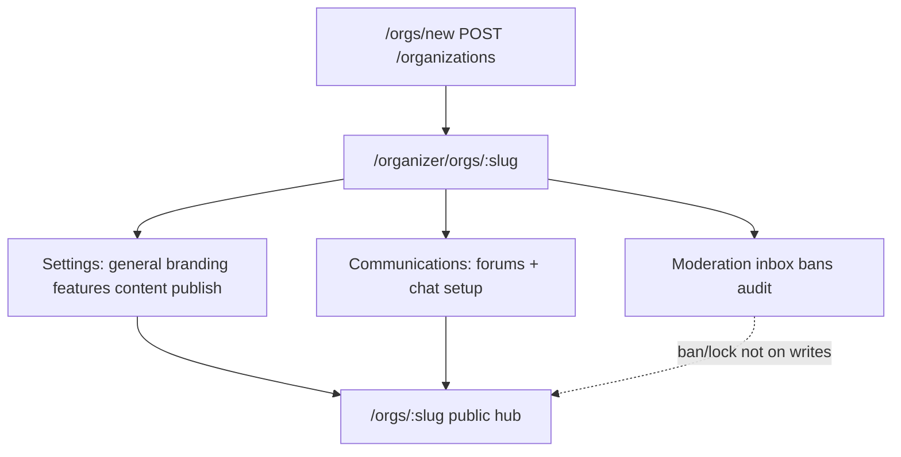

# Prelaunch audit — Organization & public hub workflows

**Audit ID:** 05  
**Date:** 2026-06-04  
**Scope:** Create organization, public hub (`/orgs/:slug`), organizer org console (`/organizer/orgs/:slug`), settings (general/branding/features/content/publish), branding upload, feature flags, public calendar, forums/chat/about tabs, members/people, moderation, org tools, public visibility, organizer console link, hub preview.  
**Method:** Static code review (no fixes applied).  
**Wave 5 remediation (2026-06-04):** Org scope bans enforced on forum thread/post/reactions; locked threads reject member replies (MOD+ override); `OrgHubClient` hides reply when locked.  
**Wave 6 remediation (2026-06-04):** Org chat message/reply/reaction writes enforce scope bans; `viewerScopeBanned` on org GET; chat composer hidden when banned.
**Primary sources:** `packages/web/src/app/orgs/**`, `packages/web/src/app/organizer/orgs/**`, `packages/web/src/components/org/**`, `packages/web/src/components/organizer/**`, `packages/api/src/routes/organizations.ts`, `packages/api/src/routes/organization-moderation.ts`, `packages/api/src/lib/org-visibility.ts`, `packages/api/src/lib/org-features.ts`, `docs/FEATURE_REGISTRY.md`, `docs/ORGANIZER_CONSOLE.md`, `docs/PILOT_READINESS.md`.

---

## 1. Executive summary

Organization workflows are **largely wired end-to-end**: authenticated create at `/orgs/new` → API insert with OWNER membership → redirect to **organizer console**; public hub uses `OrgCommunityShell` with tabbed Overview/Calendar/Forums/Chat/About (+ FAQ, Subgroups, Documents when configured); staff configure via `/organizer/orgs/:slug` with role-gated settings, communications, and moderation.

**Production gaps** cluster on **moderation enforcement** (scope bans and locked threads not checked on write paths), **visibility semantics** (`MEMBERS` orgs are readable by non-members at the API layer while the UI gates Forums/Chat), **subgroups** (flag exists but no settings toggle in the live UI), and **calendar privacy** (org event list does not filter by `events.visibility`). Branding is upload + URL PATCH only — **no server or client crop step**, despite aspect-ratio guidance in settings copy.

**Readiness:** Deployable for **PUBLIC org hubs** with moderator-led setup (forums/channels manually created in console). Treat **MEMBERS-only content protection**, **ban enforcement**, and **subgroups** as **not pilot-safe** until fixed or explicitly documented as alpha limitations.

---

## 2. Blockers

| ID | Issue | Evidence |
|----|--------|----------|
| B-05-1 | **Org scope bans not enforced on forum/chat writes.** `isUserScopeBanned` is implemented and exported from moderation access but **never called** from `organizations.ts` post/reply/reaction handlers. Banned users can still post. | `packages/api/src/lib/org-moderation-access.ts` (`isUserScopeBanned`); grep shows no usage in `organizations.ts`. |
| B-05-2 | **Locked forum threads not enforced on new posts.** Moderation can set `lockedAt` on threads; `POST .../forum/threads/:threadId/posts` does not check lock before insert. | `organization-moderation.ts` lock PATCH; `organizations.ts` ~1310–1337 (no `lockedAt` check). |
| B-05-3 | **Subgroups cannot be enabled through the live settings UI.** `subgroupsEnabled` defaults `false`; `FEATURE_DEFINITIONS` omits it; hub tab preview and home cards reference subgroups but only dead `OrgAdminDashboard.tsx` had a toggle. `OrgSubgroupAdminPanel` tells staff to “Turn on in Settings” with no path. | `org-features.ts`; `org-settings-utils.ts`; `OrgSubgroupAdminPanel.tsx`; `OrgAdminDashboard.tsx` (unmounted). |

---

## 3. High-risk issues

| ID | Issue | Impact |
|----|--------|--------|
| H-05-1 | **`MEMBERS` visibility is read-open at API.** `canViewOrg` returns true for `MEMBERS` orgs to anonymous/non-member viewers. Forums, chat message GET, member list, reviews, and calendar reads succeed while UI hides Forums/Chat behind `MembersJoinCommunityGate`. Product copy on create says “Only members can see community details” — **misaligned with API**. | `org-visibility.ts` ~20–25; `orgs/new/page.tsx` visibility copy; `OrgHubClient.tsx` `isMembersJoinPreview`. |
| H-05-2 | **Org calendar lists all org events without `events.visibility` filter.** Unlike group calendar paths that use `canViewerSeeGroupEvent`, `GET .../organizations/:orgKey/events` returns up to 100 rows for any viewer passing `canViewOrg`. | `organizations.ts` ~2223–2327 (select by `organizationId` only). |
| H-05-3 | **REST vs WebSocket mismatch for org chat.** Non-members can `GET` channel messages when `canViewOrg` passes; WS subscribe for `org:*:channel:*` requires membership (`authorizeWebSocketSubscribe`). Realtime appears broken for guests who can read history via REST. | `organizations.ts` message GET; `ws-subscribe-auth.ts` (per architecture docs). |
| H-05-4 | **Forum thread `categoryId` not validated to org** on create. Optional UUID is inserted without verifying the category belongs to the same `organizationId`. | `organizations.ts` ~1151–1158. |
| H-05-5 | **No ownership transfer API.** Leave handler references transferring ownership; no route implements it; OWNER cannot leave without manual DB intervention. | `organizations.ts` member leave paths (referenced in prior reviews). |
| H-05-6 | **`ownerId` vs `organizationMembers` divergence risk.** `requireMinRole` checks membership row only; GET detail can show `viewerRole: 'OWNER'` from `ownerId` while PATCH settings requires ADMIN **membership** role. | `organizations.ts` GET ~507–518; PATCH ~577 (`requireMinRole` ADMIN). |

---

## 4. Medium-risk issues

| ID | Issue | Notes |
|----|--------|-------|
| M-05-1 | **No image crop workflow for logo/banner.** Upload via `POST /api/upload` then PATCH URLs; `ScopeBrandingPanel` shows aspect hints (3:1 banner, 1:1 logo, 1200×630 share); settings tip mentions “cropping” but no Cropper component. | `useOrgAdminSettings.ts`; `ScopeBrandingPanel.tsx`; `settings-ui.tsx` tip. |
| M-05-2 | **Post-create redirect skips public hub.** Successful create navigates to `/organizer/orgs/:slug`, not `/orgs/:slug`. Owners may not verify member-facing hub without an extra click (“View public hub” cards). | `orgs/new/page.tsx` ~117–118. |
| M-05-3 | **Member reputation delta API has no web UI.** `PATCH .../members/:userId/reputation` (MODERATOR+) exists; no org-scoped calls in `packages/web`. | `organizations.ts` reputation handler; web grep `/reputation` only on profiles. |
| M-05-4 | **New org reputation defaults to zero with no onboarding copy.** Create does not seed reviews; composite rating 0 until reviews/members accumulate; directory cards show trust tiers from rating thresholds — new orgs appear untrusted with no explainer. | `org-reputation.ts`; `POST /organizations` insert; `OrgDirectoryCard` / directory utils. |
| M-05-5 | **`OrgAdminDashboard.tsx` dead code (~843 lines).** Superseded by organizer settings; only `OrgFlags` type still imported — maintenance and confusion risk. | Component not mounted on any route. |
| M-05-6 | **Organizer home “Recent activity” stub.** Console home shows “coming soon” while public hub Overview loads real activity feed. | `OrganizerOrgHomePanel.tsx`. |
| M-05-7 | **STAFF role: console access without moderation tab.** `MOD_ROLES` includes STAFF for console entry; `canAccessOrganizerModeration` excludes STAFF; moderation panel shows blocking message — intentional but easy to misread as broken access. | `OrganizerOrgClient.tsx` ~75, 127; `types.ts` ~50–54. |
| M-05-8 | **No default forum/channel seed on org create.** Empty Forums/Chat tabs until staff use Communications in console. | `POST /organizations` ~550–567. |
| M-05-9 | **Org event/convention list cap 100, no pagination.** Busy org calendars truncate on hub and console. | `organizations.ts` events/conventions GET. |
| M-05-10 | **Branding uploads require S3 (same as audit 01).** Without `S3_*` env, upload route fails; settings show errors on publish day if storage not configured. | `upload.ts`, deployment audit 01. |

---

## 5. Low-risk issues

| ID | Issue | Notes |
|----|--------|-------|
| L-05-1 | **Legacy public hub `?tab=Admin` redirects** to organizer settings for ADMIN/OWNER. | `OrgHubClient.tsx` query handling. |
| L-05-2 | **`?communityEdit=1` deep link** to settings content section when ADMIN/OWNER — helpful for support, undocumented in registry. | `OrgHubClient.tsx`. |
| L-05-3 | **Hub preview is mock + links, not iframe sandbox.** `PublicHubPreviewCard`, `HubTabsPreviewCard`, branding mini-header — read-only previews. | `settings-ui.tsx`, `SettingsBrandingTab.tsx`. |
| L-05-4 | **Group chat disclaimer on org hub** — clear copy that org channels are not private. | `OrgHubClient.tsx` ~123–124. |
| L-05-5 | **Seed PAF image paths** remapped via `/api/public-seed/paf/*` in shell — dev-oriented; prod should use S3 URLs. | `OrgCommunityShell.tsx` ~7–14. |
| L-05-6 | **Duplicate `ROLE_RANK` tables** across org, moderation, organizer, convention files — maintenance drift risk. | Multiple API modules. |
| L-05-7 | **Directory filter chips “Nearby / Hosting soon”** may be partially client-side on list already fetched — verify geo data exists before pilot marketing. | `orgs/page.tsx`, `org-directory-utils.ts`. |

---

## 6. Dead/misleading UI found

| Location | Element | Problem |
|----------|---------|---------|
| `/orgs/new` | **Members only** visibility description | Implies members-only *viewing*; API allows public read of shell and many endpoints. |
| Settings → Features | Subgroups in `HubTabsPreviewCard` | Tab shown in preview when flag true, but **no toggle** to enable flag. |
| Organizer → People / subgroups | `OrgSubgroupAdminPanel` “Turn on in Settings” | No settings control for `subgroupsEnabled`. |
| Settings → Branding tips | “Use a square logo for best cropping” | Implies crop tool; only full-file upload. |
| Public hub (MEMBERS, non-member) | Overview visible, Forums/Chat hidden | Can feel like broken tabs; API still exposes forum threads to scrapers. |
| Organizer home | Recent activity placeholder | Suggests incomplete product vs active public hub. |
| `OrgAdminDashboard` | Entire legacy admin UI | Dead; duplicates organizer console vocabulary. |
| Feature flags UI subtitle | “Turning off hides tab” | Accurate for calendar/forums/chat; **subgroups** cannot be turned on. |

---

## 7. Permission issues found

| Flow | UI gate | API gate | Match? |
|------|---------|----------|--------|
| Create org | Auth on `/orgs/new` | `POST /organizations` `requireUser` | Yes |
| PATCH org settings / branding / flags | Settings tab: `canAccessOrganizerSettings` (OWNER/ADMIN) | `requireMinRole` ADMIN | Yes |
| Branding file upload (client) | `isAdmin` (OWNER/ADMIN) in settings panel | Same PATCH ADMIN | Yes |
| Forum/category/channel CRUD | Communications (MODERATOR+ manage) | MODERATOR+ | Yes |
| Forum post / chat message | Member on hub | `getMembership` on writes | Yes |
| Hide forum post / report | `canModerate` (MODERATOR+) on hub | Moderation routes MODERATOR+ | Yes |
| Organizer console entry | Link when `canModerate`; direct URL | Console client checks MOD_ROLES incl. STAFF | **Partial** — STAFF enters console but not moderation |
| Moderation tab | `canAccessOrganizerModeration` | Reports/bans MODERATOR+; audit ADMIN | Yes |
| Member role / volunteer tags | People panel ADMIN | ADMIN; cannot assign OWNER | Yes |
| Member reputation delta | *No UI* | MODERATOR+ | N/A |
| ECKE publish | Settings publish section | `requireOrgModerator` + bridge env | Yes (503 if ECKE off) |
| Join org (PUBLIC/MEMBERS) | Join button on hub | `POST .../join`; PRIVATE → 403 | Yes |
| View PRIVATE org | 404 / not visible | `canViewOrg` membership required | Yes |
| View MEMBERS org content | UI gates Forums/Chat | **API read-open** | **No** (H-05-1) |
| Banned user posting | Ban list in console | **Not checked on write** | **No** (B-05-1) |
| Post to locked thread | Lock UI in moderation | **Not checked** | **No** (B-05-2) |

---

## 8. Missing env/config

| Variable / config | Relevance to org workflows |
|-------------------|----------------------------|
| `USE_DATABASE=true` | All org routes 503 without DB (audit 01). |
| `S3_*` | Logo/banner/share uploads via `POST /api/upload`. |
| `C2K_EMBED_ALLOWLIST_HOSTS` (or org embed allowlist in code) | External site embed on About when `externalEmbedEnabled` + URL set. |
| `ECKE_PUBLISH_ENABLED`, `ECKE_SUPABASE_*` | Settings → Publish preview/publish; 503 when disabled. |
| `LIVEKIT_*` | Voice channels token route; voice appears broken without. |
| `C2K_ORG_JOIN_EMAIL` | Welcome email on join (BullMQ; optional but expected in pilot). |
| `VITE_HOME_DEMO_FALLBACK` | Should not be true in prod (directory/hub mock risk). |
| `AUTH_ALLOW_FALLBACK=false` | Prevents mock viewer from appearing as org member in tests. |

No org-specific env vars are missing from templates beyond shared platform storage/mail/realtime (see audit 01).

---

## 9. Recommended fixes

| Priority | Fix |
|----------|-----|
| P0 | Call `isUserScopeBanned('organization', orgId, userId)` on all org forum/chat write handlers (and reactions) before accepting body. |
| P0 | Reject `POST .../forum/threads/:threadId/posts` when `thread.lockedAt` is set (unless MODERATOR+ override). |
| P0 | Add `subgroupsEnabled` to `FEATURE_DEFINITIONS` / `SettingsFeaturesTab` **or** remove Subgroups tab, preview row, and `OrgSubgroupAdminPanel` until API flag is manageable. |
| P1 | Align `MEMBERS` visibility: either restrict read paths with `isOrgMember` for `MEMBERS` orgs, or update create/settings copy to “join-gated community tabs, public shell”. |
| P1 | Filter `GET .../organizations/:orgKey/events` with same visibility helper used for group/event detail. |
| P1 | Validate `categoryId` belongs to org on thread create. |
| P2 | Post-create: optional “View public hub” confirm step or redirect query `?welcome=1` on `/orgs/:slug` after create. |
| P2 | WS subscribe policy or REST GET policy alignment for org chat (pick membership-required for both or neither). |
| P2 | Ownership transfer route + leave OWNER flow. |
| P3 | Branding crop UI or remove “cropping” copy; document recommended dimensions only. |
| P3 | Delete or archive `OrgAdminDashboard.tsx`; move `OrgFlags` type to `org-settings-utils.ts`. |
| P3 | Wire member reputation UI in People panel or drop API until needed. |
| P3 | Replace organizer “Recent activity” stub with condensed feed from existing org activity endpoint. |

---

## 10. Files likely affected

| Area | Paths |
|------|--------|
| Public hub | `packages/web/src/app/orgs/[slug]/OrgHubClient.tsx`, `OrgHubCalendarTab.tsx`, `OrgHubAboutTab.tsx` |
| Shell / SEO | `packages/web/src/components/org/OrgCommunityShell.tsx`, `components/seo/ScopePageMeta.tsx` |
| Create / directory | `packages/web/src/app/orgs/new/page.tsx`, `app/orgs/page.tsx`, `components/orgs/*` |
| Organizer console | `packages/web/src/app/organizer/orgs/[slug]/OrganizerOrgClient.tsx`, `components/organizer/OrganizerOrgSettingsPanel.tsx`, `components/organizer/org-console/*`, `components/organizer/moderation/*` |
| Settings | `components/organizer/settings/*`, `hooks/useOrgAdminSettings.ts`, `lib/organizer/org-settings-utils.ts` |
| API org | `packages/api/src/routes/organizations.ts` |
| API moderation | `packages/api/src/routes/organization-moderation.ts`, `lib/org-moderation-access.ts` |
| Visibility / flags | `lib/org-visibility.ts`, `lib/org-features.ts`, `lib/org-reputation.ts` |
| ECKE | `routes/ecke-publish-routes.ts`, `lib/ecke-publish-payload.ts` |
| Docs | `docs/FEATURE_REGISTRY.md`, `docs/ORGANIZER_CONSOLE.md`, `docs/PILOT_READINESS.md` |

---

## 11. Suggested tests

- API: create org (PUBLIC/MEMBERS/PRIVATE) → assert OWNER membership, default feature flags on GET, rating 0.  
- API: non-member GET forum threads + chat messages on MEMBERS org (document current open read).  
- API: ban user → attempt forum post and chat message (expect 403 after fix).  
- API: lock thread → member post (expect 403 after fix).  
- API: moderator vs admin PATCH branding; staff cannot PATCH.  
- API: org calendar includes/excludes `visibility: private` events after fix.  
- E2E: `/orgs/new` → lands organizer home → open public hub link → tabs match feature flags.  
- E2E: disable forums in settings → Forums tab disappears on hub (after reload).  
- E2E: upload banner/logo with S3 configured → hub header shows images.  
- E2E: MEMBERS org logged out → join gate on Forums; Overview still loads.  
- Manual: OWNER/ADMIN/MODERATOR/STAFF/MEMBER matrix for console tabs and hub “Organizer console” link.  
- Manual: ECKE publish preview/publish when bridge configured.  
- WS: member subscribes org channel; non-member read-only REST vs subscribe denial.

---

## 12. Confidence level

**High (~85%)** for route map, role gates on PATCH/settings, create redirect, feature-flag tab filtering, and hub shell structure — verified in source.  
**Medium** for MEMBERS visibility product intent (code is explicit; policy may be deliberate).  
**Medium–low** for runtime UX (mobile tabs, upload errors, empty states) without browser pass.  
**High** for B-05-1/B-05-2 (grep-confirmed missing checks).

---

## Org workflow smoke test checklist

Manual checklist for staging/production (`USE_DATABASE=true`, S3 for branding, session cookie).

| # | Step | Expected |
|---|------|----------|
| 1 | Logged out: `/orgs` | Directory loads PUBLIC orgs; create CTA → login if authenticated path needed. |
| 2 | Logged in: `/orgs/new` | Form: name, slug preview, visibility, bio; submit creates org. |
| 3 | After create | Redirect **`/organizer/orgs/:slug`** (not public hub); home checklist visible. |
| 4 | Settings → General | Visibility PUBLIC/MEMBERS/PRIVATE saves; PATCH 403 for non-ADMIN. |
| 5 | Settings → Branding | Upload banner + logo; public hub header updates at `/orgs/:slug`. |
| 6 | Settings → Features | Toggle calendar/forums/chat off → corresponding hub tabs hidden after reload. |
| 7 | Settings → Features | **Known gap:** no subgroups toggle; Subgroups tab stays off. |
| 8 | Communications | Create forum category + chat channel; appear on hub Forums/Chat. |
| 9 | Logged out: `/orgs/:slug` (PUBLIC) | Overview, About, Calendar (if enabled); Join CTA. |
| 10 | MEMBERS org, non-member | Overview/About visible; Forums/Chat show join gate; **API may still list threads**. |
| 11 | Join org | Member role; Forums/Chat usable; WS connect on chat (member). |
| 12 | MODERATOR | Organizer console link on hub; moderation inbox; cannot PATCH branding unless ADMIN. |
| 13 | ADMIN/OWNER | Settings save; branding upload; feature flags; content editor. |
| 14 | STAFF | Organizer console loads; moderation tab blocked with explanation. |
| 15 | Moderation | Report forum post; hide post on hub; lock thread → **verify post still allowed (bug)**. |
| 16 | Ban user | Ban in console → **verify user can still post (bug)**. |
| 17 | Calendar tab | Org events list; private events visibility per H-05-2. |
| 18 | Hub preview cards | Settings branding/features previews match live tab set. |
| 19 | ECKE (if enabled) | Publish tab preview + publish; non-PUBLIC org hidden on ECKE. |
| 20 | PRIVATE org | Non-member GET hub → not found; member invite/join path works. |

---

## Bugs/blockers

Consolidated tracker (IDs preserved).

1. **B-05-1** — Scope bans not enforced on org writes.  
2. **B-05-2** — Locked threads not enforced on reply.  
3. **B-05-3** — Subgroups flag not toggleable in live UI.  
4. **H-05-1** — MEMBERS org API read-open vs UI/marketing copy.  
5. **H-05-2** — Org calendar ignores event visibility.  
6. **H-05-3** — REST vs WS chat access mismatch.  
7. **H-05-4** — Forum categoryId org validation missing.  
8. **H-05-5** — No ownership transfer.  
9. **H-05-6** — ownerId vs membership ADMIN mismatch edge case.

---

## UI cleanup fixes

| Topic | Suggested cleanup |
|-------|-------------------|
| Visibility copy | Align `/orgs/new` and settings General text with actual MEMBERS behavior or fix API. |
| Subgroups | Remove preview/tab references until toggle ships, or add Features checkbox. |
| Branding | Rename tip to “recommended dimensions” without “cropping”; link `/support/branding`. |
| Post-create | Add prominent “View public hub” on organizer home first visit. |
| MEMBERS join gate | Short explainer on Overview: “Forums and chat unlock after you join.” |
| Dead code | Remove `OrgAdminDashboard` mount references and file; relocate `OrgFlags` type. |
| Console home | Replace “Recent activity coming soon” with activity API or remove section. |
| STAFF messaging | Clarify in People/communications: “Staff volunteers — moderation tools require moderator role.” |
| Trust badges | New org card: “New organization” badge when `reviewCount === 0` instead of low-trust tier. |
| Legacy query | Document or remove `?tab=Admin` and `?communityEdit=1` in operator runbook only. |

---

## Production readiness notes

### Pilot-safe today (with caveats)

- **Create org → organizer console → configure branding, flags, content → public hub** for PUBLIC visibility.  
- **OWNER/ADMIN settings gating** matches API for PATCH and uploads.  
- **Forums/chat/report/hide** for moderators on hub and console (hide works; bans/locks incomplete on writes).  
- **Feature flags** correctly hide Calendar/Forums/Chat tabs when disabled.  
- **Organizer console link** on hub header when `canModerate` (MODERATOR+).  
- **Join/leave** for PUBLIC and MEMBERS (PRIVATE invite-only).  
- **ECKE publish** optional when bridge env configured.

### Not pilot-safe without fix or explicit waiver

- **Enforcement of bans and locked threads** (B-05-1, B-05-2).  
- **MEMBERS-only confidentiality** if organizers expect API-level privacy (H-05-1).  
- **Subgroups product** (B-05-3).  
- **Private org events on public org calendar** (H-05-2).  
- **S3 missing** — branding broken (deployment blocker from audit 01).

### Operator checklist (org slice)

- [ ] Confirm `S3_*` and test banner upload on staging org.  
- [ ] Create pilot org as OWNER; complete settings checklist on console home.  
- [ ] Seed at least one forum category and one chat channel before inviting members.  
- [ ] Set visibility intentionally; if MEMBERS, warn organizers that shell is public-readable.  
- [ ] Assign MODERATOR vs ADMIN deliberately (branding = ADMIN only).  
- [ ] Run smoke rows 15–16 and record ban/lock behavior until fixed.  
- [ ] Verify `C2K_ORG_JOIN_EMAIL` if welcome mail expected.  
- [ ] Cross-link [`docs/PILOT_READINESS.md`](../../PILOT_READINESS.md) org row (create org, roles, hub).

### Dependencies on other audits

- **Audit 01:** DB, S3, mail, auth fallback, WS bridge for multi-replica.  
- **Audit 06:** Event visibility on org calendar overlaps event workflow fixes.  
- **Deployment:** `USE_DATABASE=true`; no Stripe in org tools (payments placeholder in console Tools tab).

---

## Appendix — Workflow map

### Route reference

| Surface | Path | Min role (typical) |
|---------|------|---------------------|
| Directory | `/orgs` | Public |
| Create | `/orgs/new` | Authenticated |
| Public hub | `/orgs/:slug` | `canViewOrg` |
| Organizer console | `/organizer/orgs/:slug` | STAFF+ (in `MOD_ROLES`) |
| Settings | `?tab=settings` | OWNER/ADMIN (UI + API ADMIN) |
| Moderation | `?tab=moderation` | MODERATOR+ (audit ADMIN) |

### New org defaults (API)

| Field | Value |
|-------|--------|
| `visibility` | `PUBLIC` if omitted |
| `featureFlags` (effective) | calendar, forums, chat **on**; subgroups, external embed **off** |
| `rating` / reviews | 0 until activity |
| `member` row | Creator **OWNER** |
| Forum/channel seed | None |

---

## Phase 3 Wave 3 fixes (2026-06-04)

| Issue | Resolution |
|-------|------------|
| H-05-1 MEMBERS org API read-open | `canViewOrgMemberContent` on member-only endpoints; org detail GET still uses `canViewOrg` for join shell |
| H-05-2 Org calendar private events | `GET .../events` filters with `canViewerSeeGroupEvent` |
| H-05-3 Chat REST open to non-members | `viewerCanAccessOrgChannel` requires org membership for MEMBERS/PRIVATE orgs |

Manual smoke row 10 expectation updated: API should not return forum threads to non-members on MEMBERS orgs.

---

*Audit completed 2026-06-04. Wave 3 implemented org visibility API fixes.*
