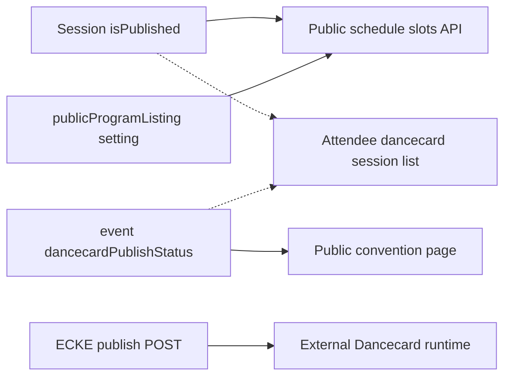

# Prelaunch audit 07 — Convention Command Bridge

**Audit date:** 2026-06-04  
**Wave 4 remediation (2026-06-04):** Exports dead downloads removed; CSV params fixed; staff import kind hidden; bulk door removed; integrations revoke removed; messaging test-send fixed; hub slot/settings/document writes gated via `requireHubConventionMutation`. Calendar subscribe GET may still 404 on some hosts.

**Wave 5 remediation (2026-06-04):** Calendar feed GET implemented; door check-in uses `resolveCheckInUpdate` + real eligibility in API; hub read uses command grants for `canManage` flag and sensitive GETs.  
**Wave 6 remediation (2026-06-04):** Remaining hub mutations use `requireHubConventionMutation`; staff-roster/crew-grid reads require `staff_ops` grant; signups PATCH shares `resolveCheckInUpdate` with door.
**Auditor:** Subagent 7 (read-only)  
**Scope:** Full Convention Command Bridge workflow — dashboard, program, room availability, import, people, messaging, settings, exports, integrations, door mode, routing, and permissions  
**Method:** Code + doc review (`docs/ORGANIZER_CONSOLE.md`, `docs/DANCECARD_ORGANIZER_PARITY.md`, `docs/architecture/CONVENTION_PEOPLE_TAB.md`). Cross-checked UI against API routes in `packages/api/src/routes/convention-organizer*`. No fixes applied.

**Canonical route:** `/organizer/orgs/:orgSlug/conventions/:convSlug?tab=<tab>&peopleTab=<subTab>&settingsPanel=<panel>`  
**Door route:** `/organizer/orgs/:orgSlug/conventions/:convSlug/door` (top-level, outside main layout)  
**Shell entry:** `ConventionDancecardOrganizerClient` → Dancecard kit tabs via `OrganizerEventShell`

---

## 1. Executive summary

The Convention Command Bridge is **structurally complete** as a connected organizer workflow: bootstrap loads permissions, slots, shifts, and event metadata; sidebar nav is permission-filtered; tab query params sync to URL; legacy people tabs redirect into `tab=people&peopleTab=…`; and core paths (program grid, per-session publish, settings blur-save, single door check-in, program CSV import with idempotent keys) hit real API endpoints.

**Production readiness:** **Deployable to staging with known limitations** — suitable for pilot organizers who understand alpha gaps. **Not production-honest** for exports, integrations (webhooks/embeds/calendar subscribe), messaging “Dancecard feed,” staff import board, or bulk door check-in without fixes. Program scheduling and org-admin settings are the strongest areas; Tools and Communications tabs over-promise relative to backend completeness.

| Workflow area | Status | Pilot-safe? |
|---------------|--------|-------------|
| Routing + legacy redirects | Mostly works | Yes, with Manage-tab caveat |
| Sidebar permissions | Implemented | Yes |
| Dashboard / readiness | Partial | Yes with caveats |
| Program grid + draft/publish | Mostly ready | Yes (scheduler grant) |
| Room availability | Partial | Yes after slots exist |
| Program import (CSV/staging) | Mostly ready | Yes |
| Staff import board | Broken | No |
| People hub sub-tabs | Implemented | Yes (see audit 08 for door/signups) |
| Messaging | Email partial; feed fake | No for feed claims |
| Settings save | Works (admin) | Yes |
| Exports | Many 404 / wrong format | No |
| Integrations | ECKE preview OK; webhooks/embeds partial | Partial |
| Door mode | Single check-in works | Yes with policy gaps (audit 08) |

**Three publish layers organizers must distinguish:** (1) per-session `isPublished`, (2) event `dancecardPublishStatus` / public listing, (3) ECKE/Dancecard outbound publish (Integrations). UI mostly states this; `ProgramVisibilityCard` still blends (1) and (2).

---

## 2. Blockers

Issues that violate “do not show UI buttons that fail when clicked” or misrepresent attendee-visible behavior:

| ID | Blocker | Area | Evidence |
|----|---------|------|----------|
| B1 | **Messaging “Dancecard feed” is not implemented** | Messaging | UI promises immediate attendee feed (`MessagingPanel.tsx` ~227–228). `POST …/message-campaigns/:id/send` returns `feedPublished: true` hardcoded with no feed write (`convention-organizer-routes.ts` ~2920–2928). |
| B2 | **Test email sends wrong body** | Messaging | UI sends `{ toEmail, subject, bodyText }`; API expects `{ to, subject, body }` (`MessagingPanel.tsx` ~194–196 vs `modules-routes.ts` ~1114–1134). User gets default body, not composed message. |
| B3 | **Staff import DnD rows never persisted** | Import | `dropOnBoard` for staff/duty only updates local state; no POST to create draft rows (`ScheduleImportPanel.tsx` ~937–951). Rows vanish on refresh. |
| B4 | **Staff import publish-preview marks all rows invalid** | Import | Non-program batches return `invalidCount: rows.length` (`convention-organizer-routes.ts` ~2073–2088). Confirm dialog unusable. |
| B5 | **Missing export routes (404 on click)** | Exports | Presenter directory, volunteer call sheet, no-photo list — UI buttons, no API routes (`ExportsHubPanel.tsx` ~338+). |
| B6 | **Calendar subscribe URL has no GET handler** | Exports | Token mint works; `subscribeUrl` points to `/api/v1/conventions/:slug/calendar-feed/:token.ics` — no route registered (`modules-routes.ts` ~809). |
| B7 | **Per-track/room/presenter calendar feeds fail** | Exports | UI sends `scope: 'room'/'presenter'`; API enum is `'location'/'person'` (`ExportsHubPanel.tsx` ~122–129 vs `modules-routes.ts` ~781). |
| B8 | **Webhook / embed revoke buttons 404** | Integrations | `DELETE …/webhooks/:id` and `DELETE …/embed-tokens/:id` missing; UI Revoke fails. |
| B9 | **Embed iframe routes do not exist** | Integrations | Example URLs `/embed/dancecard/:slug/schedule?token=…` — not in `router.tsx`. |
| B10 | **Bulk door check-in route missing** | Door | `DoorModePanel` calls `POST …/registrants/bulk-check-in`; only single check-in exists (`door-routes.ts`). |
| B11 | **`?tab=Manage` redirect strands convention staff** | Routing | Redirect uses `access?.canManage \|\| access?.isStaff`; command bridge requires org admin or `convention_command_grants` (`conventions/[slug]/page.tsx` ~827–831). Staff without grants → bootstrap 403. |

---

## 3. High-risk issues

| ID | Issue | Area | Evidence |
|----|-------|------|----------|
| H1 | **Staff import publish writes name-only shifts (no `personId`)** | Import | `publishStaffImportRows` inserts `personName` only (`scheduleImportPublish.ts` ~330–351); manual shifts require `personId` (`convention-organizer-routes.ts` staff-shifts POST). Breaks coverage/door identity linkage. |
| H2 | **Import board uses browser local TZ, not convention TZ** | Import | `dropOnBoard` uses `new Date(\`${day}T${hour}:00:00\`)` (`ScheduleImportPanel.tsx` ~936). Slots can land on wrong day vs convention `timezone`. |
| H3 | **Re-publish import batch allowed** | Import | API does not reject `batch.status === 'published'`; UI keeps “Review and publish” enabled after success. |
| H4 | **Sessions export defaults to JSON, not CSV** | Exports | Links omit `?format=csv`; API returns JSON by default (`convention-organizer-routes.ts` ~2932–2955). |
| H5 | **“Download event pack (ZIP)” returns JSON** | Exports | Button label vs `Content-Type: application/json` (`program-ext-routes.ts` ~464–495). |
| H6 | **Messaging audience mismatch** | Messaging | UI counts non-cancelled registrants; send query includes all with email, no status filter (`convention-organizer-routes.ts` ~2870–2882). |
| H7 | **`audienceFilter` on campaigns ignored on send** | Messaging | Schema field exists; send loads all emails. |
| H8 | **Scheduled slots outside event window invisible on program grid** | Program | `layoutForSlot` returns null when slot day ∉ `dayKeysInWindow` (`ProgramScheduleGrid.tsx` ~533–538). No inline warning. |
| H9 | **Venue day axis slot-derived, not window-derived** | Venues | `VenueAvailabilityGrid` builds days from scheduled slots only (`VenueAvailabilityGrid.tsx` ~211–217); program grid shows full event window. Empty days until first slot. |
| H10 | **Readiness check “Fix now” actions never populated** | Dashboard | UI expects `ReadinessCheck.action`; `buildReadinessChecks` returns no `action` field (`convention-organizer-routes.ts` ~409–526). |
| H11 | **Agreements setup task never completes via readiness** | Dashboard | `resolveSetupTasks.ts` checks `agreements-gap`; that check ID does not exist in API (grep: no matches). |
| H12 | **Participation settings save ignores HTTP errors** | Settings | `ParticipationSettingsPanel` raw `fetch` PATCH without `response.ok` check — can show “Saved” on 403. |
| H13 | **Inbound registrant / RabbitSign webhooks documented but unimplemented** | Integrations | No handlers in `packages/api/src` for `/api/webhooks/dancecard/:slug/registrants` or `/api/webhooks/rabbitsign`. |
| H14 | **Webhook delivery pipeline absent** | Integrations | `convention_webhook_deliveries` table exists; no worker enqueues deliveries; usage stays 0. |

---

## 4. Medium-risk issues

| ID | Issue | Area |
|----|-------|------|
| M1 | List view has no bulk publish/unpublish (grid only) | Program |
| M2 | `ProgramVisibilityCard` blends event status with session publish counts | Program |
| M3 | DST edge case when dragging slots between day columns | Program |
| M4 | `ScheduleCardDetailsPanel` ignores `readOnly` on import tab | Import |
| M5 | `patchRow` optimistic update without rollback on failure | Import |
| M6 | Advanced JSON import bypasses column mapping; no row cap in UI | Import |
| M7 | Class library copy references “mock program cards” for real CSV | Import |
| M8 | `readOnlyForTab('people')` always false when any sub-tab visible | People |
| M9 | `VettingQueuePanel` ignores parent `readOnly`; uses `canMutateInCommandBridge` | People |
| M10 | Applications “In review” UI status maps to API `pending` on PATCH | People |
| M11 | Exports tab gate (`staff_ops`) mismatches per-button needs (`registration`, `admin`, `scheduler`) | Exports |
| M12 | API keys: no revoke route; `last_used_at` always null | Integrations |
| M13 | Google Sheets OAuth callback builds legacy `/organizer/conventions/:slug?tab=import` URLs | Integrations |
| M14 | Settings has no single “logistics” panel (split across venue, attendee-guide, registration) | Settings |
| M15 | Door QR endpoint returns stub SVG, not scannable QR | Door |
| M16 | Door early/late UI unused because `mapRegistrant` hardcodes `checkInEligibility: 'ok'` | Door (see audit 08) |
| M17 | Legacy inline Manage tab still renders briefly before redirect | Routing |
| M18 | `assignments` tab implemented but not in sidebar (reachable via program/deep links only) | Program |

---

## 5. Low-risk issues

| ID | Issue |
|----|-------|
| L1 | Dashboard “Recent activity” placeholder — honest empty state |
| L2 | Readiness % can differ before vs after full scan (`summaryOnly` skips reg-form check) |
| L3 | Registration setup task depends on full scan completing |
| L4 | Venue day dropdown shows raw `yyyy-MM-dd` vs program’s “EEE M/d” headers |
| L5 | Mobile program defaults to list view under 768px — good UX, undocumented |
| L6 | `tab=media` legacy redirects to `exports` |
| L7 | `settingsPanel=venue` redirects to `venues` with `venuesPanel=setup` |
| L8 | Dev-only demo import buttons gated by `import.meta.env.DEV` |
| L9 | `scripts/audit-command-bridge.mjs` smoke useful but misses scope/format mismatches |
| L10 | Duplicate nav config: `conventionNavConfig.ts` (C2K wrapper) vs `organizerNavConfig.ts` (kit) — kit is authoritative in shell |

---

## 6. Dead/misleading UI found

| UI surface | What user sees | Reality |
|------------|----------------|---------|
| Messaging hero copy | “Appears immediately in every attendee's Dancecard announcements feed” | Email only (if mail configured); no attendee feed consumer |
| Messaging success modal | Dancecard reach count | Client-side pre-send count; not server-confirmed feed audience |
| Recent campaigns “feed only” | Implies feed delivery | Means zero email deliveries recorded |
| Exports “Download event pack (ZIP)” | ZIP download | JSON file |
| Exports “Activities spreadsheet” / “Scheduling problems” | Spreadsheet download | JSON unless `?format=csv` appended manually |
| Exports presenter directory, volunteer call sheet, no-photo list | Working download buttons | 404 |
| Calendar feed subscribe link | Copy-paste ICS URL | No public GET route |
| Integrations embed preview iframe | Live schedule embed | Route does not exist |
| Integrations webhook revoke | One-click revoke | DELETE route missing |
| Import staff board | Drag to create shifts | Local-only until refresh |
| Import class library | “Mock program cards” | Real CSV path |
| Dashboard readiness expandable checks | “Fix now” buttons | No actions from API |
| Setup task “Configure policies and agreements” | Completable via readiness | `agreements-gap` check never emitted |
| Program grid | All scheduled sessions visible | Sessions outside event window days hidden silently |
| Venue availability | Day columns for event | Days appear only after slots scheduled |
| Door bulk check-in UI | Batch check-in | API route missing |
| Public `?tab=Manage` | Opens command bridge | May 403 for staff without command grants |

---

## 7. Permission issues found

### Tab gates (UI ↔ API)

| Tab | UI gate (`commandBridgeNavPermissions.ts`) | API typical gate | Match? |
|-----|---------------------------------------------|------------------|--------|
| dashboard | `any` | bootstrap: `any` | Yes |
| program, venues, import | `scheduler` | `scheduler` | Yes |
| people | any visible sub-tab | per sub-tab | Yes |
| messaging | `staff_ops` OR `scheduler` | same | Yes |
| settings | `admin` (= org OWNER/ADMIN) | `admin` | Yes |
| exports | `staff_ops` | mixed (see below) | **Partial** |
| integrations | `admin` | `admin` | Yes |
| door (separate route) | `registration` | `registration` | Yes |

**Note:** `admin` in command bridge = `isFullAdmin` (org OWNER/ADMIN), not delegated command grants.

### Mismatches

| Issue | Detail |
|-------|--------|
| Exports tab vs buttons | Tab visible to `staff_ops`; registrants export needs `registration`; policy acceptances needs `admin`; ICS busy preview needs `scheduler`. Buttons visible → 403 for wrong grant mix. |
| People tab read-only badge | `readOnlyForTab('people')` false whenever any sub-tab allowed — “Read-only” never shows on People shell. |
| VettingQueuePanel | Does not receive parent `readOnly`; approve/deny appears for any command-bridge user with registration domain. |
| Settings / Integrations | Command-team grantees (scheduler/staff_ops/registration only) cannot access — intentional, but confusing vs public-page `isStaff`. |
| Import Google Sheets config | UI: `canConfigureGoogle = permissions.isFullAdmin`; API Google routes also admin — aligned. |
| Program bulk bar | Correctly hidden when `readOnly` (no scheduler write) — **good**. |
| Manage-tab redirect | Uses public `isStaff` (attendee staff flag) ≠ command bridge access — **bad**. |

### Sidebar filtering

`OrganizerEventSidebar.tsx` uses `filterNavByPermissions(ORGANIZER_SIDEBAR_SECTIONS, permissions)` — empty sections removed. Bootstrap redirect sends user to `firstAllowedTab` if current tab disallowed (`ConventionDancecardOrganizerClient.tsx` ~277–282).

### Legacy people tab redirects

`registrants` → `peopleTab=signups`, `staff` → `staff`, `vetting` → `applications`, `swaps` → `swaps`, `badges` → `badges`, `dm` → `coverage` (`organizerNavConfig.ts` ~362–383).

---

## 8. Missing env/config

| Config | Impact on Command Bridge |
|--------|--------------------------|
| `C2K_MAIL_TRANSPORT` + SMTP/Resend | Messaging email sends; test-send simulates when disabled |
| `VITE_SITE_URL` | Calendar subscribe URLs, webhook docs, ECKE links default to localhost |
| ECKE bridge env (see `ecke-publish-routes.ts`) | Integrations shows preview-only; publish to eastcoastkinkevents.com fails without bridge |
| Redis + BullMQ worker | People sync, notifications — inline fallbacks exist but lag at scale |
| DB migrations through latest | Import batches, message campaigns, calendar feed tokens, webhook tables |

No command-bridge-specific env gaps beyond platform mail/ECKE/worker requirements (see audit 01).

---

## 9. Recommended fixes

Grouped by priority (implementation order suggested in § Priority fixes below):

1. **Honesty pass:** Remove or disable UI for unimplemented exports, feed publish, embed preview, bulk door, webhook revoke until routes exist.
2. **Messaging:** Implement attendee feed **or** rewrite all copy to “email only”; fix test-send field names; filter cancelled registrants on send.
3. **Import:** Persist staff draft rows on DnD; fix staff publish-preview; use convention TZ on board; block re-publish of published batches; pass `readOnly` to card details panel.
4. **Exports:** Add `?format=csv` to download links; rename event pack button; fix calendar scope enum mapping; implement public `.ics` GET route.
5. **Integrations:** Add DELETE routes or hide Revoke; implement embed pages; inbound webhook handlers; delivery worker.
6. **Dashboard:** Add `action` to readiness checks **or** remove Fix-now CTAs; add `agreements-gap` check or alternate completion rule for setup task.
7. **Program/Venues:** Warn on out-of-window slots; align venue `dayKeys` with `dayKeysInWindow`; optional list-view bulk publish.
8. **Routing:** Manage-tab redirect should require command bridge access (bootstrap probe or `canManage` only), not `isStaff`.
9. **Settings:** Check `response.ok` in participation PATCH.
10. **Door:** Implement bulk check-in or remove UI (detail in audit 08).

---

## 10. Files likely affected

| Layer | Paths |
|-------|-------|
| Shell / routing | `packages/web/src/components/organizer/convention/ConventionDancecardOrganizerClient.tsx`, `packages/web/src/app/organizer/orgs/[slug]/conventions/[convSlug]/OrganizerConventionPageClient.tsx`, `packages/web/src/app/organizer/conventions/[slug]/OrganizerConventionManageRedirect.tsx`, `packages/web/src/app/conventions/[slug]/page.tsx`, `packages/web/src/router.tsx` |
| Nav / permissions | `packages/web/src/components/dancecard/organizer/shell/organizerNavConfig.ts`, `packages/web/src/lib/dancecard/commandBridgeNavPermissions.ts`, `packages/web/src/components/dancecard/organizer/shell/OrganizerEventSidebar.tsx` |
| Dashboard | `packages/web/src/components/dancecard/organizer/OrganizerEventDashboard.tsx`, `packages/web/src/lib/dancecard/resolveSetupTasks.ts`, `packages/web/src/lib/dancecard/setupTasks.ts` |
| Program | `packages/web/src/components/dancecard/organizer/program/ProgramTab.tsx`, `ProgramScheduleGrid.tsx`, `ProgramListView.tsx`, `ProgramVisibilityCard.tsx` |
| Venues | `packages/web/src/components/dancecard/organizer/venue/VenuesTabPanel.tsx`, `VenueAvailabilityGrid.tsx` |
| Import | `packages/web/src/components/dancecard/organizer/ScheduleImportPanel.tsx`, `packages/api/src/lib/convention-organizer/scheduleImportPublish.ts` |
| People | `packages/web/src/components/dancecard/organizer/PeopleHubPanel.tsx`, `people/peopleHubConfig.ts` |
| Messaging | `packages/web/src/components/dancecard/organizer/MessagingPanel.tsx` |
| Settings | `packages/web/src/components/dancecard/organizer/EventSettingsPanel.tsx`, `settings/eventSettingsConfig.ts` |
| Exports / integrations | `ExportsHubPanel.tsx`, `IntegrationsPanel.tsx`, `packages/web/src/components/organizer/EckePublishStub.tsx` |
| Door | `packages/web/src/app/organizer/orgs/[slug]/conventions/[convSlug]/door/page.tsx`, `door/DoorModePanel.tsx` |
| API | `packages/api/src/routes/convention-organizer-routes.ts`, `convention-organizer/modules-routes.ts`, `program-ext-routes.ts`, `door-routes.ts` |
| Docs | `docs/ORGANIZER_CONSOLE.md`, `docs/DANCECARD_ORGANIZER_PARITY.md`, `docs/architecture/CONVENTION_PEOPLE_TAB.md` |

---

## 11. Suggested tests

### Automated / script

- `node scripts/audit-command-bridge.mjs` with `SMOKE_CONV=preview-c2k-weekend` — baseline GET matrix
- `packages/api/scripts/smoke-organizer-parity.ts` — organizer API parity
- `e2e/door.spec.ts` — door smoke (extend for bulk if implemented)

### Manual Command Bridge smoke (happy path)

1. Sign in as org OWNER on demo org → `/organizer/orgs/:slug?tab=schedule` → **Manage program** → lands on `?tab=dashboard` (default).
2. Sidebar: verify only permitted tabs for delegated grant test accounts (scheduler-only, registration-only, staff_ops-only).
3. Dashboard: readiness summary loads; setup tasks link to correct tabs (`publishFilter=draft`, `settingsPanel`, `peopleTab`).
4. Settings → basics: set event window → save on blur → Program tab shows grid columns for each day in window.
5. Program: add slot, leave draft → public schedule hides it → publish session → public shows it.
6. Program grid: bulk-select → Publish → verify API; switch to list view → confirm bulk bar absent.
7. Venues: add room → assign slot → availability grid shows booking (after slot scheduled).
8. Import: upload program CSV → preview → publish → re-import same `importKey` → no duplicate slots.
9. People: each permitted `peopleTab` loads without 403; legacy `?tab=registrants` redirects to `people&peopleTab=signups`.
10. Messaging: compose → test email → verify body matches (after fix); publish → verify honest success copy.
11. Exports: each visible button returns expected content-type (after fix pass).
12. Integrations: ECKE preview loads; publish disabled/honest when bridge off.
13. Door: search → single check-in → `checkedInAt` set.
14. Legacy: `/organizer/conventions/:slug` → org-scoped URL; `/conventions/:slug?tab=Manage` as command-grant user → bridge; as staff-only → should not 403 (after fix).

---

## 12. Confidence level

**High** for routing, tab params, sidebar permission filtering, program grid/window alignment logic, and bulk-action gating on grid. **High** for messaging feed stub and export 404s (direct code verification). **Medium** for pilot incident rates without live telemetry. **Medium** for DST drag edge cases. Cross-audit overlap with **08** (door/signups identity) and **09** (import idempotency detail) — those reports go deeper on people ops and program import respectively.

---

## Command Bridge end-to-end workflow report

### Entry and navigation

```
/organizer/orgs/:orgSlug/conventions/:convSlug?tab=<tab>
  ├── ConventionDancecardOrganizerClient (bootstrap GET …/organizer/bootstrap)
  ├── OrganizerEventShell + OrganizerEventSidebar (filterNavByPermissions)
  └── Tab panels (see below)

Legacy:
  /organizer/conventions/:slug → OrganizerConventionManageRedirect → org-scoped URL
  /conventions/:slug?tab=Manage → navigate to bridge if canManage OR isStaff (⚠ B11)
  ?tab=registrants|staff|vetting|… → redirect to tab=people&peopleTab=…
  ?tab=media → tab=exports
  settingsPanel=venue → tab=venues&venuesPanel=setup
```

**Query params verified:**

| Param | Purpose |
|-------|---------|
| `tab` | Primary tab; defaults to `dashboard` if missing |
| `peopleTab` | People hub sub-tab (`signups`, `roster`, `staff`, …) |
| `settingsPanel` | Settings left nav panel |
| `slot` | Deep-link program session drawer |
| `publishFilter=draft` | Program list/grid draft-only filter |
| `venuesPanel=setup` | Venues setup sub-panel |
| `guide` | Onboarding guide router |

### Workflow-by-tab

| Tab | Primary components | API backbone | E2E status |
|-----|-------------------|--------------|------------|
| **dashboard** | `OrganizerEventDashboard`, setup tasks, live ops | `GET …/readiness`, bootstrap | Partial — readiness actions dead |
| **program** | `ProgramTab`, grid/list, drawer, conflicts | `GET/POST/PATCH …/program-slots`, bulk | **Strong** for schedulers |
| **venues** | `VenuesTabPanel`, setup + assign + grid | `GET/POST …/locations`, slot PATCH | Partial — day alignment |
| **import** | `ScheduleImportPanel`, mapping, Sheets | `POST …/imports`, publish-preview/publish | Program path strong; staff broken |
| **people** | `PeopleHubPanel` + 9 sub-panels | Domain-specific routes per sub-tab | Strong (see audit 08) |
| **messaging** | `MessagingPanel` | templates, campaigns, send | Email partial; feed fake |
| **settings** | `EventSettingsPanel` (admin) | `GET/PATCH …/event`, registration, policies | Strong for org admin |
| **exports** | `ExportsHubPanel` | mixed | Weak — many broken actions |
| **integrations** | `IntegrationsPanel`, `EckePublishStub` | ECKE publish, api-keys, webhooks, embeds | ECKE preview OK; rest partial |
| **door** (separate route) | `DoorModePanel` | lookup, check-in, roster cache | Single check-in OK |

### Connected operator journey (ideal pilot path)

1. **Create convention shell** (org schedule tab or event modal) → open bridge.
2. **Settings → basics:** dates, timezone, branding.
3. **Settings → registration:** categories + form (admin).
4. **Venues:** create rooms (or defer to free-text on slots).
5. **Import or Program:** build schedule; publish sessions individually or bulk on grid.
6. **Integrations:** preview ECKE listing; publish when bridge configured.
7. **People:** signups, staff shifts, applications as needed.
8. **Door:** day-of check-in (single attendee flow).
9. **Messaging:** email announcement (not feed, until fixed).

### Publish visibility chain



Organizers must complete layers independently; dashboard and Program visibility cards attempt to summarize but can disagree mid-setup.

---

## Blocking bugs (consolidated)

All **§2 Blockers (B1–B11)** — highest user-trust impact:

1. Fake Dancecard feed publish (B1)
2. Broken test email payload (B2)
3. Staff import board non-persistent (B3–B4, H1)
4. Export buttons → 404 or wrong format (B5–B7, H4–H5)
5. Integrations revoke/embed dead ends (B8–B9)
6. Bulk door check-in missing (B10)
7. Manage-tab redirect permission bug (B11)

---

## Misleading UI (consolidated)

See **§6** for full table. Top trust eroders:

- Messaging feed promises
- Export ZIP/spreadsheet labels
- Integrations embed preview
- Import staff board persistence illusion
- Dashboard readiness “Fix now” affordances
- Silent program grid omission of out-of-window slots

---

## Permission mismatches (consolidated)

See **§7**. Critical fixes:

1. Manage-tab redirect: require command bridge access, not `isStaff`
2. Exports tab: split sections by domain or hide buttons that 403
3. People shell read-only semantics (optional UX fix)
4. Document that Settings/Integrations are org-admin-only, not grantee-accessible

---

## Priority fixes

### P0 — before pilot (trust / click failures)

| # | Fix |
|---|-----|
| 1 | Messaging: remove feed claims **or** implement feed; fix test-send fields |
| 2 | Hide/disable export buttons with no API route |
| 3 | Fix calendar feed scope mapping + public `.ics` route **or** hide subscribe |
| 4 | Hide webhook/embed revoke until DELETE routes exist |
| 5 | Fix `?tab=Manage` redirect gate |
| 6 | Hide bulk door check-in **or** implement route |

### P1 — data integrity / operator mistakes

| # | Fix |
|---|-----|
| 7 | Staff import: POST draft rows; fix publish-preview; require `personId` on staff publish |
| 8 | Import board: convention timezone for placement |
| 9 | Block re-publish of published import batches |
| 10 | Add `?format=csv` to export download links |
| 11 | Warn when program slots fall outside event window columns |

### P2 — workflow completeness

| # | Fix |
|---|-----|
| 12 | Readiness check actions or remove CTAs; fix agreements setup task |
| 13 | Align venue day keys with event window |
| 14 | Participation settings save error handling |
| 15 | Embed routes + token validation |
| 16 | Inbound webhook handlers |

### P3 — polish

| # | Fix |
|---|-----|
| 17 | List view bulk publish parity |
| 18 | API key revoke + usage metering |
| 19 | Webhook delivery worker |
| 20 | Venue day header formatting; DST drag hardening |

---

*Related audits: [08 — Registration, people, door](./08-registration-people-door.md), [09 — Program import publishing](./09-program-import-publishing.md), [03 — Auth permissions](../prelaunch/03-auth-permissions-privacy.md) (when available).*
