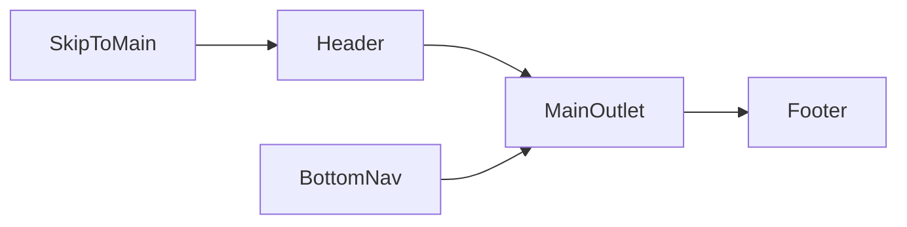

# UX walkthrough audit — page by page

**Purpose:** Walk the product like a typical user (and as staff/moderator where relevant): what each page offers, how you move forward and back, whether **privileged powers** are obvious, and **nice-to-have** ideas that improve cohesion without cluttering every screen.

**Source of truth for URLs:** [`packages/web/src/router.tsx`](../packages/web/src/router.tsx)  
**Shared chrome:** [`packages/web/src/layouts/RootLayout.tsx`](../packages/web/src/layouts/RootLayout.tsx), [`Header.tsx`](../packages/web/src/components/Header.tsx), [`Footer.tsx`](../packages/web/src/components/Footer.tsx), [`BottomNav.tsx`](../packages/web/src/components/BottomNav.tsx), [`site.config.ts`](../packages/web/src/config/site.config.ts)

**Change tags (see [Appendix A — Proposed changes triage](#appendix-a--proposed-changes-triage))**

| Tag           | Meaning                                              |
| ------------- | ---------------------------------------------------- |
| **Doc-only**  | Documentation, copy, or process; no code required   |
| **Small UI**  | Localized change (typically one component or page)  |
| **Larger UX** | New shared pattern, multiple routes, or new API use |

**Last updated:** 2026-04-17

---

## Global experience (every page)

### What the user always has

- **Skip link** to `#main-content` ([`RootLayout.tsx`](../packages/web/src/layouts/RootLayout.tsx)).
- **Header:** primary nav when the app considers the user “in scene”, Create menu, notifications and messages dropdowns, profile menu (with ecosystem fetch when open) ([`Header.tsx`](../packages/web/src/components/Header.tsx)).
- **Footer:** directory links from `siteConfig.footer`, legal links, sitemap/accessibility links ([`Footer.tsx`](../packages/web/src/components/Footer.tsx)).
- **Mobile bottom nav:** Home, Advanced Search (labeled “Search”), Create, Messages, Profile ([`BottomNav.tsx`](../packages/web/src/components/BottomNav.tsx)).
- **Browser back/forward:** Several hubs sync primary UI to the URL (e.g. [`useTabFromUrl`](../packages/web/src/hooks/useTabFromUrl.ts) on groups, events detail tabs) so shared links restore state.

### Global gaps

- **No universal breadcrumb** or page-level “Back”; users rely on header/footer, bottom nav, and in-page CTAs. Some empty states already say “Back to …” ([`EmptyState`](../packages/web/src/components/ui/EmptyState.tsx)) — good but inconsistent.
- **`site.config.ts` → `navSecondary`** still shows **hardcoded badge counts** (e.g. Connections `254`, My Events `362`). Next to real API-backed surfaces this reads as fictional. **[Small UI]** Remove counts or wire real totals.
- **`navMore` duplicates** entries that already exist in `navPrimary` (Vendors, Presenters, Education). **[Small UI]** Deduplicate or rename “More” to truly secondary items.
- **Mock vs production:** [`MockDataBanner`](../packages/web/src/components/MockDataBanner.tsx) only renders when `NODE_ENV === 'development'`; its copy still says “in-memory / demo” which can diverge from real API sessions — **[Doc-only]** clarify in tester docs. Home feed uses API hooks plus extensive mock rails ([`HomePageClient.tsx`](../packages/web/src/app/home/HomePageClient.tsx), `VITE_HOME_DEMO_FALLBACK`).

### Wayfinding conventions (recommended)

| Situation                         | Preferred pattern                                      |
| --------------------------------- | ------------------------------------------------------ |
| List → detail                     | Detail page links back to list in title area or CTA   |
| Tabbed hub (org, group, event)    | URL-synced tab + header nav to parent vertical         |
| Deep admin (convention Manage)    | Optional back link to hub + tab label “Manage”       |
| Share link (`/share/post/:id`)   | Explicit “← Back to home” (already present)            |

---

## `/` — Landing

**File:** [`packages/web/src/app/page.tsx`](../packages/web/src/app/page.tsx)

| Area            | Notes                                                                 |
| --------------- | --------------------------------------------------------------------- |
| **Elements**    | Hero, Create Account → `/onboarding`, Explore Events → `/events`, `LoginCard` (supports `?login=1` and safe `redirect`), trust strip (counts from **mock** data), “How it works”, featured cards. |
| **Navigate on** | Strong CTAs into onboarding, events, and login.                      |
| **Navigate back** | Usually entry page; after login, users land elsewhere.           |
| **Admin**       | N/A                                                                   |

**Nice-to-haves:** Replace mock trust strip with real metrics when API exists; subtle line under hero explaining demo vs registered session.

**Proposed changes:** **[Doc-only]** Document `redirect` query for post-login return. **[Larger UX]** Trust strip from API or hide until wired.

---

## `/feed` — Redirect

**Behavior:** Replaces with `/home?tab=Local` ([`router.tsx`](../packages/web/src/router.tsx)).

**Proposed changes:** **[Doc-only]** Note legacy bookmark compatibility.

---

## `/home` — Home feed

**File:** [`packages/web/src/app/home/HomePageClient.tsx`](../packages/web/src/app/home/HomePageClient.tsx)

| Area            | Notes                                                                 |
| --------------- | --------------------------------------------------------------------- |
| **Elements**    | Tablist “Home feed sections” (`Local`, `Events`, `Conventions`, …), rich/mock composers, rails (people, events, vendors, education, trending, etc.), `useApiEvents` / `useApiVendors` integration. |
| **Navigate on** | Tabs change `?tab=`; cards deep-link to events, groups, profiles, conventions. |
| **Navigate back** | Header Home; bottom nav Home; browser history respects `tab` param. |
| **Admin**       | N/A (no org/group admin on this page).                                |

**Nice-to-haves:** One-line status: “Live data” vs “Demo fallback” when `VITE_HOME_DEMO_FALLBACK=true`. Unified empty state with “Try Advanced Search / Events”.

**Proposed changes:** **[Doc-only]** Per-tab data source matrix for QA. **[Small UI]** Context line above tabs. **[Larger UX]** Reduce mock surface when API returns empty 200.

---

## `/share/post/:id` — Shared post

**File:** [`packages/web/src/app/share/post/[id]/page.tsx`](../packages/web/src/app/share/post/[id]/page.tsx)

| Area            | Notes                                                                 |
| --------------- | --------------------------------------------------------------------- |
| **Elements**    | Unauthed → redirect to `/?login=1&redirect=…`; `← Back to home`; fetches `GET /api/v1/feed/posts/:id`; shows `LocalPostCard` or error. |
| **Navigate back** | Explicit back link to `/home?tab=Local`.                           |
| **Admin**       | N/A                                                                   |

**Nice-to-haves:** OpenGraph / unfurl for public shares (future).

**Proposed changes:** **[Larger UX]** Public preview for logged-out users if product wants viral shares.

---

## `/discovery` — Find people

**File:** [`packages/web/src/app/discovery/page.tsx`](../packages/web/src/app/discovery/page.tsx), route wrapper [`DiscoveryRoute.tsx`](../packages/web/src/app/discovery/DiscoveryRoute.tsx)

| Area            | Notes                                                                 |
| --------------- | --------------------------------------------------------------------- |
| **Elements**    | Search field, mobile filter drawer, people sort tabs, `PersonCard` grid via [`useApiPeopleSearch`](../packages/web/src/hooks/useApiPeopleSearch.ts). Directory cross-links footer. No entity tabs or tag browse row. |
| **Navigate back** | Header “Find people”; footer; bottom nav “Find people”. Legacy `?entity=` query redirects to canonical directories. |
| **Admin**       | N/A                                                                   |

**Nice-to-haves:** Server-side profile sort/filter params (SG-141).

**Proposed changes:** None — scope narrowed to people-only for alpha.

---

## `/tags/:tag` — Tag browse (demoted)

**File:** [`packages/web/src/app/tags/[tag]/page.tsx`](../packages/web/src/app/tags/[tag]/page.tsx)

| Area            | Notes                                                                 |
| --------------- | --------------------------------------------------------------------- |
| **Elements**    | Section tabs (`Photos`, `Events`, …); content from **mock** `getMockContentByTag`; empty tag → link to Find people. **`TagLink`** on cards renders non-navigating pills (no mock hub). |
| **Navigate back** | Link to Find people when empty.                                |
| **Admin**       | N/A                                                                   |

**Nice-to-haves:** Do not invest in global tag browse until entity directories cover the use case.

**Proposed changes:** **[Larger UX]** Server-driven tag hub or fold into Discovery.

---

## `/places` — Places near you

**File:** [`packages/web/src/app/places/page.tsx`](../packages/web/src/app/places/page.tsx)

| Area            | Notes                                                                 |
| --------------- | --------------------------------------------------------------------- |
| **Elements**    | Marketing copy; US states / Canada provinces as buttons updating a **local state** label only; links to `/events` and `/groups`. |
| **Navigate back** | Header / footer. No real map or place API on page.                  |
| **Admin**       | N/A                                                                   |

**Nice-to-haves:** Wire to places API / map; persist selected place to profile or session.

**Proposed changes:** **[Doc-only]** Label as preview in FEATURE_REGISTRY. **[Larger UX]** Real geo browse.

---

## `/events` and `/events/:id`

**Files:** [`app/events/page.tsx`](../packages/web/src/app/events/page.tsx), [`app/events/[id]/EventDetailClient.tsx`](../packages/web/src/app/events/[id]/EventDetailClient.tsx)

| Route   | Notes |
| ------- | ----- |
| `/events` | Filters, `useApiEvents` + ranked list; sidebar **MOCK_RSVPS** block (static demo); “Create event” if present in UI. |
| `/events/:id` | Tabs (Overview, Attendees, Vendors, Discussion, Safety Info, optional Matchmaker); UUID loads API; host edit panel when API marks viewer as host; RSVP and location visibility per ADR 003 patterns. |

**Navigate back:** List from detail via header Events or browser back; internal `Link`s to hosts/groups.

**Admin clarity:** **Host** powers appear when API indicates host — good pattern; ensure non-hosts never see destructive controls (verify in UI review).

**Nice-to-haves:** Remove or gate **MOCK_RSVPS** when `useApiEvents` has real data. Breadcrumb `Events / {title}`.

**Proposed changes:** **[Small UI]** Hide mock RSVP strip when API returns rows. **[Doc-only]** Host edit field list for moderators.

---

## `/groups` and `/groups/:id`

**Files:** [`app/groups/page.tsx`](../packages/web/src/app/groups/page.tsx), [`app/groups/[id]/page.tsx`](../packages/web/src/app/groups/[id]/page.tsx), [`hooks/useGroupDetail.ts`](../packages/web/src/hooks/useGroupDetail.ts)

| Route   | Notes |
| ------- | ----- |
| `/groups` | Fetches `/api/v1/groups`; falls back to **mock** list if empty/error; **Create Group** disabled (“Coming soon”). |
| `/groups/:id` | **UUID** → API-backed detail (`apiBacked`), forums/feedback tabs, **Settings** tab only when `canModerate`; legacy mock slug path uses simpler tab set. |

**Navigate back:** “Back to groups” on empty state; header Groups.

**Admin clarity:** **Gap:** [`GroupHeader`](../packages/web/src/components/group/GroupHeader.tsx) does not show **viewer role** for API groups; moderators infer power from appearance of **Settings** tab only.

**Nice-to-haves:** Role chip (“Moderator”, “Member”) when `apiBacked && viewerRole`. Short tooltip on Settings tab listing capabilities.

**Proposed changes:** **[Doc-only]** Document UUID vs legacy mock IDs for support staff. **[Small UI]** Role chip + one-line “You can moderate photos and …” when `canModerate`. **[Larger UX]** Merge legacy mock path into UUID-only when data allows.

---

## `/orgs`, `/orgs/new`, `/orgs/:slug`

**Files:** [`app/orgs/page.tsx`](../packages/web/src/app/orgs/page.tsx), [`app/orgs/new/page.tsx`](../packages/web/src/app/orgs/new/page.tsx), [`app/orgs/[slug]/OrgHubClient.tsx`](../packages/web/src/app/orgs/[slug]/OrgHubClient.tsx)

| Route   | Notes |
| ------- | ----- |
| `/orgs` | Search; cards link to `/:slug`; **Create organization** CTA. |
| `/orgs/new` | Create form (API). |
| `/orgs/:slug` | Tabs: Overview, Calendar, Forums, Chat, About, FAQ, Subgroups, Documents, **Admin** (only for `STAFF` / `MODERATOR` / `ADMIN` / `OWNER` per client gate). Rich community modules, voice panel when configured, digest/mail dependencies per ADR 002. |

**Navigate back:** Orgs list from hub via header or in-page links.

**Admin clarity:** **Strength:** Admin tab hidden from non-staff — reduces noise. **Gap:** Members do not see *why* Admin is missing (no “request staff” affordance).

**Nice-to-haves:** Collapsible “Staff cheat sheet” (dismissible) on Admin tab first visit. **[Larger UX]** Optional “Request moderator role” workflow.

**Proposed changes:** **[Small UI]** Footnote on hub for non-staff: “Staff tools appear when you’re added as staff.” **[Doc-only]** Tab vs API matrix already partially in FEATURE_REGISTRY — keep synced.

---

## `/conventions/:slug` and dancecard share

**Files:** [`app/conventions/[slug]/page.tsx`](../packages/web/src/app/conventions/[slug]/page.tsx), [`app/conventions/[slug]/dancecard/s/[token]/page.tsx`](../packages/web/src/app/conventions/[slug]/dancecard/s/[token]/page.tsx)

| Area            | Notes                                                                 |
| --------------- | --------------------------------------------------------------------- |
| **Elements**    | Program tabs (Schedule, ISO, …); **Manage** tab when `access.canManage \|\| access.isStaff`; gated schedule messaging; WS + polling; large Manage surface (slots, staff, CSV, etc.). |
| **Navigate back** | From Manage → other tabs; link to org hub where applicable.        |
| **Admin clarity** | **Strong:** Manage tab is explicit; users without access are pushed off Manage to Schedule. |

**Nice-to-haves:** Sticky sub-nav inside Manage; “Saved” toasts for slot edits; breadcrumb `Org / Convention`.

**Proposed changes:** **[Small UI]** Breadcrumb or compact back to org. **[Larger UX]** Manage autosave / draft state.

---

## `/presenters`, `/presenters/:username`

**Files:** [`app/presenters/page.tsx`](../packages/web/src/app/presenters/page.tsx), [`app/presenters/[username]/page.tsx`](../packages/web/src/app/presenters/[username]/page.tsx)

| Area            | Notes                                                                 |
| --------------- | --------------------------------------------------------------------- |
| **List**        | Live `GET /api/v1/presenters` with search/tag filters.                |
| **Detail**      | Presenter profile, offerings, reviews, materials gating per API.      |
| **Admin**       | Convention staff flows live on convention pages, not here.           |

**Nice-to-haves:** “Claim this presenter profile” when viewer matches username (if product wants).

**Proposed changes:** **[Doc-only]** Link from convention Manage to presenter directory search (already referenced in FEATURE_REGISTRY).

---

## `/vendors`, `/vendors/new`, `/vendors/:id`

**Files:** [`app/vendors/page.tsx`](../packages/web/src/app/vendors/page.tsx), [`app/vendors/new/page.tsx`](../packages/web/src/app/vendors/new/page.tsx), [`app/vendors/[id]/page.tsx`](../packages/web/src/app/vendors/[id]/page.tsx)

| Area            | Notes                                                                 |
| --------------- | --------------------------------------------------------------------- |
| **List**        | API via `useApiVendors` with mock fallback when env flag set.         |
| **Create**      | Vendor creation + optional Etsy hook.                                |
| **Detail**      | Shop header layouts, listings, [`VendorShopAppearancePanel`](../packages/web/src/components/vendors/VendorShopAppearancePanel.tsx) for owner; external store panel needs `VITE_API_URL` for Shopify OAuth redirect messaging. |

**Navigate back:** Vendors index from detail.

**Admin clarity:** Owner tooling grouped under appearance — good; ensure visitor never sees owner-only panels (verify).

**Nice-to-haves:** Owner badge on header when `viewerIsOwner`.

**Proposed changes:** **[Small UI]** Explicit “You’re viewing your shop” vs public. **[Doc-only]** Shopify OAuth env note next to beta checklist.

---

## `/education`, `/education/:slug`

**Files:** [`app/education/page.tsx`](../packages/web/src/app/education/page.tsx), [`app/education/[slug]/page.tsx`](../packages/web/src/app/education/[slug]/page.tsx)

| Area            | Notes                                                                 |
| --------------- | --------------------------------------------------------------------- |
| **Hub**         | Category tabs + search over **mock** articles (`mockArticles`).      |
| **Article**     | Per-slug article view (mock-driven).                                  |
| **Admin**       | N/A on public pages; editorial workflow TBD.                         |

**Nice-to-haves:** CMS or API-backed articles; author attribution and “Report” consistent with rest of site.

**Proposed changes:** **[Larger UX]** API-backed education catalog.

---

## Profiles: `/profile`, `/profile/edit`, `/profile/complete`, `/profile/:username`

**Files:** [`app/profile/ProfilePageClient.tsx`](../packages/web/src/app/profile/ProfilePageClient.tsx), [`app/profile/edit/page.tsx`](../packages/web/src/app/profile/edit/page.tsx), [`app/profile/complete/page.tsx`](../packages/web/src/app/profile/complete/page.tsx), [`app/profile/[username]/page.tsx`](../packages/web/src/app/profile/[username]/page.tsx)

| Route   | Notes |
| ------- | ----- |
| `/profile` (self) | Tabs (About, ISO, …); merges API profile with **localStorage** mock key `c2k_profile_edit_mock`; “Events attended” includes mock rows; ISO editor/view. |
| `/profile/edit` | Edit flow. |
| `/profile/complete` | Completion wizard. |
| `/profile/:username` | Public view: mock person fallback + API for ISO/refs/ecosystem; peer trust voting when authenticated. |

**Navigate back:** Header Profile; link to `/profile/edit` from self profile (verify prominence in UI pass).

**Admin clarity:** N/A; moderation is `/moderation/profile-flags`.

**Nice-to-haves:** Remove or gate localStorage overlay for registered users; “View as public” toggle on self profile.

**Proposed changes:** **[Small UI]** Banner when localStorage overrides API. **[Larger UX]** Single source of truth for profile draft state.

---

## `/messaging`, `/notifications`, `/connections`

| Route   | Notes |
| ------- | ----- |
| `/messaging` | Safety copy; conversation list + thread UI; **mock messages** seeded per conversation in component state when not API-filled (see [`app/messaging/page.tsx`](../packages/web/src/app/messaging/page.tsx)). |
| `/notifications` | [`useNotificationsList`](../packages/web/src/hooks/useNotificationsList.ts): API first, **mock fallback** if unauthenticated or error; day grouping in [`NotificationsPageClient.tsx`](../packages/web/src/app/notifications/NotificationsPageClient.tsx). |
| `/connections` | API list + send request by username; errors surfaced inline. |

**Navigate back:** Header entries; bottom nav Messages.

**Admin** | N/A

**Nice-to-haves:** Single explainer doc: **Chat (coming soon) vs Messaging vs Org Chat**. Mark-as-read undo.

**Proposed changes:** **[Doc-only]** Three-way messaging explainer. **[Small UI]** Empty inbox CTA to Discovery. **[Larger UX]** Real-time messaging feel (WS) if product priority.

---

## `/onboarding`

**File:** [`app/onboarding/page.tsx`](../packages/web/src/app/onboarding/page.tsx)

| Area            | Notes                                                                 |
| --------------- | --------------------------------------------------------------------- |
| **Elements**    | Six-step wizard (location, purposes, interests, experience, trust picks, “near you” mock cards); final **Go to Home** → `/home`. |
| **Navigate back** | No explicit “Back” between steps (only progress bars) — users rely on browser back. |
| **Admin**       | N/A                                                                   |

**Nice-to-haves:** Step Back button; persist partial onboarding server-side.

**Proposed changes:** **[Small UI]** Previous step control. **[Larger UX]** Persist onboarding progress to API.

---

## `/settings`

**File:** [`app/settings/page.tsx`](../packages/web/src/app/settings/page.tsx)

| Area            | Notes                                                                 |
| --------------- | --------------------------------------------------------------------- |
| **Elements**    | Loads `GET /api/settings/me`; privacy / notifications / feed toggles; presenter catalog section; **Profile review flags** link when `GET /api/v1/moderation/me` says `moderator`. |
| **Navigate back** | Header profile menu → Settings; footer rarely.                     |
| **Admin clarity** | Moderators discover queue via **Settings** only — acceptable if copy says “Moderation tools” explicitly (verify label). |

**Nice-to-haves:** Dedicated “Moderation” entry in header for moderators (optional, avoid clutter).

**Proposed changes:** **[Small UI]** Clear subsection heading “Moderation tools” when link visible. **[Larger UX]** Header badge for open flag count.

---

## `/moderation/profile-flags`

**File:** [`app/moderation/profile-flags/page.tsx`](../packages/web/src/app/moderation/profile-flags/page.tsx)

| Area            | Notes                                                                 |
| --------------- | --------------------------------------------------------------------- |
| **Elements**    | Gate: must be authenticated **and** `GET /api/v1/moderation/me` → `moderator`; else `EmptyState` / access denied; OPEN flags list; close with optional note. |
| **Navigate back** | Link to profile or home in empty states (see file tail).           |
| **Admin clarity** | **Good:** hard gate prevents non-mods from thinking they can act. |

**Nice-to-haves:** Link to target profile from each row; keyboard shortcuts for triage.

**Proposed changes:** **[Small UI]** Deep link `to={`/profile/${username}`}` from row. **[Larger UX]** Bulk actions.

---

## Cluster — `ComingSoonLayout` marketing / legal shells

**Component:** [`components/ui/ComingSoonLayout.tsx`](../packages/web/src/components/ui/ComingSoonLayout.tsx) — default secondary CTA is **Back to home** unless overridden.

| Route | Heading | Primary CTA | Secondary CTA |
| ----- | ------- | ----------- | ------------- |
| `/about` | About | Browse events | Back to home |
| `/chat` | Chat | Open messages | Back to home |
| `/community` | Community | Groups | Home feed |
| `/dungeons` | Dungeons | Places | Events |
| `/forums` | Forums | Browse groups | Home |
| `/online` | Online now | Advanced Search | Messages |
| `/rendezvous` | Rendezvous | Events | Advanced Search |
| `/states` | States | Advanced Search | Events |
| `/contact` | Contact | Support | Back to home |
| `/privacy` | Privacy Policy | Back to home | Support |
| `/terms` | Terms | Community guidelines | Back to home |
| `/guidelines` | Guidelines | Support | Back to home |
| `/accessibility` | Accessibility | Back to home | Contact |
| `/calendar` | Calendar | *(default: Browse events)* | *(default: Back to home)* |

**`/support`:** [`ComingSoonLayout`](../packages/web/src/app/support/page.tsx) **plus** [`SupportFeedbackClient`](../packages/web/src/app/support/SupportFeedbackClient.tsx) below — good pattern (explainer + partial tool).

**Navigate on / back:** Every shell offers **two** CTAs; cohesion is strong. Calendar omits custom CTAs and uses layout defaults — still fine.

**Admin** | N/A

**Nice-to-haves:** Shared strip “Explore live features” using `siteConfig.navPrimary` to avoid drift between shells. **[Larger UX]** Replace shells with real content per legal launch checklist.

**Proposed changes:** **[Small UI]** Pass consistent `secondaryCta` to `/calendar` (e.g. Advanced Search). **[Doc-only]** Legal pages must be replaced before public launch (Privacy already warns).

---

## `*` — Not found

**File:** [`router.tsx`](../packages/web/src/router.tsx) inline `NotFoundPage`

| Area            | Notes                                                                 |
| --------------- | --------------------------------------------------------------------- |
| **Elements**    | Message + **Go home** link.                                           |
| **Navigate back** | Home link only — no link to previous vertical.                     |

**Nice-to-haves:** Link to `/discovery` or site map.

**Proposed changes:** **[Small UI]** Add “Advanced Search” second link.

---

## Appendix A — Proposed changes triage

Consolidated from sections above. **Priority** is rough ordering for slow-mode implementation.

| ID | Proposal | Tag | Priority |
| -- | -------- | --- | -------- |
| G1 | Wayfinding doc: breadcrumbs vs back link vs URL tabs | Doc-only | P1 |
| G2 | Remove or wire `navSecondary` mock counts in `site.config.ts` | Small UI | P1 |
| G3 | Deduplicate `navMore` vs `navPrimary` | Small UI | P2 |
| G4 | Beta doc: clarify `VITE_HOME_DEMO_FALLBACK`, API vs mock on `/home` | Doc-only | P1 |
| H1 | `/home` one-line live vs demo indicator | Small UI | P2 |
| H2 | Unified empty-state “next steps” component (Discovery, lists) | Larger UX | P3 |
| P1 | Profile: gate/banner when localStorage overrides API | Small UI | P1 |
| P2 | Self profile “View as public” preview | Larger UX | P3 |
| B1 | Group API: role chip + short moderator capability line | Small UI | P1 |
| B2 | Org hub: one-line hint for non-staff about hidden Admin tab | Small UI | P2 |
| C1 | Convention Manage: breadcrumb / back to org | Small UI | P2 |
| E1 | Events list: hide `MOCK_RSVPS` when API data exists | Small UI | P2 |
| N1 | Messaging / Chat / Org Chat explainer (doc or single footer link) | Doc-only | P2 |
| M1 | Moderation queue: link rows to `/profile/:username` | Small UI | P2 |
| O1 | Onboarding: explicit Back between steps | Small UI | P2 |
| S1 | Settings: subsection title for moderation tools | Small UI | P3 |
| L1 | Education + tags: API-backed content | Larger UX | P4 |
| 404 | NotFound: second CTA to Advanced Search | Small UI | P3 |

---

## Appendix B — Route coverage checklist

Use this table when refreshing docs; route order matches [`router.tsx`](../packages/web/src/router.tsx) children.

| Path | Audited in section |
| ---- | ------------------ |
| `/` | Landing |
| `/feed` | Redirect |
| `/home` | Home |
| `/share/post/:id` | Shared post |
| `/discovery` | Advanced Search |
| `/events`, `/events/:id` | Events |
| `/groups`, `/groups/:id` | Groups |
| `/places` | Places |
| `/vendors`, `/vendors/new`, `/vendors/:id` | Vendors |
| `/orgs`, `/orgs/new`, `/orgs/:slug` | Organizations |
| `/conventions/:slug`, `/conventions/.../dancecard/...` | Conventions |
| `/presenters`, `/presenters/:username` | Presenters |
| `/education`, `/education/:slug` | Education |
| `/tags/:tag` | Tags |
| `/profile`, `/profile/edit`, `/profile/complete`, `/profile/:username` | Profiles |
| `/messaging`, `/notifications`, `/connections` | Comms |
| `/onboarding` | Onboarding |
| `/settings` | Settings |
| `/moderation/profile-flags` | Moderation |
| `/about`, `/contact`, `/support`, `/privacy`, `/terms`, `/guidelines`, `/accessibility`, `/calendar`, `/community`, `/dungeons`, `/forums`, `/online`, `/rendezvous`, `/states`, `/chat` | Coming soon cluster |
| `*` | Not found |

---

## Related docs

- [`FEATURE_REGISTRY.md`](./FEATURE_REGISTRY.md) — route/API inventory and status markers.
- [`ROUTING_AND_PAGES_AUDIT.md`](./ROUTING_AND_PAGES_AUDIT.md) — routing-focused audit (complement).
- [`EXECUTIVE_PLATFORM_READINESS.md`](./EXECUTIVE_PLATFORM_READINESS.md) — maturity summary for stakeholders.
