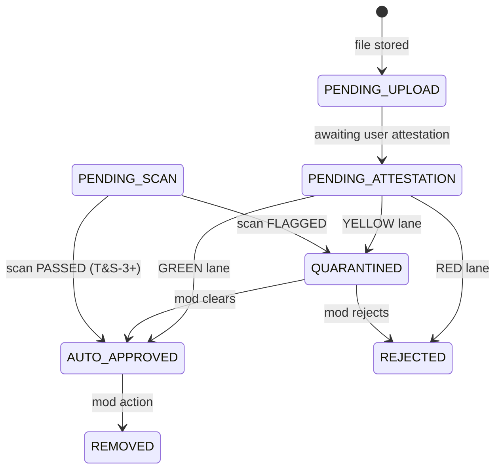

# Media lifecycle (T&S-2)

**Wave:** T&S-2 — adult media metadata, upload attestation, visibility rules, risk-based publish lanes  
**Source of truth (enums):** `packages/shared/src/media-types.ts` (`@c2k/shared`)  
**Schema spine:** `media_assets` table — see [`T&S-IMPLEMENTATION.md`](./T&S-IMPLEMENTATION.md)  
**Audit baseline:** [`T&S-AUDIT.md`](./T&S-AUDIT.md) §3–4  
**Status:** **In progress**

---

## Product frame

C2K is an adult-oriented community platform. **Consensual adult nudity and explicit content are allowed.** The goal is not to block adult expression — it is to enforce age, consent, visibility, reporting, moderation linkage, and auditability before risky media reaches the wrong audience.

**Mental model:**

```text
Adult-community moderation — consent, age, privacy, coercion, and legality are the problem.
Not Instagram-style “nudity is the problem.”
```

**Publish-most, review-risk:** Normal attested adult uploads publish immediately. Only reports, policy triggers, and risk signals send content to human review.

---

## Three publish lanes

| Lane | Meaning | Human review? | Typical `upload_status` |
|------|---------|---------------|-------------------------|
| **GREEN** | Low-risk, attested adult content from a trusted-enough account | No — auto-publish | `AUTO_APPROVED` |
| **YELLOW** | Elevated risk — uncertain signals, multi-person explicit, edge cases | Yes — `MEDIA_REVIEW` queue | `QUARANTINED` or `PENDING_SCAN` |
| **RED** | Suspected minors, NCII, illegal content, severe policy violations | Immediate block + urgent/restricted queue | `REJECTED`, `ESCALATED`, or `QUARANTINED` |

Helper: `resolvePublishLane()` in `@c2k/shared` (`media-types.ts`).

### GREEN — auto-publish

All of the following must be true:

- Required attestation fields present (`allRequiredAttestationsPresent`)
- `content_rating` is `EXPLICIT_ADULT` or `ADULT_NON_EXPLICIT` (not `EDGE_REVIEW` or `BLOCKED_ILLEGAL`)
- `depicted_people` is `ONLY_ME` (solo explicit) or non-explicit rating
- No caption/metadata risk terms (see YELLOW triggers)
- Account trust signals acceptable (not brand-new + high-volume explicit pattern)
- `visibility` is an allowed logged-in surface — **never `PUBLIC_PREVIEW` for explicit**
- No known bad hash (T&S-3+) and no open severe reports on uploader

**User experience:** Upload → attestation → **Publish** immediately. No “pending moderator approval” message.

### YELLOW — queue for review

Any of these forces YELLOW (human review, not a ban):

| Trigger | Rationale |
|---------|-----------|
| `depicted_people` = `ME_AND_OTHER_ADULTS` or `OTHER_ADULTS` on explicit upload | Multi-person consent tooling not mature — **alpha rule: multi-person explicit → review** |
| `content_rating` = `EDGE_REVIEW` | Ambiguous harm signals — no auto-publish |
| Brand-new or low-trust account uploading explicit content | Abuse pattern mitigation |
| Caption/metadata contains risk terms (`teen`, `barely legal`, `leaked`, `hidden cam`, `ex-girlfriend`, `asleep`, etc.) | Not “has nudity” — suspicious framing |
| Explicit content targeting public-ish visibility (`PUBLIC_PREVIEW` attempt — rejected at validation) | Alpha visibility boundary |
| Repeat reports on same asset or uploader under investigation | Escalation from T&S-1 cases |
| Attestation metadata mismatch (e.g. explicit rating + `NO_IDENTIFIABLE_PERSON`) | Integrity check |
| Deferred scan required and not yet `PASSED` (T&S-3+) | Scan backlog |

**User experience:** “Your upload needs a quick safety review because of [risk reason]. Adult content is allowed — this is not a ban.” Asset stays out of public gallery until cleared.

**Status mapping:** Multi-person explicit → `QUARANTINED`; other YELLOW → `PENDING_SCAN` or `QUARANTINED` per `computeMediaUploadStatusAfterAttestation()` (`media-publish-lane.ts`).

### RED — block or quarantine urgently

| Trigger | Queue | Action |
|---------|-------|--------|
| `content_rating` = `BLOCKED_ILLEGAL` | Restricted / urgent | Never publish — `REJECTED` |
| Suspected CSAM / minor safety (`PolicyReason` P0) | `MINOR_SAFETY_RESTRICTED` | Quarantine + restricted staff only |
| NCII, hidden camera, AI deepfake without consent | `NCII_URGENT` | Quarantine + P0 notify |
| User selects attestation conflicts (e.g. confirms minors) | — | `REJECTED` at attestation |
| Doxxing, trafficking, extortion in metadata/caption | P0 / `GENERAL_REVIEW` | Block publish |

RED content never reaches member-visible URLs. Hash-block paths (T&S-4) may auto-quarantine with admin confirm — no autonomous identity ban.

---

## Alpha visibility rules

These rules are **non-negotiable for alpha** and encoded in `validateVisibilityRatingCombo()` / `explicitCannotBePublicPreview()`:

| Rule | Behavior |
|------|----------|
| **Explicit allowed logged-in with SHOW pref** | Signed-in users with `adultContentPreference: SHOW` see explicit media unblurred on allowed surfaces |
| **Never `PUBLIC_PREVIEW` for explicit** | `EXPLICIT_ADULT` + `PUBLIC_PREVIEW` is rejected at API validation |
| **Logged-out users** | No direct explicit media — hidden or blurred via `shouldBlurMediaForViewer()` |
| **Multi-person explicit → review** | `ME_AND_OTHER_ADULTS` / `OTHER_ADULTS` on explicit → YELLOW lane, not GREEN |
| **`EDGE_REVIEW`** | No auto-publish — always YELLOW |
| **`BLOCKED_ILLEGAL`** | Never publish |

### Surface matrix (alpha)

| Surface / context | Explicit adult behavior |
|-------------------|-------------------------|
| Logged-out pages, OG/share previews | Hidden or blurred — no explicit |
| Search / feed thumbnails | Blurred unless viewer pref = `SHOW` |
| Profile avatar | Prefer non-explicit; explicit avatar discouraged |
| Profile gallery (logged-in, attested) | Allowed on `LOGGED_IN`, `FOLLOWERS`, `PRIVATE_PROFILE`, etc. |
| Moderator review UI | **Blurred by default** — reveal → audit (T&S-4) |

### Viewer adult content preference

Stored in `user_settings.privacy_settings.adultContentPreference` (`SHOW` | `BLUR` | `HIDE`). Default for alpha: **`BLUR`** (safer onboarding; user can opt into `SHOW`).

| Pref | Signed-in explicit media |
|------|--------------------------|
| `SHOW` | Render normally (no blur) |
| `BLUR` | Blurred overlay; tap to reveal optional later |
| `HIDE` | Not rendered in feeds/lists; profile may show placeholder |

Helpers: `canViewerSeeMedia()`, `shouldBlurMediaForViewer()` — `packages/api/src/lib/media-visibility.ts`.

---

## Lifecycle states

### Upload status (`media_upload_status`)



| Status | Member-visible? | Notes |
|--------|-----------------|-------|
| `PENDING_UPLOAD` | No | File in storage; metadata incomplete |
| `PENDING_ATTESTATION` | No | Awaiting attestation modal |
| `PENDING_SCAN` | No | GREEN/YELLOW path; scan deferred (T&S-3+) |
| `AUTO_APPROVED` | Yes (if visibility + viewer rules pass) | GREEN publish |
| `APPROVED_BLURRED` | Yes, blurred | Published but default-blurred contexts |
| `QUARANTINED` | No (owner sees pending state) | YELLOW — in mod queue |
| `REJECTED` | No | RED or mod rejection |
| `REMOVED` | No | Post-publish takedown |
| `ESCALATED` | No | External/legal path |
| `PRESERVED` | No | Legal hold — staff only |

Published = `AUTO_APPROVED` or `APPROVED_BLURRED` (`isMediaPublished()`).

### Content rating (`media_content_rating`)

| Code | Auto-publish? | Notes |
|------|---------------|-------|
| `SAFE_PUBLIC` | Yes (GREEN) | May use `PUBLIC_PREVIEW` |
| `ADULT_NON_EXPLICIT` | Yes (GREEN) | Suggestive; logged-in surfaces |
| `EXPLICIT_ADULT` | Yes (GREEN) if solo + attestations | **Never `PUBLIC_PREVIEW`** |
| `EDGE_REVIEW` | No — YELLOW | Ambiguous; human decides |
| `BLOCKED_ILLEGAL` | Never — RED | Hard block |

### Visibility (`media_visibility`)

| Code | Explicit allowed? |
|------|-------------------|
| `PUBLIC_PREVIEW` | **No** for `EXPLICIT_ADULT` |
| `LOGGED_IN` | Yes (alpha primary explicit surface) |
| `FOLLOWERS` | Yes |
| `PRIVATE_PROFILE` | Yes |
| `GROUP_ONLY` | Yes (group context) |
| `ORG_ONLY` | Yes |
| `EVENT_ATTENDEES` | Yes |
| `CONVENTION_ATTENDEES` | Yes |
| `STAFF_ONLY` | Staff paths only |

### Depicted people (`depicted_people`)

| Code | Explicit lane (alpha) |
|------|------------------------|
| `ONLY_ME` | GREEN (solo explicit) |
| `ME_AND_OTHER_ADULTS` | **YELLOW** — review |
| `OTHER_ADULTS` | **YELLOW** — review |
| `NO_IDENTIFIABLE_PERSON` | GREEN for non-identifiable art/scenery |
| `UNKNOWN` | YELLOW — treat as uncertain |

---

## Attestation

**Version:** `MEDIA_ATTESTATION_VERSION = 1`  
**API:** `PATCH /api/v1/media/assets/:id/attestation`  
**UI:** `MediaAttestationModal` (web)

Before explicit adult media can publish, uploader must confirm:

| Field | Meaning |
|-------|---------|
| `uploader_confirmed_18` | Uploader is 18+ |
| `uploader_confirmed_depicted_adults_18` | Everyone depicted is 18+ |
| `uploader_confirmed_consent` | Everyone depicted consented to this upload |
| `uploader_confirmed_right_to_upload` | Uploader has right to post |
| `uploader_confirmed_no_ncii` | Not revenge porn / leaked intimate media |
| `uploader_confirmed_no_hidden_camera` | Not hidden-camera content |
| `uploader_confirmed_no_ai_deepfake_without_consent` | Not AI sexual content of real person without consent |
| `uploader_confirmed_no_minors` | No minors, even in background |

Attestation submission:

1. Validates required fields for rating
2. Runs `resolvePublishLane()` → sets `upload_status`
3. Writes moderation/media audit event
4. Returns lane message (GREEN published vs YELLOW pending review)

Missing attestation keeps status `PENDING_ATTESTATION` — asset not linked to public gallery.

---

## Deferred scanning (T&S-3+)

T&S-2 **defines** scan metadata; **does not** integrate vendors.

| `scan_status` | T&S-2 behavior |
|---------------|----------------|
| `NOT_REQUIRED` | Default for GREEN solo explicit at alpha |
| `PENDING` | Queued for worker (T&S-3) — may hold YELLOW path |
| `PASSED` | Scan complete, no action |
| `FLAGGED` | Route to `MEDIA_REVIEW` or restricted queue |
| `FAILED` / `ERROR` | Retry via BullMQ; do not auto-publish explicit |

**Deferred to T&S-3/T&S-4:**

- Magic-byte / MIME allowlist, EXIF strip
- S3 quarantine prefix (no public URL until approved)
- SHA-256 / perceptual hash registry
- PhotoDNA or other CSAM hash providers
- Virus scanning
- Video frame scanning
- Inline scan in upload route — **post-commit worker only**

At alpha, `sha256_hash` and `perceptual_hash` on `media_assets` are nullable placeholders.

---

## Integration with T&S-1

| Concern | T&S-2 behavior |
|---------|----------------|
| Report target | `media_asset` validated in intake |
| Case linkage | `media_assets.moderation_case_id` FK |
| Queue routing | YELLOW → `MEDIA_REVIEW`; RED P0 → existing P0 queues |
| Snapshots | Case stores metadata + rating + attestation flags — not raw file bytes |
| Hide/remove | `REMOVED` status + existing `hide_content` when wired (T&S-2+) |

Policy reason for mislabeled explicit: `EXPLICIT_VISIBILITY_VIOLATION` → `MEDIA_REVIEW` ([`POLICY_TAXONOMY.md`](./POLICY_TAXONOMY.md)).

---

## First wired surfaces (alpha)

T&S-2 wires **one primary upload path** first — profile photo / gallery (`profile_photos.media_asset_id` FK). Other surfaces (feed attachments, convention gallery, ISO images) follow the same helpers in later slices.

**Do not** require attestation on non-image or non-adult surfaces until those flows exist.

---

## What mods should NOT review daily

Normal consensual adult content that hits GREEN lane:

- Solo nudity, fetishwear, rope, impact marks, BDSM imagery
- Explicit profile/gallery images with complete attestation
- Adult group posts on logged-in surfaces

The queue holds **problems and risk**, not every nude upload. See [`MODERATOR_WORKFLOW.md`](./MODERATOR_WORKFLOW.md).

---

## Verification

```bash
npm run verify:trust-safety          # includes *media*.test.ts when USE_DATABASE=true
npm run verify:trust-safety:media    # media-only slice (when wired)
```

Key test scenarios:

- Solo attested explicit → `AUTO_APPROVED` on `LOGGED_IN`
- Multi-person explicit → `QUARANTINED` + `MEDIA_REVIEW`
- `EXPLICIT_ADULT` + `PUBLIC_PREVIEW` → validation error
- Logged-out / `HIDE` pref → blur or deny
- `SHOW` pref signed-in → unblurred explicit
- Report on `media_asset` → case + queue item

E2E: `e2e/media-ts.spec.ts` (attestation, logged-out blur, report → case).

---

## Deferred (explicitly not T&S-2)

| Item | Wave |
|------|------|
| External scanning vendors (PhotoDNA, etc.) | T&S-3+ |
| CSAM external reporting automation | T&S-4+ |
| NCII public takedown form | T&S-4+ |
| Video scanning | T&S-3+ |
| DM image attachments | T&S-5+ |
| Perceptual hashing enforcement | T&S-3+ |
| Full media gallery product | T&S-3+ |
| Report button on every UGC surface | T&S-5+ |
