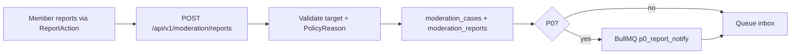

# Moderator workflow (alpha — T&S-1 through T&S-5)

Human-in-the-loop only — trust summary and scanner signals inform review; **no LLM case summarization or autonomous bans** except documented hash-block + admin confirm paths (T&S-4+).

**Status:** Shipped for alpha — platform console, unified intake, scoped mod parity, media pipeline, OSS scanners. Platform appeals on `moderation_appeals` deferred (T&S-7); scoped appeals alpha at `/settings/trust`.

**Companion:** [`docs/MODERATION_WIREFRAME.md`](../../MODERATION_WIREFRAME.md), [`docs/architecture/12-moderation-systems.md`](../../architecture/12-moderation-systems.md), [`POLICY_TAXONOMY.md`](./POLICY_TAXONOMY.md), [`MEDIA_LIFECYCLE.md`](./MEDIA_LIFECYCLE.md), [`T&S-IMPLEMENTATION.md`](./T&S-IMPLEMENTATION.md).

---

## Roles

| Role | Table / env | Capabilities |
|------|-------------|--------------|
| **Member** | `users` | Report in-context (`ReportAction` → `TsReportModal`); block/mute; view own report status in Settings |
| **Org/group mod** | org/group membership | Scoped inbox, hide/lock, scope bans, audit, escalate to platform |
| **Event/convention mod** | event host / convention staff | Hide discussion posts, lock threads, hide hub chat (T&S-5) |
| **Platform mod** | `platform_staff.MODERATOR` | Cross-community cases, propose actions, rule-of-two |
| **Site admin** | `platform_staff.SITE_ADMIN` | Override rule-of-two, identity ban, org freeze, suspend (audit today), restricted queues |

**Seeded QA users:** RopeDreamer (`MODERATOR`), Brax (`SITE_ADMIN`). Passwords: `demo` (demo users) / `Airship!2` (Brax default).

**Grant Brax site admin on an existing DB:** `npm run db:ensure-brax-site-admin` (idempotent upsert of `platform_staff.SITE_ADMIN` for username `Brax`).

---

## Accessing the moderation console (T&S-3.5+)

**Who sees it:** Platform moderators and site admins only (`GET /api/v1/moderation/me` → `{ moderator: true }`). Org/group/convention moderators use **scoped** organizer panels unless they also have `platform_staff`.

**Where to click:**

1. **Account menu (desktop + mobile)** — section **Trust & Safety** → dashboard, queues, cases.
2. **Settings → Account** — **Moderation tools** panel (same links).
3. **Direct URL** — `/moderation/dashboard` (index redirects here).

**Platform console routes (current):**

| Route | Purpose |
|-------|---------|
| `/moderation/dashboard` | Open counts, P0 callouts, recent cases |
| `/moderation/queues` | Routed inbox items |
| `/moderation/cases`, `/moderation/cases/:caseId` | Unified case queue + detail |
| `/moderation/actions` | Rule-of-two proposal queue |
| `/moderation/reports` | Legacy platform report inbox (secondary) |
| `/moderation/profile-flags` | Peer downvote surge queue |
| `/moderation/audit` | Append-only audit log |
| `/moderation/admin` | Site admin: freeze org, identity ban, suspend |
| `/moderation/legal`, `/moderation/dmca` | Legal-alpha requests and DMCA |

**Required role resolution:**

| Source | Role |
|--------|------|
| `platform_staff` table | `SITE_ADMIN` or `MODERATOR` |
| Env bootstrap | `C2K_SITE_ADMIN_USER_IDS`, `C2K_PLATFORM_MODERATOR_USER_IDS` |

**Restricted queue:** `MINOR_SAFETY_RESTRICTED` counts and queue items are visible only to `SITE_ADMIN`. Platform moderators receive 403 when filtering that queue.

**Seed a test case:** Run `npm run db:seed` (includes moderation demo fixtures) or file a report as a non-admin member via in-context report UI.

**Automation:** `npm run verify:trust-safety` (DB dashboard + queue ACL tests in `moderation-ts-admin.test.ts`).

---

## Intake → case (current)

**Canonical path:** `ReportAction` → `TsReportModal` → `useSubmitReport` → `POST /api/v1/moderation/reports`. Legacy `POST /api/v1/reports` delegates to the same intake.

**Dual-stack bridge:** Scoped org/group reports also mirror a row in legacy `reports` for organizer inboxes; platform cases always carry `policy_reason`, severity, and queue on `moderation_cases`.

**Context excerpts:** `moderation-report-context.ts` supplies target label, scope, and safe excerpt for mod review without opening every surface.

**Report target types (23):** `profile`, `profile_photo`, `post`, `comment`, `message`, `conversation`, `group`, `group_thread`, `group_reply`, `organization`, `org_chat_message`, `org_forum_thread`, `org_forum_reply`, `event`, `convention`, `convention_chat_message`, `vendor`, `presenter`, `media_asset`, `education_article`, `media_show`, `media_episode`, `platform` — see `moderation-ts-target-validate.ts`.

---

## Platform mod daily flow

### 1. Triage inbox

- **Dashboard** (`/moderation/dashboard`) — open case counts, queue/severity breakdown, NCII/minor-safety callouts, trust-safety config, recent cases.
- **Cases** (`/moderation/cases`) — unified queue by `ModerationQueue`.
- **Queues** (`/moderation/queues`) — routed inbox items.
- **Actions** (`/moderation/actions`) — pending rule-of-two proposals.
- **Reports** (`/moderation/reports`) — legacy alpha inbox (still available; not linked from primary nav).
- **Profile flags** (`/moderation/profile-flags`) — peer downvote surges.

Filter by queue, severity, status. P0 items surface in `NCII_URGENT` and `MINOR_SAFETY_RESTRICTED`.

**Media review queue (`MEDIA_REVIEW`):** T&S-2 routes **YELLOW-lane** uploads here — multi-person explicit, edge-review ratings, low-trust account patterns, caption risk terms, attestation mismatches, scanner flags. **Not** every nude upload. GREEN-lane solo attested explicit content auto-publishes and only appears in this queue if **reported** or scan-flagged.

### 2. Case detail

1. Read policy reason, reporter note, context excerpt.
2. **Trust Summary panel** — mod-only SQL aggregation for target user (incidents, standing signals).
3. **Incident cluster panel** — linked incidents, findings, resolution (alpha).
4. **Restricted queues:** minor safety / CSAM — only trained staff; blurred media preview with reveal → audit `content.revealed`.
5. **Media assets (T&S-2 / T&S-3 / T&S-4A):** metadata (rating, visibility, depicted people, attestation flags, publish lane, storage state, scan status, SHA-256, dimensions, public URL issued yes/no) plus **scanner summary** (malware, hash list, adult classifier, OCR risk). Explicit previews blurred by default — reveal → audit. Case actions: `keep_quarantined`, `remove_media`, `restore_media` for `media_asset` / `profile_photo`.
6. Add **internal note** (not visible to reporter).
7. Propose enforcement, `hide_content` (forum/chat only), or mark `CLOSED_NO_VIOLATION` / `CLOSED_DUPLICATE`.

### 3. Rule of two

1. Mod A proposes action (`moderation_actions` → `PENDING_APPROVAL`).
2. Mod B (different user) approves.
3. Worker executes → `moderation_audit_events`.

Site admin may **execute now** with reason → audit `action.rule_of_two_overridden`.

### 4. Reporter-facing status

- **Settings → Support & reports** — `GET /api/v1/me/moderation/reports` (canonical); legacy `GET /api/v1/me/reports` merged in UI for scoped rows.
- **`report_reviewed` notification** — emitted when platform case closes with action or no-violation (T&S-5), and when org/group mods resolve scoped reports.
- Full platform appeals workflow — T&S-7 (deferred). Scoped appeal filing — `/settings/trust` (alpha).

---

## Org/group/event mod flow (T&S-5)

1. **Organizer** → org or group **Moderation** tab — scoped inbox (`OrganizerOrgModerationPanel`, `OrganizerGroupModerationPanel`).
2. Hide post / lock thread / hide chat message.
3. Scope ban; optional **escalate to platform** checkbox → platform case + `moderation_report_escalated` notify.
4. Org/group audit timeline (`GET .../moderation/audit`).
5. **Event hosts** — hide/lock on event discussion (`event-moderation.ts`).
6. **Convention staff** — hide hub chat message.

Platform-critical policy reasons (minor safety, NCII, trafficking, etc.) must not be dismissed locally only — escalate or route to platform T&S. Helper: `isPlatformCriticalPolicyReason()` in `@c2k/shared`.

---

## Enforcement matrix (current)

| Surface | Report | Mod takedown (platform case) | Scoped mod takedown |
|---------|--------|------------------------------|---------------------|
| Forum / org chat | ✓ | `hide_content` (forum/chat targets) | Hide / lock |
| Profile | ✓ | Case only — no hide | Identity ban (site admin) |
| Feed post | ✓ | **Gap** — case only | N/A |
| Education / media show / episode | ✓ | Case; media uses `remove_media` | N/A |
| DMs / conversation | ✓ | Case only — metadata path | Block/mute |
| Media uploads | ✓ | `remove_media` / quarantine actions | N/A |
| Convention hub chat | ✓ | Case only | Staff hide |
| Event discussion | ✓ | Case only | Host hide / lock |

---

## Audit and accountability

Every enforcement write goes to `moderation_audit_events` with verb from `MODERATION_AUDIT_VERBS`. Rows are append-only.

Search: `/moderation/audit`. Export CSV — T&S-8.

---

## Media review — what belongs in the queue

**Publish-most model:** Mods review **problems and risk**, not normal adult expression.

| In queue | Not in queue (unless reported) |
|----------|--------------------------------|
| User reports (NCII, minor safety, harassment, etc.) | Solo explicit with complete attestation (GREEN) |
| Multi-person explicit pending review (alpha rule) | Consensual kink/fetish/nudity on logged-in surfaces |
| `EDGE_REVIEW` or attestation mismatch | Normal profile gallery explicit for opted-in members |
| Caption risk terms (`teen`, `leaked`, `hidden cam`, …) | |
| Brand-new account explicit upload spikes | |
| Scanner flags (hash, malware, classifier, OCR) | |
| `EXPLICIT_VISIBILITY_VIOLATION` reports (wrong visibility/label) | |

**Daily rhythm at alpha scale:**

1. Clear P0 / restricted queues first (minor safety, NCII).
2. Triage `MEDIA_REVIEW` — focus on quarantined (`QUARANTINED`) assets, not auto-approved gallery browsing.
3. General reports once or twice daily.
4. Do **not** treat consensual adult nudity as a violation by default.

---

## What mods must not do

- Approve or reject every explicit upload — only YELLOW/RED lane and reported content.
- Auto-resolve or auto-ban from ML/scanner scores alone.
- Read DM bodies in platform console (metadata-only path in T&S-8).
- Change audit history.
- Skip rule-of-two without site admin override + documented reason.

---

## Local verification

| Command | Requires |
|---------|----------|
| `npm run verify:trust-safety` | Docker + `db:prepare` — full moderation + media gate |
| `npm run verify:trust-safety:unit` | Node only — shared enum unit tests |
| `VERIFY_TS_E2E=1 npm run verify:trust-safety:local` | Docker + dev stack + Playwright |
| `node scripts/smoke-moderation-checkpoint.mjs` | Dev stack + seed |
| `npm run test:e2e:trust-safety` | E2E moderation slice |

E2E spec: `e2e/moderation-ts.spec.ts` — runs against live cases API when DB + seed users available (skips only when DB or login unavailable).
