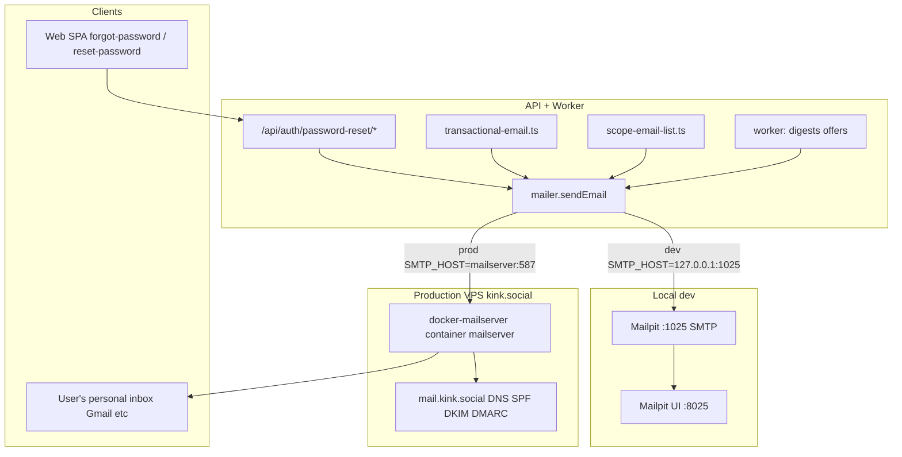

# C2K Email System — Full Handoff for External Analysis

**Purpose:** Give another assistant (or operator) enough context to answer: *How do recovery emails work? Why might mail not arrive? What is configured on prod vs local?*

**Repo:** `coast-to-coast-kink` (monorepo)  
**Production site:** https://kink.social  
**Last updated:** 2026-06-13

---

## 1. Executive summary — how recovery emails work

Password recovery is **100% server-side**. The web app only collects the identifier and posts to the API; it does **not** send mail itself.

### End-to-end flow (password reset)

```
User → /forgot-password (web)
     → POST /api/auth/password-reset/request { identifier: email or username }
     → API finds user (or silently no-ops)
     → Generates 32-byte token → SHA-256 hash stored in password_reset_tokens
     → Builds email with link: {C2K_PUBLIC_WEB_URL}/reset-password?token={rawToken}
     → sendEmail() via mailer (SMTP or Resend)
     → User clicks link → /reset-password?token=… (web)
     → POST /api/auth/password-reset/confirm { token, password }
     → Password updated, sessionVersion bumped, "password changed" email sent
```

**Important behaviors:**

- API **always** returns the same generic success message whether or not the account exists (no account enumeration).
- If `sendEmail()` fails, the API **still** returns success to the client; failure is **logged only** (`password reset email failed`).
- Reset links expire in **45 minutes** by default (`C2K_PASSWORD_RESET_TTL_MS`).
- Password must be **12–128 characters** on confirm.

### What actually sends the mail?

Single choke point: `packages/api/src/lib/mailer.ts` → `sendEmail()`.

Transport is selected by `C2K_MAIL_TRANSPORT`:

| Value | Behavior |
|-------|----------|
| `disabled` (default) | No mail sent; `{ ok: false, error: 'mail_transport_disabled' }` |
| `smtp` | Nodemailer → `SMTP_HOST`:`SMTP_PORT` with optional auth |
| `resend` | HTTPS POST to Resend API with `RESEND_API_KEY` |

---

## 2. Architecture (local vs production)



### Local development

| Item | Value |
|------|-------|
| Container | `mailpit` in `docker-compose.dev.yml` |
| SMTP | `127.0.0.1:1025` (no TLS, no auth) |
| **Web UI inbox** | http://127.0.0.1:8025 |
| Env | `.env.development`: `C2K_MAIL_TRANSPORT=smtp`, `SMTP_HOST=127.0.0.1`, `SMTP_PORT=1025` |

Start: `docker compose -f docker-compose.dev.yml up -d mailpit`

### Production (kink.social VPS)

| Item | Value |
|------|-------|
| Mail container | `ghcr.io/docker-mailserver/docker-mailserver` (service name `mailserver`) |
| Internal SMTP | `SMTP_HOST=mailserver`, `SMTP_PORT=587` (Docker network) |
| Public ports | 25, 587, 465 on VPS |
| Public DNS | `mail.kink.social` (A record to VPS) |
| From address | Typically `noreply@kink.social` (`C2K_MAIL_FROM`) |
| **Webmail UI** | **None** — no Roundcube/web UI in stack; Caddy only serves kink.social app |
| Operator access | SSH + `docker compose logs mailserver`, DKIM setup scripts |

**Deliverability note:** `docs/SERVER_CUTOVER_LOG.md` lists formal SPF/DKIM/DMARC sign-off as **operator-owned / may be incomplete**. Transport can work while Gmail still spam-folders or rejects mail.

### Alternative prod path (documented, not necessarily live)

K8s / external SMTP: `SMTP_HOST=mail.yourdomain.com` or `C2K_MAIL_TRANSPORT=resend` + `RESEND_API_KEY`. See `docs/DEPLOY_MAIL_K8S.md`.

---

## 3. Password reset — code map

| Concern | File |
|---------|------|
| Token + email builders + DB | `packages/api/src/lib/password-reset.ts` |
| Startup validation | `packages/api/src/lib/mail-config.ts` |
| HTTP routes | `packages/api/src/routes/auth.ts` |
| Send implementation | `packages/api/src/lib/mailer.ts` |
| DB table | `password_reset_tokens` in `packages/api/src/db/schema.ts` |
| Rate limits | `packages/api/src/lib/rate-limit-config.ts` |
| Tests | `packages/api/src/test/password-reset.test.ts`, `e2e/auth.spec.ts` |

### API routes

| Method | Path | Body |
|--------|------|------|
| `POST` | `/api/auth/password-reset/request` | `{ identifier: string }` |
| `POST` | `/api/auth/password-reset/confirm` | `{ token: string, password: string }` |
| `GET` | `/api/auth/password-reset/policy` | `{ enabled, genericMessage }` |

### Rate limits (defaults)

| Preset | Limit |
|--------|-------|
| `passwordResetRequest` | 5 / hour / IP + identifier |
| `passwordResetConfirm` | 10 / hour / IP |

Bypass: `C2K_RATE_LIMIT_DISABLE=true`

### Email content (reset)

- **Subject:** `{APP_NAME} password reset`
- **Link format:** `{C2K_PUBLIC_WEB_URL}/reset-password?token={base64url}`
- **TTL in copy:** ~45 minutes (from `C2K_PASSWORD_RESET_TTL_MS`)

After successful confirm, a second email: **"{APP_NAME} password changed"**.

### Web UI

| Route | File |
|-------|------|
| `/forgot-password` | `packages/web/src/app/forgot-password/page.tsx` |
| `/reset-password` | `packages/web/src/app/reset-password/page.tsx` |
| Link from login | `packages/web/src/components/LoginCard.tsx` → "Forgot password?" |

Both pages are **public** (`packages/web/src/lib/public-routes.ts`).

---

## 4. All outbound email types (inventory)

Everything goes through `sendEmail()` unless noted.

### Auth & account

| Email | Trigger | Builder / sender | Gate env |
|-------|---------|------------------|----------|
| Password reset link | `POST /api/auth/password-reset/request` | `buildPasswordResetEmail` → `sendEmail` in `password-reset.ts` | Reset enabled + transport not disabled |
| Password changed notice | `POST /api/auth/password-reset/confirm` | `buildPasswordChangedEmail` → `sendEmail` | Same |
| Account welcome | `POST /api/auth/register` (async, fire-and-forget) | `sendAccountWelcomeEmail` in `transactional-email.ts` | `C2K_ACCOUNT_WELCOME_EMAIL=true` |

### Community / org

| Email | Trigger | File |
|-------|---------|------|
| Org join welcome | `POST /api/v1/organizations/:slug/join` | `sendOrgWelcomeEmail` |
| Event RSVP confirm | RSVP PUT in ecosystem routes | `sendEventRsvpConfirmationEmail` |
| Scope list confirm | Org/group subscribe | `buildScopeEmailConfirmEmail` via `scope-email-list.ts` |
| Scope broadcast | Organizer broadcast POST | `sendScopeEmailBroadcast` |
| Convention participation offer | Worker job `send-offer-email` | `convention-participation-offer-email.ts` |
| Convention message campaigns | Organizer bulk send routes | convention message routes |
| Weekly org digest | Worker `org-digest-sweep` | `org-digest-sweep.ts` |
| Pinned conventions digest | Worker `pinned-digest-sweep` | `pinned-digest-sweep.ts` |

### Dev / ops

| Endpoint | Purpose |
|----------|---------|
| `GET /api/v1/me/email/status` | Transport + feature flags for signed-in user |
| `POST /api/v1/me/email/test-send` | `{ template: 'account_welcome' \| 'event_rsvp_confirm' }` |
| `GET /api/health/mail` | Non-destructive config diagnostic (no send) |

**Web has no mail env vars** — all SMTP/Resend config is API/worker only.

---

## 5. Environment variables (complete reference)

### Core transport

| Variable | Default | Notes |
|----------|---------|-------|
| `C2K_MAIL_TRANSPORT` | `disabled` | `smtp` \| `resend` \| `disabled` |
| `C2K_MAIL_FROM` | — | Required when transport enabled |
| `C2K_PUBLIC_WEB_URL` | `http://127.0.0.1:5173` | **Required** for reset links when reset enabled |
| `C2K_PLATFORM_MAIL_BCC` | — | Comma-separated; BCC on every send |
| `SMTP_HOST` | — | Required for smtp |
| `SMTP_PORT` | `587` | |
| `SMTP_SECURE` | `false` | |
| `SMTP_USER` / `SMTP_PASS` | — | Optional for Mailpit; required for prod mailserver auth |
| `RESEND_API_KEY` | — | Required when transport=resend |
| `C2K_ALLOW_DEV_SMTP_IN_PRODUCTION` | — | Allows localhost/mailpit host in prod (discouraged) |

### Password reset

| Variable | Default | Notes |
|----------|---------|-------|
| `C2K_PASSWORD_RESET_ENABLED` | enabled | Set `false` to disable |
| `C2K_PASSWORD_RESET_TTL_MS` | 2700000 (45 min) | |
| `PASSWORD_RESET_TOKEN_PURGE_MS` | retention | Purged by worker retention job |

### Transactional toggles

| Variable | Effect |
|----------|--------|
| `C2K_ACCOUNT_WELCOME_EMAIL=true` | Register welcome |
| `C2K_ORG_JOIN_EMAIL=true` | Org join welcome |
| `C2K_EVENT_RSVP_EMAIL=true` | RSVP confirmation |
| `C2K_SCOPE_EMAIL_DOUBLE_OPTIN=true` | Confirm email on list subscribe |

### Rate limits

| Variable | Default |
|----------|---------|
| `C2K_RATE_LIMIT_PASSWORD_RESET_REQUEST_MAX` | 5 |
| `C2K_RATE_LIMIT_PASSWORD_RESET_REQUEST_WINDOW_MS` | 3600000 |
| `C2K_RATE_LIMIT_PASSWORD_RESET_CONFIRM_MAX` | 10 |
| `C2K_RATE_LIMIT_PASSWORD_RESET_CONFIRM_WINDOW_MS` | 3600000 |
| `C2K_RATE_LIMIT_DISABLE` | — |

### Worker digests

| Variable | Notes |
|----------|-------|
| `C2K_ORG_DIGEST_DISABLE` | |
| `C2K_ORG_DIGEST_REPEAT_MS` | default 7 days |
| `C2K_PINNED_DIGEST_DISABLE` | |
| `C2K_PINNED_DIGEST_REPEAT_MS` | |
| `C2K_LIFECYCLE_DISABLE_REPEAT` | disables all lifecycle repeats |

### Where env is loaded

- **Local:** root `.env.development` (API reads via dotenv in dev)
- **Prod VPS:** `/opt/c2k/.env.production` — both `api` and `worker` services use `env_file`
- **Example template:** `.env.production.example`

---

## 6. Startup guards (production)

`packages/api/src/server.ts` calls `assertMailConfiguredForPasswordReset()` at boot.

If password reset is enabled in **production**:

- `C2K_PUBLIC_WEB_URL` must be set
- `C2K_MAIL_TRANSPORT` must be `smtp` or `resend` (not `disabled`)
- SMTP must not point at dev hosts (`127.0.0.1`, `mailpit`, etc.) unless `C2K_ALLOW_DEV_SMTP_IN_PRODUCTION=true`
- `C2K_MAIL_FROM` required; `RESEND_API_KEY` required for resend

**Implication:** If API is running on prod, mail transport is *configured* — but individual sends can still fail (auth, relay, DNS).

---

## 7. Database

| Table | Purpose |
|-------|---------|
| `password_reset_tokens` | `userId`, `tokenHash` (SHA-256, not raw token), `expiresAt`, `usedAt`, `requestIp` |
| `platform_email_captures` | Marketing/list signup archive |
| Org/group scope email tables | Subscribers, pending confirm tokens (see `scope-email-list.ts`) |

User email may be encrypted at rest; lookup uses `findUserByEmailLookup` / `EMAIL_LOOKUP_PEPPER`.

---

## 8. Scope / marketing email (separate from recovery)

| Web route | API |
|-----------|-----|
| `/email/confirm?token=` | `GET /api/v1/email-list/confirm?token=` |
| `/email/unsubscribe?scope=&id=&email=` | POST org/group unsubscribe |

Organizer panels: `ScopeEmailBroadcastPanel.tsx`, `OrgEmailListPanel.tsx` — show "Mail transport disabled" when server transport is off.

User notification prefs (including digest email toggles): **Settings → Notifications** (`SettingsNotificationsPage.tsx`), not a dedicated mail settings page.

---

## 9. Scripts & tests

| Script | Use |
|--------|-----|
| `scripts/smoke-transactional-mail.mjs` | Local: register welcome, org join, RSVP via Mailpit |
| `scripts/smoke-scope-email-double-optin.mjs` | Local double opt-in |
| `scripts/pilot-readiness-smoke.mjs` | Local or prod health + optional Mailpit |
| `scripts/vps/smoke-mail.sh` | VPS: swaks send through mailserver:587 |
| `npm run mail:config-check -w @c2k/api` | Config diagnostic |
| `e2e/mail.spec.ts` | Playwright confirm/unsubscribe UX |
| `packages/api/src/test/password-reset.test.ts` | Unit + rate limit smoke |

---

## 10. Production debugging playbook

Run on VPS (`cd /opt/c2k`) unless noted.

### Step 1 — Is mail configured?

```bash
curl -sS https://kink.social/api/health/mail
curl -sS https://kink.social/api/auth/password-reset/policy
```

Expect `ok: true`, `transport: smtp`, no issues array entries.

### Step 2 — Did the API try to send?

```bash
docker compose -f docker-compose.prod.yml -f docker-compose.prod.vps.yml \
  --env-file .env.production logs api --tail=200 | grep -i 'password reset email'
```

Look for `password reset email failed` with `err` field.

### Step 3 — Did mailserver accept relay?

```bash
docker compose -f docker-compose.prod.yml -f docker-compose.prod.vps.yml \
  --env-file .env.production logs mailserver --tail=200
```

### Step 4 — SMTP smoke from inside stack

```bash
bash scripts/vps/smoke-mail.sh
```

### Step 5 — DKIM / DNS

```bash
docker compose ... exec mailserver cat \
  /tmp/docker-mailserver/opendkim/keys/kink.social/mail.txt
```

Compare with DNS TXT for DKIM; verify SPF includes VPS sending IP / `mail.kink.social`.

### Step 6 — Authenticated test send

Sign in as platform admin (`C2K_PLATFORM_ADMIN_EMAILS`), then:

```http
POST /api/v1/me/email/test-send
{ "template": "account_welcome" }
```

### Emergency stop

Set `C2K_MAIL_TRANSPORT=disabled` in `.env.production`, restart `api` + `worker`.

---

## 11. Common failure modes (for ChatGPT to investigate)

| Symptom | Likely causes |
|---------|----------------|
| Forgot-password UI succeeds, no email | Transport disabled; `sendEmail` failed (check API logs); user has no email on row; rate limited (429) |
| Email in spam | Missing/wrong SPF, DKIM, DMARC; new domain reputation; From domain mismatch |
| Reset link 410 | Token expired (45 min); already used; clock skew |
| API won't start in prod | `assertMailConfiguredForPasswordReset` fatal — missing `C2K_PUBLIC_WEB_URL` or transport |
| Works locally, not prod | Mailpit vs mailserver; prod needs real DNS; `C2K_PUBLIC_WEB_URL` must be `https://kink.social` |
| Platform BCC works, user doesn't | BCC is separate recipient; user inbox provider blocking |
| Encrypted email lookup miss | User registered with email that doesn't match lookup normalization |

---

## 12. Key file index (copy-paste paths)

```
packages/api/src/lib/mailer.ts
packages/api/src/lib/mail-config.ts
packages/api/src/lib/password-reset.ts
packages/api/src/lib/transactional-email.ts
packages/api/src/lib/scope-email-list.ts
packages/api/src/routes/auth.ts
packages/api/src/routes/email-routes.ts
packages/api/src/routes/scope-email-routes.ts
packages/api/src/routes/health.ts
packages/api/src/worker.ts
packages/api/src/lib/org-digest-sweep.ts
packages/web/src/app/forgot-password/page.tsx
packages/web/src/app/reset-password/page.tsx
packages/web/src/lib/public-routes.ts
docker-compose.dev.yml          # mailpit
docker-compose.prod.vps.yml     # mailserver
.env.development
.env.production.example
Caddyfile                       # no mail routes
docs/DEPLOY_MAIL_K8S.md
docs/PROD_SMTP_K8S_CHECKLIST.md
docs/SERVER_CUTOVER_LOG.md
docs/handoff/SESSION-2026-06-11-MOBILE-AUTH-MAIL.md
scripts/vps/smoke-mail.sh
scripts/smoke-transactional-mail.mjs
```

---

## 13. Open questions / gaps (good prompts for ChatGPT)

1. **Deliverability:** Are SPF, DKIM, and DMARC correctly published for `kink.social` and `mail.kink.social`? Cross-check live DNS vs docker-mailserver DKIM key on VPS.
2. **Inbound vs outbound:** Stack is optimized for **outbound transactional** mail. Is there any requirement for mailboxes users can log into on-domain?
3. **Silent send failures:** Reset request returns success even when `sendEmail` fails — should product surface an ops alert or queue retries?
4. **Worker parity:** Confirm worker container has identical mail env to api (digests use worker).
5. **Encrypted emails:** If `getEmailFromUserRow` returns null for some users, reset mail never sends but API still says success — audit seed/prod user rows.
6. **Alternative transport:** Would Resend (or SES SMTP) be simpler than self-hosted docker-mailserver for deliverability?
7. **Forgot-password on auth-only landing:** `/forgot-password` is a separate public page (not the minimal landing card) — intentional UX gap noted in prior handoff.

---

## 14. Quick answer cheat sheet

**Q: How are recovery emails sent?**  
A: User submits identifier on `/forgot-password` → API `POST /api/auth/password-reset/request` → `requestPasswordReset()` in `password-reset.ts` → `sendEmail()` in `mailer.ts` over SMTP to `mailserver:587` (prod) or Mailpit (dev) → email contains link to `/reset-password?token=…`.

**Q: Is there a mail server web UI on kink.social?**  
A: **No.** Local dev only: Mailpit at http://127.0.0.1:8025. Production: docker-mailserver, SSH/logs only.

**Q: What env vars must be set for recovery on prod?**  
A: `C2K_MAIL_TRANSPORT=smtp`, `SMTP_HOST=mailserver`, `SMTP_PORT=587`, `C2K_MAIL_FROM`, `SMTP_USER`/`SMTP_PASS` (for mailserver auth), `C2K_PUBLIC_WEB_URL=https://kink.social`, and do not set `C2K_PASSWORD_RESET_ENABLED=false`.

---

*Generated for external handoff. Update this file when mail architecture or env changes.*
