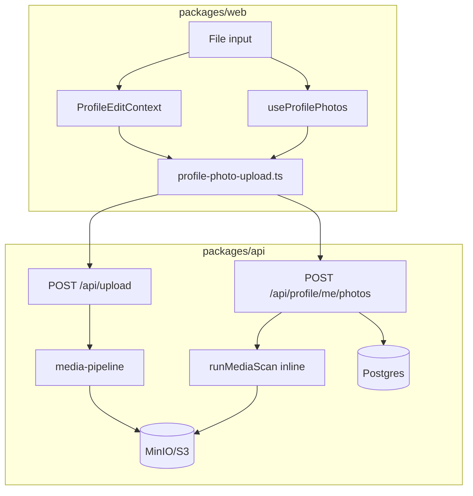

# Profile photo & upload system — full handoff for repair agent

**Purpose:** Single source of truth for how profile photos and uploads work in C2K, what is broken, and what to fix.  
**Audience:** Senior agent / human doing a proper fix pass.  
**Repo:** `coast-to-coast-kink` monorepo (`packages/shared`, `packages/api`, `packages/web`).  
**Last audited:** 2026-06-11 (conversation + codebase read).

> **Production VPS incident (2026-06-11) — RESOLVED.** Upload hangs and empty gallery on `kink.social` were caused by **server-side Sharp/mozjpeg** on full-res photos (2-core VPS) plus **delete-before-insert** on primary photo attach. Full write-up: [`PHOTO-UPLOAD-VPS-FIX-2026-06-11.md`](./PHOTO-UPLOAD-VPS-FIX-2026-06-11.md).

---

## 0. User-reported failures (Brax session)

| Symptom | Likely cause |
|---------|----------------|
| Profile photo “won’t update” after many tries | Was: delete primary before insert left empty gallery on attach failure. Fixed: insert then delete other primaries. See [`PHOTO-UPLOAD-VPS-FIX-2026-06-11.md`](./PHOTO-UPLOAD-VPS-FIX-2026-06-11.md). |
| Footer shows “Uploading…” with no Network activity | Misleading UX: Save button relabeled during photo upload though Save does not upload photos; upload hangs if API/MinIO down; file input was disabled during hang |
| `useProfileEdit must be used within ProfileEditProvider` | HMR/dev remount glitch or render outside provider; structure in router is correct |
| Photo looks saved but public profile unchanged | `pendingReview` / `QUARANTINED` — photo saved but hidden from public until scan/moderation; OR `avatar_url` not synced when primary is not published |
| Console empty during upload | Upload activity is in **Network** tab (`POST /api/upload`, `POST /api/profile/me/photos`), not Console |

---

## 1. End-to-end flow (intended)

```
Browser picks File
  → POST /api/upload  (multipart: file + purpose=profile_photo)
      → processIncomingImageUpload → S3 quarantine/{userId}/{uuid}.ext
      ← { quarantineKey, sha256, mimeType, sizeBytes, width, height, url: null }

  → POST /api/profile/me/photos  (JSON: quarantineKey + metadata, sortOrder: 0)
      → createMediaAssetForProfilePhoto (sourceSurface=profile_gallery)
      → autoPublishProfileGalleryPhoto (auto-attest SAFE_PUBLIC + onlyMe)
      → submitMediaAttestation → resolvePublishLane → runMediaScan (inline, sync)
      → finalizeMediaAfterAttestation → maybe promoteMediaAssetToPublic
      → INSERT profile_photos, then [if sortOrder=0] delete other sort_order=0 rows (not new id), syncProfileAvatarUrl
      ← { photo: ProfilePhotoDto with uploadStatus, pendingReview, url }

  → [optional] PATCH /api/v1/media/assets/:id/attestation (if PENDING_ATTESTATION — rare for profile auto-path)

  → GET /api/profile/me (reload) — hydrate edit UI from photos[]
```

**Dev routing:** Vite `5173` proxies `/api/*` → `http://127.0.0.1:3001` (`packages/web/vite.config.ts`).

**Requires locally:** `USE_DATABASE=true`, API on 3001, Docker MinIO (`S3_ENDPOINT=http://127.0.0.1:9000`), `npm run dev`.

---

## 2. API routes (complete list)

| Method | Path | File |
|--------|------|------|
| POST | `/api/upload` | `packages/api/src/routes/upload.ts` |
| GET | `/api/profile/me/photos` | `packages/api/src/routes/profile-photos.ts` |
| POST | `/api/profile/me/photos` | same |
| PATCH | `/api/profile/me/photos/:photoId` | same |
| DELETE | `/api/profile/me/photos/:photoId` | same |
| GET | `/api/profile/me` | `packages/api/src/routes/profile.ts` (includes `photos`) |
| GET | `/api/profile/:username` | same (public photos filtered) |
| POST | `/api/v1/media/assets` | `packages/api/src/routes/media-assets.ts` |
| PATCH | `/api/v1/media/assets/:id/attestation` | same |
| GET | `/api/v1/media/assets/:id` | same |
| GET | `/api/v1/media/assets/:id/content` | same (auth-gated stream for quarantine) |
| POST | `/api/v1/moderation/cases/:id/actions` | `packages/api/src/routes/moderation-ts-admin.ts` |
| DELETE | `/api/v1/me/media/:mediaAssetId` | `packages/api/src/routes/privacy-data-routes.ts` |

Registered in `packages/api/src/server.ts`.

---

## 3. Request / response contracts

### POST `/api/upload`

**Auth:** required  
**Body:** multipart  
- `file` (required)  
- `purpose` (required) — must be `profile_photo` for profile path  

**Guards:**  
- `USE_DATABASE=true` else 503  
- `C2K_ALPHA_DISABLE_PROFILE_PHOTO_UPLOADS=true` blocks profile photos  

**Success 200:**
```json
{
  "quarantineKey": "quarantine/{userId}/{uuid}.jpg",
  "key": "quarantine/...",
  "sha256": "...",
  "mimeType": "image/jpeg",
  "sizeBytes": 12345,
  "width": 800,
  "height": 600,
  "exifStripped": true,
  "status": "quarantined",
  "url": null,
  "contentUrl": null
}
```

### POST `/api/profile/me/photos`

**Body** (at least one of `url`, `quarantineKey`, `mediaAssetId`):
```typescript
{
  url?: string
  quarantineKey?: string
  mediaAssetId?: string
  caption?: string | null
  sortOrder?: number  // default existing.length; 0 = primary
  mimeType?, sizeBytes?, originalFilename?, sha256Hash?,
  imageWidth?, imageHeight?, storageBucket?
}
```

**Success 201:**
```json
{
  "photo": {
    "id": "uuid",
    "url": "https://... or /api/v1/media/assets/{id}/content",
    "caption": null,
    "order": 0,
    "mediaAssetId": "uuid",
    "uploadStatus": "AUTO_APPROVED | QUARANTINED | PENDING_SCAN | REJECTED | ...",
    "contentRating": "SAFE_PUBLIC",
    "visibility": "LOGGED_IN",
    "isBlurredByDefault": false,
    "pendingReview": true,
    "publishLane": "GREEN | YELLOW | RED | null"
  }
}
```

**Errors:**  
- `400` + `code: profile_photo_blocked` — hard reject (explicit rating / RED lane)  
- `401`, `503`

---

## 4. Database tables

### `profiles` (`packages/api/src/db/schema.ts`)
- `avatar_url` — denormalized public avatar for cards/search; synced by `syncProfileAvatarUrl` and `promoteMediaAssetToPublic`

### `profile_photos`
- `id`, `profile_id`, `media_asset_id`, `url`, `caption`, `sort_order`, `created_at`
- `sort_order = 0` → primary slot
- Load order: `ORDER BY sort_order ASC, created_at ASC`

### `media_assets`
Key columns: `uploader_user_id`, `owner_type`/`owner_id` (`profile` + profile id), `source_surface` (`profile_gallery`), `storage_key`, `quarantine_storage_key`, `public_storage_key`, `storage_state`, `upload_status`, `scan_status`, `content_rating`, `visibility`, `depicted_people`, attestation booleans, `moderation_case_id`

---

## 5. S3 / MinIO paths

**File:** `packages/api/src/lib/s3-upload.ts`

| Prefix | Pattern |
|--------|---------|
| Quarantine | `quarantine/{userId}/{objectId}.{ext}` |
| Public | `media/{userId}/{objectId}.{ext}` |

**Env:**
- `S3_ENDPOINT`, `S3_ACCESS_KEY`, `S3_SECRET_KEY`, `S3_BUCKET` (default `c2k-uploads`), `S3_REGION`, `S3_PUBLIC_BASE_URL`
- `S3_CONNECTION_TIMEOUT_MS`, `S3_REQUEST_TIMEOUT_MS`
- `MEDIA_PIPELINE_ALLOW_NO_S3=1` — dev bypass (broken downstream)

**Serving URL logic** (`profilePhotoServingUrl` in `profile-photos.ts`):
1. If `publicStorageKey` → `publicUrlForKey`
2. Else → `/api/v1/media/assets/{mediaAssetId}/content` (owner/moderator stream)

---

## 6. Upload statuses & visibility

**Source:** `packages/shared/src/media-types.ts` — `MEDIA_UPLOAD_STATUSES`

| Status | Public? | Notes |
|--------|---------|-------|
| `PENDING_ATTESTATION` | No | Initial after `createMediaAssetForProfilePhoto` |
| `PENDING_SCAN` | No | Scan error / retry |
| `QUARANTINED` | No | Scanner flagged or YELLOW lane |
| `ESCALATED` | No | Escalated review |
| `AUTO_APPROVED` | Yes | GREEN + scan passed + promoted |
| `APPROVED_BLURRED` | Yes | Published blurred |
| `REJECTED` | No | Hard block |

**Published:** `isMediaPublishedStatus` → only `AUTO_APPROVED` | `APPROVED_BLURRED`

**`pendingReview` (API `mediaAssetToPhotoDto`):** true when  
- `uploadStatus` ∈ `{ PENDING_SCAN, QUARANTINED, ESCALATED }`, OR  
- `publishLane === 'YELLOW'` and status not `PENDING_ATTESTATION` or `REJECTED`

**Shared helper:** `isProfilePhotoPendingReviewStatus` in `packages/shared/src/profile-photo-policy.ts`

**Public filter:** `isPhotoPubliclyVisible` in `profile-photos.ts` — hides pending attestation, pendingReview, non-published. Legacy rows **without** `mediaAssetId` are always visible (pre-moderation URLs).

---

## 7. Key server functions (call graph)

```
POST /api/upload
  processIncomingImageUpload (media-pipeline.ts)
    validate, sanitize, putObject quarantine

POST /api/profile/me/photos
  createMediaAssetForProfilePhoto (media-asset-service.ts)
  autoPublishProfileGalleryPhoto (profile-photo-policy.ts)
    submitMediaAttestation (media-asset-service.ts)
      resolvePublishLane (media-publish-lane.ts)
      finalizeMediaAfterAttestation (media-pipeline.ts)
        runMediaScan → defaultScanAdapters (media-scan/adapters.ts)
          AdultClassifierScanner + scoreProfilePortraitLikelihood (profile-photo-portrait-heuristic.ts)
            for profile_gallery + SAFE_PUBLIC only
        promoteMediaAssetToPublic (if GREEN + passed)
  [sortOrder=0] delete old sort_order=0 profile_photos
  insert profile_photos
  syncProfileAvatarUrl (uses loadPublicProfilePhotos — first **published** photo only)
```

**Scan is synchronous in the API request** — no BullMQ queue for profile photo scan.  
**Worker** (`retention-sweep`) only purges stale quarantine objects later.

---

## 8. Profile photo policy (shared)

**File:** `packages/shared/src/profile-photo-policy.ts`

- Allowed ratings: `SAFE_PUBLIC`, `ADULT_NON_EXPLICIT` only for profile header
- Auto-attest path forces `SAFE_PUBLIC` + `onlyMe` + `LOGGED_IN`
- `PROFILE_PHOTO_BLOCKED_MESSAGE` — explicit/genitals block copy
- `PROFILE_PHOTO_PENDING_REVIEW_MESSAGE` — scanner false-positive copy
- `pickPrimaryProfilePhoto(photos)` — newest among `order === 0`, else `photos[0]`
- `getProfilePhotoUploadFeedback()` — client success/info messages

**API policy:** `packages/api/src/lib/profile-photo-policy.ts`  
- `autoPublishProfileGalleryPhoto` outcomes: `published` | `pending_review` | `rejected`  
- Only `rejected` returns HTTP 400; `pending_review` still inserts photo (201)

---

## 9. Web client — files & responsibilities

### Shared upload lib
**`packages/web/src/lib/profile-photo-upload.ts`**
- `uploadProfilePhotoFile(file, { signal? })` → POST `/api/upload`
- `attachUploadedProfilePhoto(uploaded, sortOrder, { signal? })` → POST `/api/profile/me/photos`
- Timeouts: 45s upload, 60s attach
- Returns `ProfilePhotoAttachResult` with `outcome: published | pending_review | rejected`

### Profile edit (primary user path)
**`packages/web/src/contexts/ProfileEditContext.tsx`**
- Provider wraps `ProfileEditLayout` only
- Photo uploads **on file pick** via `handleFileChange` → `uploadProfilePhotoFromFile`
- **`handleSave` does NOT upload photos** — only PATCH `/api/profile/me` + kinks
- State: `photoPreviewUrl`, `photoPendingReview`, `photoUploadStage` (`uploading`|`saving`), `cancelPhotoUpload`, `saveNotice`
- Hydrate: `pickPrimaryProfilePhoto` from `GET /api/profile/me` photos

**`packages/web/src/components/profile/edit/ProfileBasicsPanel.tsx`** — file input, pending overlay, upload status

**`packages/web/src/app/profile/edit/ProfileEditLayout.tsx`**
- `<ProfileEditProvider><ProfileEditLayoutInner /></ProfileEditProvider>`
- Footer: status text separate from Save button; `MediaAttestationModal`

**Router:** `packages/web/src/router.tsx`  
`/profile/edit` → `ProfileEditLayout` → child routes (`ProfileBasicsPanel` index)

### Owner gallery (`/profile` Media tab)
**`packages/web/src/hooks/useProfilePhotos.ts`**
- `addPhoto` duplicates upload logic (direct fetch, **not** `attachUploadedProfilePhoto`)
- Filters out `PENDING_ATTESTATION` from displayed list
- Attestation modal support

**`packages/web/src/app/profile/ProfilePageClient.tsx`**
- Header: first non-`pendingReview` photo, else first photo
- Gallery grid with pending overlay

### Onboarding
**`packages/web/src/components/onboarding/MemberOnboardingWizard.tsx`**
- Step 3 optional photo: same upload lib, **no attestation modal**

### Orphan / broken
**`packages/web/src/components/profile/ProfileFinishPanel.tsx`**
- **Not mounted in router**
- Bug: checks `pd.items` but API returns `{ photos: [...] }`
- Upload on form submit, not file pick

### Public display
**`packages/web/src/app/profile/[username]/page.tsx`** — `GET /api/profile/:username`  
**`packages/web/src/components/profile/ProfilePublicHero.tsx`** — avatar  
**`packages/web/src/components/profile/ProfilePhotoGallery.tsx`** — visitor grid

---

## 10. Types (web)

```typescript
// useApiProfileMe.ts
ProfileMePhoto = { id, url, caption, order, pendingReview?, uploadStatus? }

// profile-photo-upload.ts
ProfilePhotoAttachResult =
  | { ok: true, outcome: 'published'|'pending_review', photoUrl?, mediaAssetId?, pendingReview?, message? }
  | { ok: false, outcome: 'rejected', error, code? }
```

---

## 11. Known bugs & gaps (fix priority)

### P0 — User-visible broken behavior

1. **Multiple primary photos historically** — Fixed partially: POST deletes `sort_order=0` before insert; existing DB may still have duplicates until user re-uploads. Client uses `pickPrimaryProfilePhoto` (newest at order 0).

2. **Avatar sync vs pending review** — `syncProfileAvatarUrl` uses first **published** photo. New primary in `QUARANTINED` leaves old avatar or null; user sees old photo on public profile/cards.

3. **Moderator `mark_no_violation` does not publish** — Quarantined photos stay quarantined after moderator clears case; no `promoteMediaAssetToPublic`, no status → `AUTO_APPROVED`.

4. **Upload hang with no feedback** — If API/MinIO down, fetch pending until timeout. Recent fix: shorter timeout, cancel button, separate footer status; verify still works.

5. **Three duplicate client upload paths** — `ProfileEditContext`, `useProfilePhotos.addPhoto`, `ProfileFinishPanel` — inconsistent error handling and attach outcomes.

### P1 — Data / consistency

6. **Primary replace does not delete old `media_assets` or S3 objects** — Orphan quarantine/public keys accumulate.

7. **DELETE profile photo does not call `syncProfileAvatarUrl`** — Stale `profiles.avatar_url`.

8. **`pickPrimaryProfilePhoto` vs DB load order mismatch** — Shared picks newest at order 0; `syncProfileAvatarUrl` picks first **published** by sort order asc.

9. **`promoteMediaAssetToPublic` vs `syncProfileAvatarUrl`** — Two different avatar update paths.

10. **Legacy `profile_photos` without `mediaAssetId`** — Always publicly visible bypass.

### P2 — UX / architecture

11. **Save vs upload confusion** — Docs/handoff still say “pick photo → Save”; edit flow uploads on pick. Align copy and UX.

12. **`photoUploading` on context unused** — Dead state; use `photoUploadStage` everywhere or remove.

13. **Onboarding has no attestation modal** — If path returns `PENDING_ATTESTATION`, photo invisible with no recovery UI.

14. **`ProfileFinishPanel` orphaned** — Remove or wire; fix `items` vs `photos`.

15. **Duplicate React key `Profile photo`** — Fixed in `[username]/page.tsx` trust chips (badge label collision).

16. **HMR `useProfileEdit` error** — Split context/provider files or document hard-refresh after dev edits.

---

## 12. Environment checklist (local dev)

```bash
docker compose -f docker-compose.dev.yml up -d   # Postgres, Redis, MinIO, Mailpit
npm run dev                                       # API :3001, Web :5173
```

**.env.development must include:**
- `USE_DATABASE=true`
- `S3_ENDPOINT=http://127.0.0.1:9000` (and keys)
- `C2K_MAIL_TRANSPORT=smtp` → Mailpit optional

**Verify:**
```bash
curl http://127.0.0.1:3001/api/health
# Browser Network tab: POST http://localhost:5173/api/upload (proxied to 3001)
```

---

## 13. Tests

| File | Covers |
|------|--------|
| `packages/shared/src/profile-photo-policy.test.ts` | pending review status, pickPrimaryProfilePhoto |
| `packages/api/src/lib/profile-photo-policy.test.ts` | rating allowlist, quarantine ≠ reject |
| `packages/api/src/test/media-assets.test.ts` | media asset routes |
| `packages/api/src/test/media-scanner-pipeline.test.ts` | scan pipeline |

Run:
```bash
cd packages/shared && npm run build
cd packages/api && node --import tsx/esm --test src/lib/profile-photo-policy.test.ts ../shared/src/profile-photo-policy.test.ts
```

---

## 14. Recommended fix strategy (for repair agent)

1. **Single client upload module** — All UI calls `attachUploadedProfilePhoto` only; delete duplicate fetch in `useProfilePhotos.addPhoto`.

2. **Primary photo = replace transaction** — API: one transaction — delete old primary row + optional orphan media cleanup + insert + `syncProfileAvatarUrl`; return clear `pendingReview` in response.

3. **Owner vs public URLs** — Edit UI always shows owner content-proxy URL for pending photos; public profile uses `loadPublicProfilePhotos` only.

4. **Moderation publish path** — On `mark_no_violation` for media cases, call `promoteMediaAssetToPublic` + `syncProfileAvatarUrl`.

5. **Upload UX** — One progress surface; never relabel Save; show errors in banner; reset state on unmount; integration test with mock API.

6. **Delete primary** — DELETE handler calls `syncProfileAvatarUrl`.

7. **Remove or fix `ProfileFinishPanel`** — Wire to router or delete.

8. **Smoke script** — Authenticated POST upload + attach + GET `/api/profile/me` asserting newest primary `mediaAssetId` changed.

---

## 15. File index (quick lookup)

| Area | Path |
|------|------|
| Upload route | `packages/api/src/routes/upload.ts` |
| Profile photos route | `packages/api/src/routes/profile-photos.ts` |
| Media pipeline | `packages/api/src/lib/media-pipeline.ts` |
| Media asset service | `packages/api/src/lib/media-asset-service.ts` |
| Auto-publish policy | `packages/api/src/lib/profile-photo-policy.ts` |
| Portrait heuristic | `packages/api/src/lib/profile-photo-portrait-heuristic.ts` |
| Scanners | `packages/api/src/lib/media-scan/adapters.ts` |
| S3 | `packages/api/src/lib/s3-upload.ts` |
| Shared policy | `packages/shared/src/profile-photo-policy.ts` |
| Shared statuses | `packages/shared/src/media-types.ts` |
| Web upload client | `packages/web/src/lib/profile-photo-upload.ts` |
| Edit context | `packages/web/src/contexts/ProfileEditContext.tsx` |
| Edit layout | `packages/web/src/app/profile/edit/ProfileEditLayout.tsx` |
| Gallery hook | `packages/web/src/hooks/useProfilePhotos.ts` |
| Prior handoff | `docs/handoff/PROFILE-EDIT-2026-06-11.md` |

---

## 16. Architecture diagram



---

**End of handoff.** Fix agent should read `docs/C2K-STRATEGIC-GUIDance.md` §21 hard rejects (no Stripe, no second upload stack) and extend existing tables/routes per `.cursor/rules/extend-before-add.mdc`.
