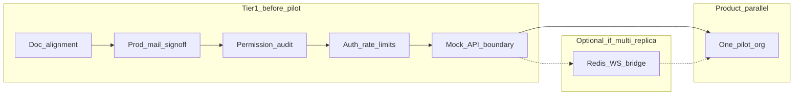

# Tier 1 pilot readiness plan

**Status:** **Tier 1 engineering complete** — **VPS alpha live** at kink.social (2026-06-11); formal `PILOT-MAIL` / `PILOT-ORG` sign-off open  
**Saved:** 2026-06-12  
**Strategic context:** [`../C2K-STRATEGIC-GUIDANCE.md`](../C2K-STRATEGIC-GUIDANCE.md) v3 §2, §16, §18  
**Local sprint:** [`../SERVER_CUTOVER_LOG.md`](../SERVER_CUTOVER_LOG.md) · active backlog [`../BACKLOG_QUEUE.md`](../BACKLOG_QUEUE.md)

**Overview:** Align docs with strategic guidance, then execute Tier 1 pilot blockers (mail sign-off, permission audit, auth rate limits, mock/API boundary) before any Phase 2 social work. Redis WS pub/sub is a conditional track if you deploy multiple API replicas.

## Todo checklist

- [x] **doc-align** — Update `MASTER_NEXT_STEPS` §7 + add `docs/PILOT_READINESS.md` runbook
- [x] **local-docker** — Active env: `docker-compose.dev.yml` + Mailpit
- [ ] **mail-signoff** — **In progress** — transport green on kink.social; complete `PROD_SMTP_K8S_CHECKLIST` A–E
- [x] **perm-audit** — audit + smoke-command-bridge + organizer-parity all green (2026-05-26)
- [x] **pilot-1-3** — registrants 400, session-feedback paths, categories smoke key
- [x] **rate-limits** — Add `@fastify/rate-limit` for auth/register/push/subscribe; env disable flag + test
- [x] **mock-boundary** — Gate `VITE_HOME_DEMO_FALLBACK` to guests only in HomePageClient, events, vendors
- [x] **redis-ws-optional** — Redis pub/sub bridge on `realtime-bus` with `C2K_REALTIME_REDIS_BRIDGE`
- [ ] **pilot-org** — **In progress** — invite alpha on prod; external pilot org onboarding open — [`PILOT_READINESS.md`](../PILOT_READINESS.md)
- [x] **verify-docs** — `verify:prelaunch` + `verify:alpha:auto`; HANDOFF + BACKLOG_QUEUE updated (2026-06-06)

---

Per [`docs/C2K-STRATEGIC-GUIDANCE.md`](../C2K-STRATEGIC-GUIDANCE.md) §2 and §13, the product is in **Phase 1** (organizer flywheel). Engineering should **not** start Following feed UI or `feed_activities` until Tier 1 is done and at least one org is on a real event.



**Explicitly out of scope for this plan:** `feed_activities` / Following feed (Phase 2, Tier 2), capability sub-profiles, federation Layer 1+, ComingSoon route cleanup (Tier 2 item 10 — separate pass unless pilot nav is painful).

---

## 0. Doc alignment (quick, same PR as kickoff)

Update [`docs/MASTER_NEXT_STEPS.md`](../MASTER_NEXT_STEPS.md) §7 **Suggested next sprint** to match strategic guidance:

| Remove / demote | Promote |
|-----------------|--------|
| “FetLife home F1 — IA only on `/home`” | Tier 1 table (mail → audit → rate limits → mock) |
| | Link to new `docs/PILOT_READINESS.md` (create in step 1) |
| | Phase 2: `feed_activities` F1 write path only after Tier 1 + pilot |

---

## 1. Pilot runbook doc (new)

Add [`docs/PILOT_READINESS.md`](../PILOT_READINESS.md) as the **single operator + engineer checklist** for first real org:

- **Prerequisites:** links to [`PROD_SMTP_K8S_CHECKLIST.md`](../PROD_SMTP_K8S_CHECKLIST.md), [`LOCALHOST_DEMO_LINKS.md`](../LOCALHOST_DEMO_LINKS.md), [`DANCECARD_ORGANIZER_PARITY.md`](../DANCECARD_ORGANIZER_PARITY.md) manual smoke section
- **Pilot event path:** org create → convention → registration public URL → registrant with `user_id` → People hub → hub chat/announcements → optional mail/push
- **Env flags** to set for pilot (`C2K_ORG_JOIN_EMAIL`, `C2K_EVENT_RSVP_EMAIL`, VAPID, push kill switches)
- **Sign-off table** mirroring Tier 1 items (checkboxes for mail, audit script green, rate limits enabled, no demo fallback for signed-in users)
- **Rollback:** disable mail transport, `C2K_PUSH_*=false`

---

## 2. Prod mail sign-off (operator-led, engineering supports)

**Goal:** Real attendee email works before any pilot sends mail.

**Execute** [`docs/PROD_SMTP_K8S_CHECKLIST.md`](../PROD_SMTP_K8S_CHECKLIST.md) sections A–E on **staging first**, then production:

- DNS SPF/DKIM/DMARC for `C2K_MAIL_FROM`
- `k8s/base/secret.yaml` from `k8s/base/secret.example.yaml` — api + worker `envFrom`
- Smoke: template test send, org join welcome, RSVP mail, scope-email confirm (`C2K_SCOPE_EMAIL_DOUBLE_OPTIN`), pinned digest (worker `pinned-digest-sweep`)
- VAPID keys for hub push smoke (optional for pilot but documented in same pass)

**Engineering deliverable:** If smoke fails, fix in `packages/api/src/lib/mailer.ts` / route callers — not new features. Record pass/fail dates in `PILOT_READINESS.md`.

**No code required** if checklist passes as-is.

---

## 3. Organizer permission audit (engineering)

**Goal:** Confirm strategic rule: **org MODERATOR does not automatically get command bridge**; every organizer query is scoped to the convention’s org; no cross-org IDOR.

**Existing tooling (run first):**

```bash
npm run dev   # or staging
node scripts/audit-command-bridge.mjs
node scripts/smoke-command-bridge.mjs
npx tsx packages/api/scripts/smoke-organizer-parity.ts <convSlug>
```

**Code review focus** (document findings in `PILOT_READINESS.md` § Security):

| Area | Files | Check |
|------|-------|-------|
| Command bridge | `packages/api/src/lib/convention-command-access.ts` | Only `OWNER`/`ADMIN` get `fullCommandPermissions()`; `MODERATOR` uses grants only |
| Organizer routes | `packages/api/src/routes/convention-organizer-routes.ts` + `routes/convention-organizer/*` | All mutating routes go through `requireConventionCommand` |
| Convention reads | `packages/api/src/routes/conventions-routes.ts` | `getConventionWithAccess` used for attendee vs staff boundaries |
| WS parity | `packages/api/src/lib/ws-subscribe-auth.ts` | Schedule/org scopes match REST visibility |

**Gaps to fix if found:**

- Any organizer `GET`/`PUT` that accepts `conventionId` or `orgId` without verifying `conv.organizationId` matches the actor’s org membership
- Any path that grants command access from org role alone without grant row (except documented `OWNER`/`ADMIN` full bridge)

**Optional hardening (small PR):** Add 2–3 HTTP tests in `packages/api/src/routes/http-smoke.test.ts` for “org MODERATOR without grant → 403 on `…/command-team` mutator” if not already covered by audit script.

---

## 4. Auth and public subscribe rate limits (engineering)

**Status:** **Shipped** (2026-05-26) — `@fastify/rate-limit` in `packages/api/src/server.ts`; env tunables in `rate-limit-config.ts`; kill switch `C2K_RATE_LIMIT_DISABLE=true`.

**Original implementation spec (for reference):**

1. Add `@fastify/rate-limit` to `packages/api/package.json`.
2. Register in `packages/api/src/server.ts` with env-tunable limits, e.g.:
   - `POST /api/auth/session` — e.g. 10/min per IP
   - `POST /api/auth/register` — e.g. 5/hour per IP
   - `POST /api/v1/me/push/subscribe` — e.g. 30/hour per user (after session)
3. Public scope-email subscribe — per-IP cap
4. Return **429** with `Retry-After`; log at warn
5. Env kill switch: `C2K_RATE_LIMIT_DISABLE=true` for local dev if needed
6. Unit test: one route returns 429 after threshold

**Do not** rate-limit health checks or static assets.

---

## 5. Mock/API boundary for signed-in users (engineering)

**Status:** **Shipped** (2026-05-26) — guests-only demo fallback; prod builds use `VITE_HOME_DEMO_FALLBACK=false`.

**Original implementation spec (for reference):**

**Current state (pre-ship):** `VITE_HOME_DEMO_FALLBACK` could backfill mock cards while authenticated.

**Implementation (done):**

- `const useDemoFallback = homeDemoFallback && !session?.authenticated` (use `AuthContext`).
- Production/staging: `VITE_HOME_DEMO_FALLBACK=false` in `.env.production.example` and `PILOT_READINESS.md`.
- Keep fallback **only for guests** on localhost if desired.

**Acceptance:** Signed-in `RopeDreamer` on `/home` never sees “Demo backfill is on” banner; empty rails show empty state, not mock IDs like `g1`.

---

## 6. Redis WebSocket pub/sub bridge (optional track)

**Defer if** first pilot uses **one API replica** (per [`REALTIME_SCALING.md`](../REALTIME_SCALING.md)).

**Include if** staging/prod will run **2+ API pods** before pilot:

- Extend `packages/api/src/lib/realtime-bus.ts`: `publishToScope` → Redis `PUBLISH`; on boot `SUBSCRIBE` and forward locally
- Flag: `C2K_REALTIME_REDIS_BRIDGE=true`; default false in dev
- Update `docs/architecture/05-realtime-architecture.md` + `REALTIME_SCALING.md`

---

## 7. Product: first pilot org (parallel, non-code)

- Pick one org (munch or small convention)
- Run end-to-end path from `PILOT_READINESS.md`
- Capture blockers as `BACKLOG_QUEUE` rows (organizer gaps only — not Following feed)

---

## 8. Verification (end of sprint)

**Official local alpha gate:**

```bash
npm run verify:alpha              # Docker + db:prepare + dev + verify:alpha:auto
# stack already up:
npm run verify:alpha:auto
```

Gate steps (`scripts/verify-alpha-auto.mjs`): `verify:prelaunch` → `test:e2e:alpha-gate` → alpha screenshots → pilot smokes (11-check `pilot-readiness-smoke.mjs`, registration, reports, organizer tab walk, attendee dancecard, command-bridge audit, scope-email, transactional mail).

**T&S / moderation (parallel track, not in default alpha gate):**

```bash
npm run verify:trust-safety
node scripts/smoke-moderation-checkpoint.mjs
```

**Full Playwright matrix (optional):** `npm run test:e2e`

Update [`HANDOFF.md`](../HANDOFF.md) + [`BACKLOG_QUEUE.md`](../BACKLOG_QUEUE.md) with Tier 1 completion status.

---

## Suggested execution order (1–2 weeks)

| Week | Focus |
|------|--------|
| **1** | Doc alignment + `PILOT_READINESS.md` + permission audit (fix findings) + rate limits |
| **1–2** | Prod mail checklist on staging (operator) |
| **2** | Mock boundary + optional Redis bridge + pilot org dry run |
| **After green** | Repopulate backlog from pilot feedback; **then** consider Tier 2 `feed_activities` F1 |

---

## Risk notes

- **Mail** is mostly ops/DNS — engineering cannot “finish” Tier 1 without operator sign-off.
- **Command bridge audit** may surface IDOR bugs — treat as P0 fixes before pilot.
- **MASTER_NEXT_STEPS §7** currently contradicts strategic guidance — fix in step 0 to avoid agents building Following UI next.

**Resume prompt for Cursor (local):** “Execute the Tier 1 pilot readiness plan in `docs/plans/TIER_1_PILOT_READINESS.md`.”

**Resume prompt for Cursor (server mounted):** “Follow `docs/SERVER_MOUNT_RUNBOOK.md` — complete prod mail checklist and pilot sign-off on our cluster URL.”
